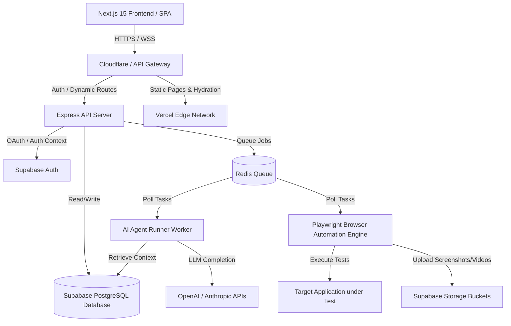

# Sculra System Architecture

This document describes the high-level system architecture for **Sculra**, a scalable, enterprise-grade AI-powered QA automation platform.

---

## 1. High-Level Architecture Overview

Sculra is designed around a decoupled, monorepo-friendly architecture consisting of a Next.js 15 frontend, an Express/TypeScript backend, a Supabase (PostgreSQL) data tier, and modular, distributed worker nodes for AI analysis and browser automation.

---

## 2. Component Design & Responsibilities

### 2.1 Frontend (Next.js 15 App Router)

- **Deployment**: Hosted on Vercel.
- **Data Fetching**: Server Components for SEO/initial loads; Client-side React Query / Supabase Client for dynamic dashboards.
- **Realtime**: Supabase realtime subscriptions for streaming test progress and AI reasoning tokens.

### 2.2 Backend API (Express.js / TypeScript)

- **Role**: Handles business logic, webhook ingestion (Stripe, GitHub), security validation, role-based access control (RBAC), and job dispatching.
- **State Management**: Stateless controllers communicating with Redis and PostgreSQL database layers.

### 2.3 Browser Automation Engine

- **Technology**: Playwright/Puppeteer running in a containerized environment (Docker on ECS/GCP Cloud Run).
- **Functionality**: Fully handles form discovery, DOM analysis, execution of test scripts, viewport adjustments, console log capturing, network request monitoring, and screenshot/video recording.

### 2.4 AI Orchestration System (Agents)

- **Structure**: Independent agent workflows (e.g., Tester, PM, Security, Accessibility) orchestrated via LangChain or custom light wrappers.
- **Memory**: Vector store built on Postgres (`pgvector`) within Supabase, retaining context of website history and past bug fixes.

### 2.5 Database & Storage (Supabase)

- **Database**: PostgreSQL with Row Level Security (RLS) enabled on all tables.
- **Auth**: Supabase Auth (JWT-based session management, social login via GitHub, Google).
- **Storage**: Standardized storage buckets for media artifacts (screenshots, video traces, reports, user avatars).

---

## 3. Reliability & Scalability Strategy

- **Job Queuing**: Redis-backed queue (BullMQ) to prevent heavy browser automation tasks from blocking the API event loop.
- **Horizontal Scaling**: API and worker layers scale independently based on CPU/Memory and active queue size.
- **Caching Layer**: Redis cache layer for frequently read database entities (user settings, plan limits).
- **Rate Limiting**: Implemented at the Cloudflare gateway layer and reinforced at the API middleware layer via token bucket algorithms.
