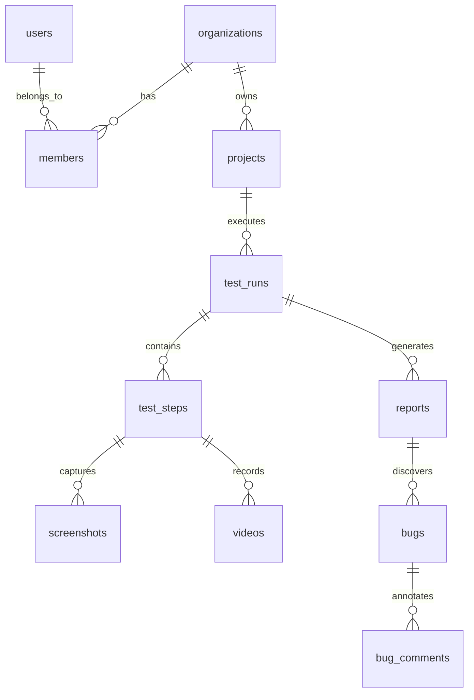

# Sculra Database Architecture Reference

This document outlines the database schema, security policies, triggers, and functions within Sculra's Supabase PostgreSQL environment.

---

## 1. Schema & Table Architecture

All schemas are configured under the `public` schema.



### Table Definitions (Metadata Summary)

- `users`: Extends Supabase authentication profiles. Holds display names and configuration preferences.
- `organizations`: Groups users under a unified workspace billing entity.
- `members`: Maps users to organizations using RBAC roles (`owner`, `admin`, `member`).
- `projects`: Configured target websites or GitHub repositories.
- `test_runs`: Execution record of test tasks.
- `test_steps`: Step-by-step browser interactions (clicks, inputs, validations).
- `bugs`: Detected issues including severity, description, element identifier, and AI analysis.
- `audit_logs`: Write-once log table recording security-relevant actions.

---

## 2. Row Level Security (RLS)

All tables inside the `public` schema have Row Level Security enabled. Standard security pattern asserts membership query parameters:

```sql
-- Example security policy for projects table
CREATE POLICY "Users can access projects in their organization"
ON public.projects
FOR ALL
USING (
  organization_id IN (
    SELECT organization_id FROM public.members
    WHERE user_id = auth.uid()
  )
);
```

---

## 3. Database Triggers & Stored Procedures

### Sync User Profile

Triggers automatic record insertion into the `public.users` table whenever a new authentication entry is added to `auth.users`.

- **Function**: `handle_new_user()`
- **Trigger**: `on_auth_user_created`

### Updated Timestamp Guard

Ensures matching tables update the `updated_at` column automatically.

- **Function**: `update_modified_column()`
- **Trigger**: `set_updated_timestamp`
