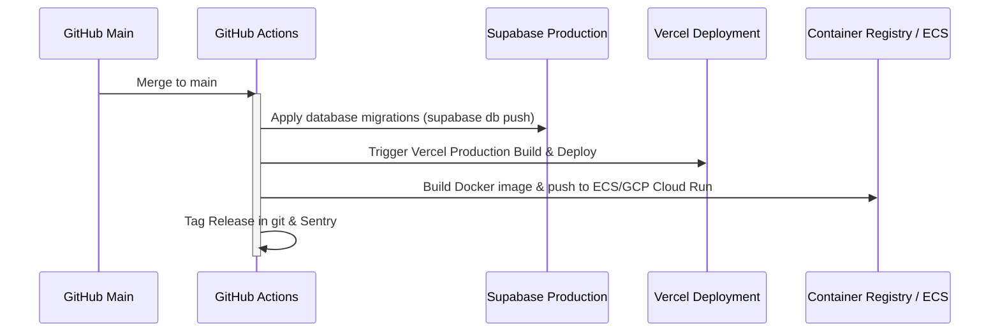

# Sculra Deployment Guide

This document describes the production deployment lifecycle, pipelines, and cloud provider strategies for Sculra.

---

## 1. Cloud Providers & Services

- **Frontend Hosting**: Vercel (Edge-network enabled next-generation serverless hosting).
- **Backend API Server**: AWS ECS (Fargate) or GCP Cloud Run (Dockerized autoscaling container environment).
- **Database & Auth**: Supabase Managed Cloud (PostgreSQL on AWS with multi-zone replication).
- **Cache & Queue**: Upstash Redis or AWS ElastiCache (Serverless Redis for low latency caching and BullMQ handlers).
- **CDN, WAF, DNS**: Cloudflare.

---

## 2. Infrastructure as Code (IaC)

Supabase setups are tracked using the Supabase CLI (`supabase/` folder containing migrations and config). Backend orchestration configurations are stored as Terraform templates or CloudFormation files under the `infrastructure/` subfolder (if implemented).

---

## 3. Deployment Pipelines (CI/CD via GitHub Actions)

### 3.1 Pull Request Checks
Every pull request targeting `main` or `staging` branches must satisfy the following pipeline conditions:
1. **Linting & Formatting**: Ensure ESLint, Prettier, and TypeScript compilation pass:
   ```bash
   npm run lint
   npm run ts-check
   ```
2. **Unit & Integration Tests**: Verify all tests pass:
   ```bash
   npm run test
   ```

### 3.2 Production Deployment Flow



---

## 4. Post-Deployment Monitoring

- **Error Verification**: Sentry alerts for unexpected exceptions occurring immediately post-deploy.
- **Synthetics**: Synthetic test flows triggered against `https://Sculra.io/health` to confirm gateway routing.
- **Rollback Procedure**: In the event of high latency or error counts, Vercel deployments can be instantly reverted via the dashboard, and ECS tasks can fall back to the previous stable Docker image tag.

