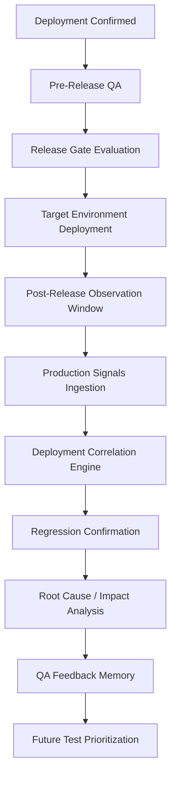

# Sculra Post-Release QA Intelligence, Incident Correlation & Feedback Loop

## 1. Overview & Lifecycle Sequence

Sculra provides continuous, evidence-backed post-release observability and incident correlation connecting production runtime telemetry directly into the QA lifecycle.

The end-to-end lifecycle is:


Under our core invariant **NO EVIDENCE → NO INFERENCE**, the system strictly distinguishes:
- `measured fact`: Direct commit SHA, deployment ID, or endpoint match.
- `temporal correlation`: Coincidence in time without causal identifier evidence (`TEMPORAL_ONLY`).
- `possible correlation`: Route, service, or API signature similarity.
- `confirmed relationship`: Direct identifier and regression verification evidence.
- `unknown / insufficient evidence`: Absence of monitoring or test execution.

---

## 2. Canonical Production Signal Model

Signals ingested from monitoring providers are normalized into a canonical, provider-neutral schema:
```typescript
export interface ProductionSignal {
  id: string;
  organizationId: string | null;
  projectId: string;
  environmentId: string | null;
  deploymentId: string | null;
  releaseId: string | null;
  provider: 'SENTRY' | 'POSTHOG' | 'GENERIC_WEBHOOK' | 'MANUAL' | 'CI_CD';
  providerSignalId: string | null;
  signalType:
    | 'ERROR'
    | 'EXCEPTION'
    | 'PERFORMANCE_DEGRADATION'
    | 'AVAILABILITY_FAILURE'
    | 'USER_JOURNEY_FAILURE'
    | 'HTTP_ERROR'
    | 'API_FAILURE'
    | 'SECURITY_EVENT'
    | 'ACCESSIBILITY_REGRESSION'
    | 'VISUAL_REGRESSION'
    | 'RESOURCE_FAILURE'
    | 'CUSTOM_INCIDENT';
  severity: 'INFO' | 'LOW' | 'MEDIUM' | 'HIGH' | 'CRITICAL';
  status: 'OPEN' | 'INVESTIGATING' | 'CONFIRMED_REGRESSION' | 'POSSIBLE_REGRESSION' | 'RESOLVED' | 'SUPPRESSED' | 'IGNORED';
  title: string;
  description: string | null;
  fingerprint: string;
  firstObservedAt: string;
  lastObservedAt: string;
  resolvedAt: string | null;
  affectedUrl: string | null;
  affectedRoute: string | null;
  affectedService: string | null;
  affectedVersion: string | null;
  affectedCommit: string | null;
  affectedBranch: string | null;
  occurrenceCount: number;
  rawReference: Record<string, any>;
  confidence: number;
  createdAt: string;
  updatedAt: string;
}
```

### Normalization Guarantees:
- **Empty strings to NULL**: Any empty or whitespace-only string is strictly normalized to `null`.
- **Secret Redaction**: Authorization bearer tokens, passwords, API keys, and sensitive credentials in titles, descriptions, and URLs are redacted with `[REDACTED_SECRET]`.
- **Zero Fabrication**: Fields not provided by external telemetry remain `null`. Sculra never fabricates project identifiers, commit SHAs (`HEAD`, `latestCommit`), or environment names (`production`).

---

## 3. Provider Adapters

Sculra connects to external production monitoring services via standardized adapters:

| Provider | Status | Signature Validation | Ingestion Route |
| :--- | :--- | :--- | :--- |
| **Sentry** | Operational | HMAC SHA-256 (`sentry-hook-signature`) | `/api/webhooks/signals/sentry` |
| **Generic Webhook** | Operational | HMAC SHA-256 (`x-sculra-signature` / Bearer) | `/api/webhooks/signals/generic` |
| **PostHog** | Scaffolded / NOT_SUPPORTED | Rejects with explicit `NOT_SUPPORTED` | `/api/webhooks/signals/posthog` |

*Rule*: For unsupported providers, Sculra returns explicit `NOT_SUPPORTED` and never fabricates successful ingestion.

---

## 4. Deterministic Deployment Correlation

The `DeploymentCorrelationEngine` correlates incoming production signals against candidate deployments:

- **`EXACT_MATCH`**: Signal provides an exact matching `deploymentId` or exact matching `affectedCommit` disambiguated by environment/release.
- **`STRONG_CORRELATION`**: Signal provides a matching commit SHA or release ID when deployment ID is omitted.
- **`POSSIBLE_CORRELATION`**: Signal route or service overlaps with deployment artifacts, but commit SHA is absent.
- **`TEMPORAL_ONLY`**: Signal occurs within the deployment window (0 - 60 minutes), but provides **no** commit SHA, deployment ID, or route evidence.
  - *Invariant*: Temporal proximity alone is strictly classified as `TEMPORAL_ONLY` and **never** inferred as causality or deployment-caused.
- **`AMBIGUOUS`**: Multiple candidate deployments share the commit SHA or release ID without distinguishing evidence.
- **`NO_CORRELATION`**: Telemetry and identifiers do not match any candidates.
- **`INSUFFICIENT_EVIDENCE`**: Signal lacks all diagnostic metadata and candidate pool is empty.

---

## 5. Regression Confirmation & Issue Deduplication

When a production signal is ingested, `RegressionConfirmationEngine` compares it against known project issues:
1. **Fingerprint Match**: Exact match with known issue fingerprint yields `MATCHED_EXISTING_ISSUE` (confidence 1.0).
2. **Route & Signature Match**: Matching endpoint/route and error title yields `MATCHED_EXISTING_ISSUE` or `POSSIBLE_MATCH`.
3. **Novel Defect**: Unmatched signal yields `NEW_SIGNAL`.
4. **Insufficient Data**: Empty or uninformative payload yields `INSUFFICIENT_EVIDENCE`.

---

## 6. Recovery Semantics

Sculra detects empirical recovery between deployments without fabricating causal credit:
- **`WORKFLOW_RECOVERED`**: Workflow failed in previous deployment and passed in current deployment.
- **`SIGNAL_DISAPPEARED`**: Production signal was active previously and is no longer observed, without direct code remediation proof.
- **`REGRESSION_RESOLVED`**: Defect reproduction test passed in current deployment.
- **`ROOT_CAUSE_FIXED`**: Explicit code commit remediation evidence and passing QA verification.
- **`NO_RECOVERY_OBSERVED`**: Workflow did not fail previously (no recovery to claim) or continues to fail.
- **`INSUFFICIENT_EVIDENCE`**: Current workflow has not been retested.

---

## 7. Post-Release Health State Evaluation

The overall health of a deployment is strictly evidence-derived:
- **`HEALTHY`**: ONLY when verified positive health evidence exists (verification QA passed or active monitoring operational with 0 incidents).
- **`REGRESSION_DETECTED`**: Active confirmed regression or verification campaign failure.
- **`INCIDENT_ACTIVE`**: Active critical production signal.
- **`DEGRADED`**: Active high production signal or non-critical verification defects.
- **`RECOVERY_OBSERVED`**: Verified recovery of prior defects.
- **`INSUFFICIENT_EVIDENCE`**: Missing monitoring data and no post-release QA.
  - *Invariant*: Absence of monitoring data is strictly `INSUFFICIENT_EVIDENCE` and **never** defaulted to `HEALTHY`.
- **`UNKNOWN`**: Telemetry ambiguous or verification in progress.

---

## 8. Strategy Prioritization Feedback

The `DeterministicPrioritizer` applies a bounded, explainable priority boost (15 - 25 points) to candidate workflows matching recent production signals:
- Explanation format: `"Prioritized because this workflow had N production signal(s) in the previous 14 days."`
- The count `N` is directly measured from genuine signals and never fabricated.

---

## 9. Security & Access Control

- **Row Level Security**: Supabase policies enforce organization membership using Clerk functions:
  - `public.clerk_user_id()`
  - `public.org_id()`
  - `public.is_org_member(...)`
  - Zero usage of deprecated `auth.uid()`.
- **Permissions**:
  - `signals.read`: Read-only access to production signals and correlation history (VIEWER, DEVELOPER, QA_LEAD, ADMIN, OWNER).
  - `signals.ingest`: Authorization to ingest or manually record production signals (DEVELOPER, QA_LEAD, ADMIN, OWNER).
- **Durable Webhook Ingestion**: Webhooks synchronously persist signals and correlations before returning HTTP 202 Accepted. Zero in-memory unawaited promises.
