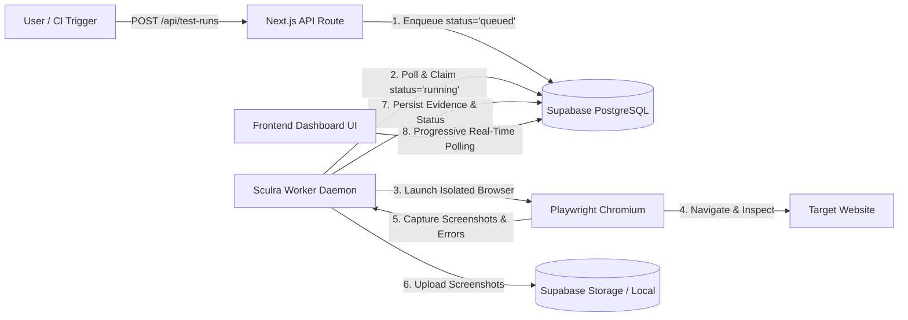
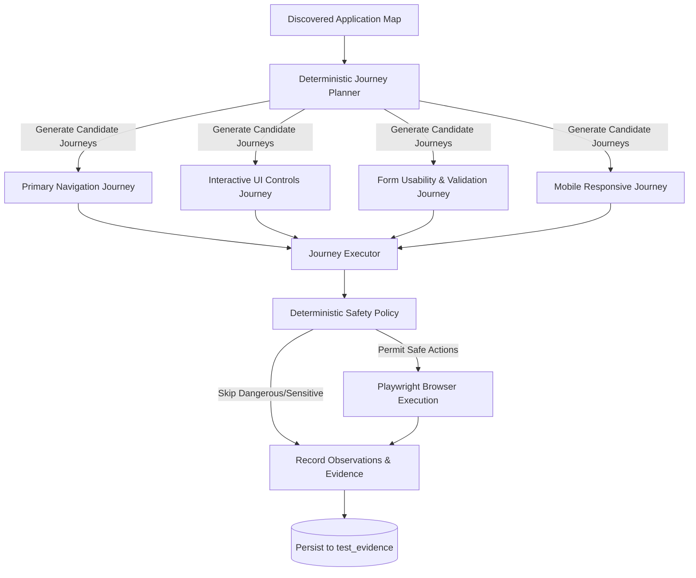
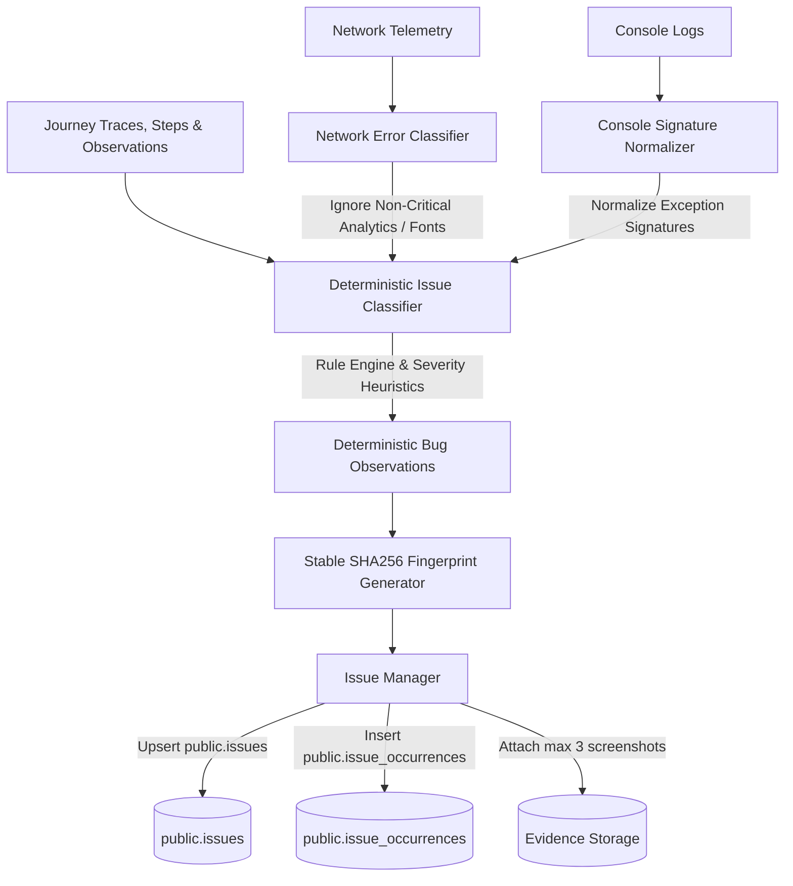
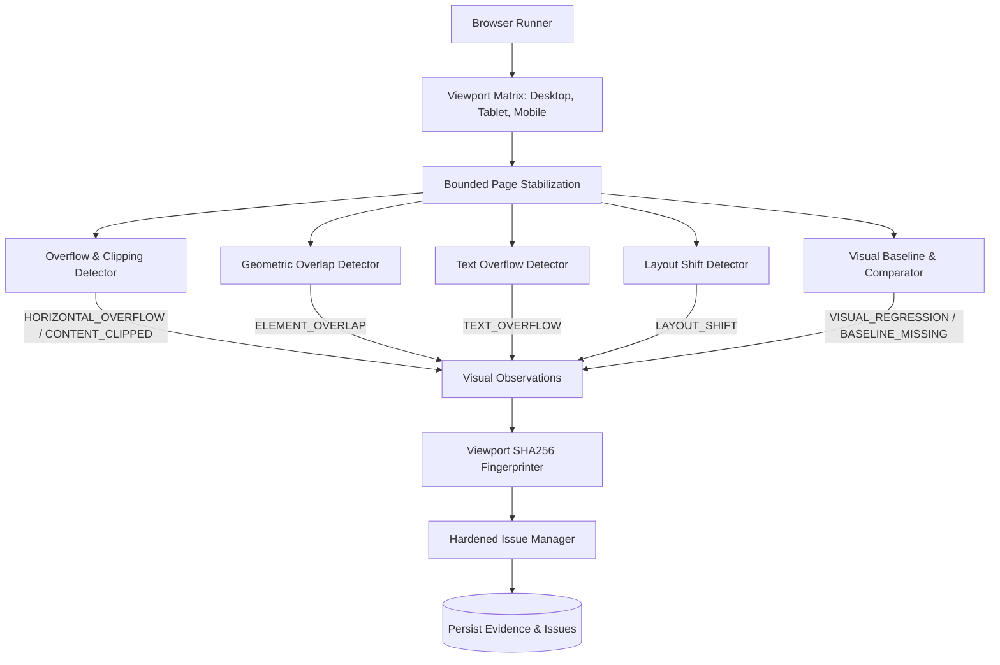
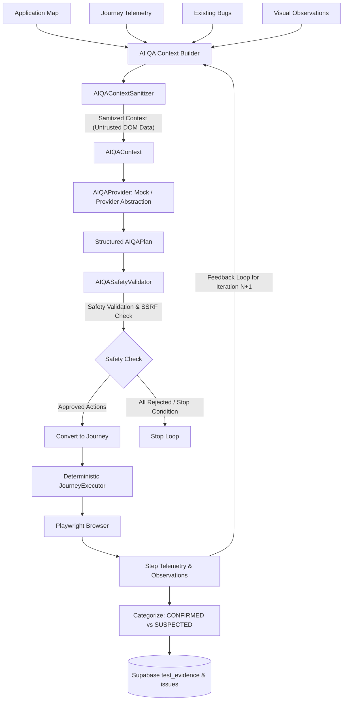
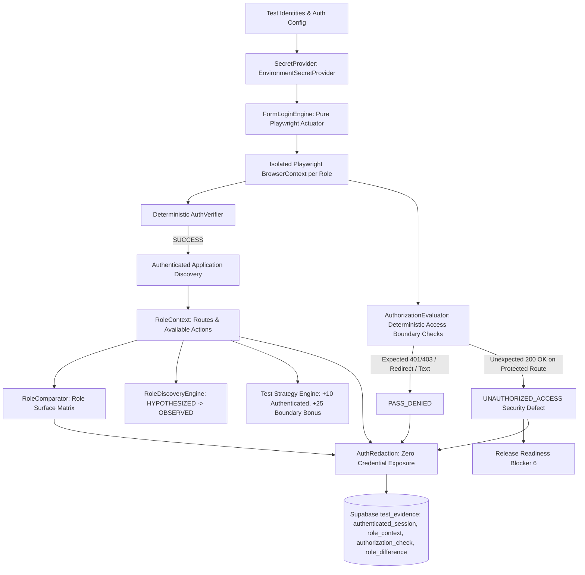
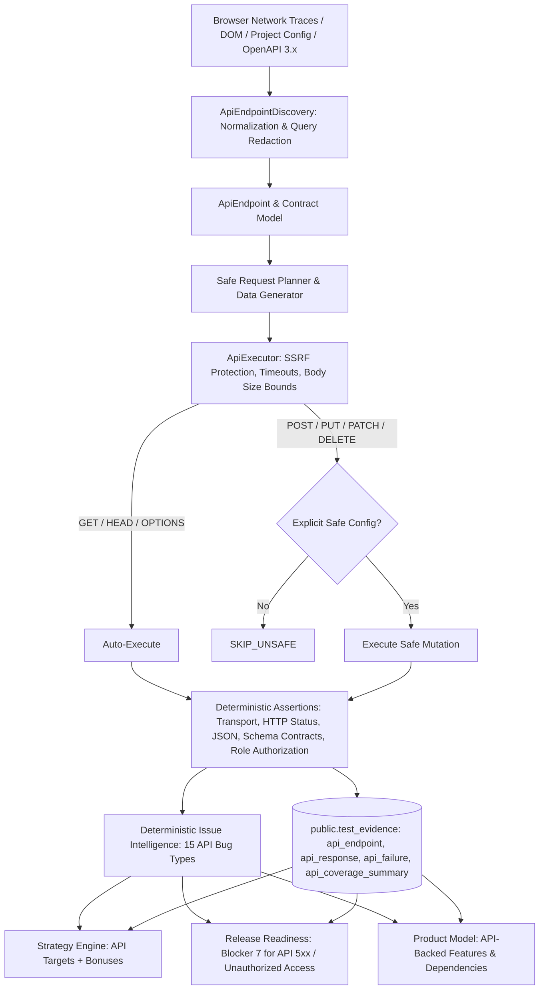
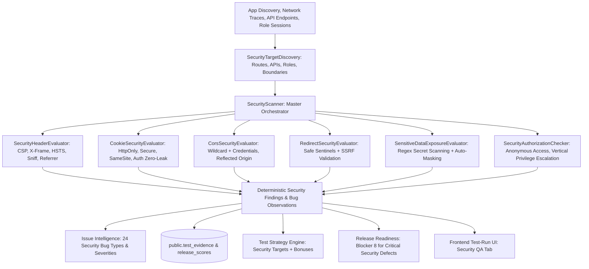
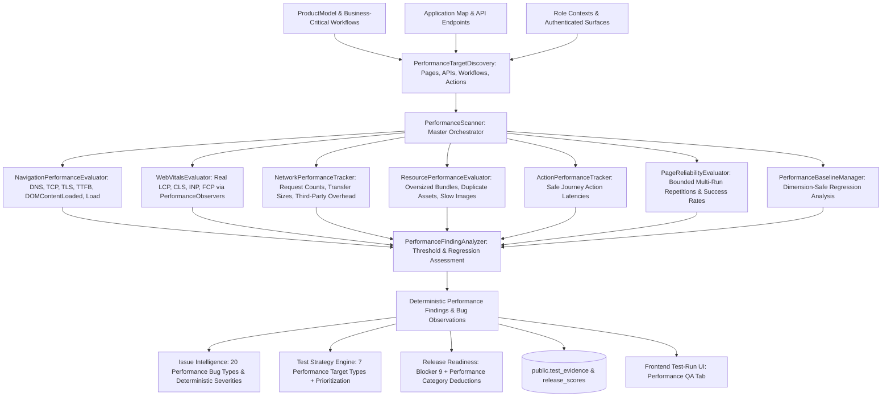
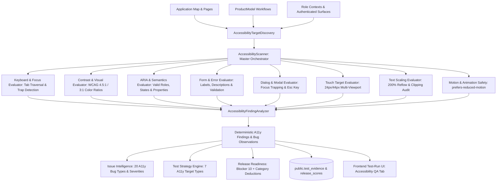

# Sculra Autonomous Test Engine Architecture

This document describes the architecture, lifecycle, and operational instructions for the Sculra Playwright Test Worker (`@sculra/worker`).

---

## 1. System Overview

Sculra's testing engine is decoupled into two primary components:
1. **Frontend / API Service (`frontend`)**: Next.js 16 web application that allows users to trigger test runs (`POST /api/test-runs`), view progressive execution status, and inspect collected evidence (`/test-runs/[testRunId]`).
2. **Autonomous Test Worker Daemon (`@sculra/worker`)**: A background Node.js service running Playwright Chromium in headless mode, continuously polling Supabase for queued test runs and capturing real browser artifacts without blocking user requests.



---

## 2. Test Execution Lifecycle & State Machine

A test run progresses through the following deterministic states:

```
[queued] ──> [running] ──> [passed]
    │             │
    └──> [cancelled] <──┘
                  │
                  └──> [failed]
```

1. **`queued`**: Created when a user clicks "Run Test" or triggers `POST /api/test-runs`.
2. **`running`**: Claimed atomically by the worker daemon (`UPDATE test_runs SET status = 'running' WHERE id = :id AND status = 'queued'`).
3. **`passed`**: Page navigation completed cleanly (HTTP status 200–399, DOM loaded, screenshot captured).
4. **`failed`**: Navigation timeout, DNS failure, server error (HTTP 5xx), or security validation rejection.
5. **`cancelled`**: User initiated cancellation before or during execution.

> **Release Readiness Scoring**: The engine deterministically computes `overall_score` (0–100), 5 category scores (functional, visual, responsive, reliability, coverage), blockers, risk levels, and confidence levels, persisting them to `public.release_scores` and updating `test_runs.overall_score`. See `docs/RELEASE_READINESS.md` for full details.

---

## 3. Worker Daemon CLI Commands

### Running the Worker Daemon
To start the continuous background worker polling daemon from the repository root:
```bash
pnpm worker
# or
pnpm --filter @sculra/worker start
```

### Running a Single Test Run
To execute a specific test run by ID and terminate immediately upon completion:
```bash
pnpm --filter @sculra/worker start <testRunId>
```

### Running Test Suites
```bash
# Run worker test suite including real Playwright browser tests
pnpm --filter @sculra/worker test

# Run all test suites across the monorepo
pnpm test
```

---

## 4. Environment Configuration

The worker reads standard environment variables from `.env` or system environment:

| Variable | Description | Default |
| :--- | :--- | :--- |
| `NEXT_PUBLIC_SUPABASE_URL` | Supabase project API URL | Required for DB sync |
| `SUPABASE_SERVICE_ROLE_KEY` | Supabase privileged service role key | Required for worker writes |
| `SCULRA_AI_PROVIDER` | AI QA provider implementation (`mock`, `openai`) | `mock` |
| `OPENAI_API_KEY` | OpenAI API Secret Key | Required if `SCULRA_AI_PROVIDER=openai` |
| `OPENAI_MODEL` | OpenAI Model ID for structured QA planning | `gpt-4o-mini` |
| `OPENAI_MAX_RETRIES` | Max retries for transient 429/5xx errors | `3` |
| `OPENAI_TIMEOUT_MS` | Per-request timeout limit in milliseconds | `30000` |
| `OPENAI_BASE_URL` | Optional custom base URL for OpenAI-compatible proxies | `undefined` |
| `WORKER_POLL_INTERVAL_MS` | Queue polling frequency in milliseconds | `2000` |
| `WORKER_CONCURRENCY` | Maximum concurrent browser executions | `1` |
| `TEST_BROWSER` | Playwright browser engine (`chromium`) | `chromium` |
| `TEST_NAVIGATION_TIMEOUT_MS` | Page load timeout limit in milliseconds | `15000` |
| `TEST_RUN_TIMEOUT_MS` | Maximum duration for an entire test job | `30000` |

---

## 5. Security & SSRF Protection

All target URLs undergo strict security validation in `shared/utils/security.ts` and `worker/src/security.ts` before browser launch:
- **Restricted Hosts**: Access to cloud metadata IPs (`169.254.169.254`, `metadata.google.internal`), private IPv4 subnets (`10.0.0.0/8`, `172.16.0.0/12`, `192.168.0.0/16`), and loopback addresses is blocked by default in production.
- **Protocol Enforcement**: Only `http:` and `https:` protocols are permitted. `file://`, `ftp://`, and `data://` schemes are rejected.
- **Port Allowlisting**: Traffic is restricted to standard web ports (80, 443, 8080, 8443, 3000, 5173).

---

## 6. Evidence Storage Abstraction

The storage layer (`worker/src/storage.ts`) implements `IEvidenceStorage`:
- **Supabase Storage Bucket**: When credentials and the `test-evidence` bucket are configured, screenshots are uploaded directly to Supabase Storage with public URLs.
- **Local Filesystem Fallback**: If Supabase Storage is unavailable, screenshots are safely saved to `.storage/evidence/<testRunId>/` for local development.
- **Structured Evidence Table (`public.test_evidence`)**: Records every captured artifact with type (`screenshot`, `console_error`, `network_error`, `navigation`, `application_map`, `journey_result`, `journey_step`, `action_trace`, `observation`), metadata, and timestamp.

---

## 7. Application Discovery Engine

The Application Discovery module (`worker/src/discovery.ts`) maps the structural surface of a target web application:
- **Same-Origin Crawling**: BFS queue respecting configurable bounds (`maxPages`, `maxDepth`, `maxLinksPerPage`, `maxElementsPerPage`).
- **Interactive Element Extraction**: Locates non-text actionable elements (buttons, links, form fields, select dropdowns, checkboxes).
- **Responsive Viewport Probing**: Captures screenshots across desktop (`1280x720`), tablet (`768x1024`), and mobile (`390x844`) layouts.
- **Resilient Selectors**: Computes robust CSS and semantic locators for every discovered interactable element.

---

## 8. Deterministic User Journey & Safe Interaction Engine

The User Journey Engine (`worker/src/journeys/`) systematically plans and executes safe user journeys across discovered applications:



### Deterministic Safety Policy (`worker/src/journeys/safety.ts`)
- **Dangerous Action Filter**: Automatically skips destructive operations (deletion, permanent removal, account termination, log out / sign out, monetary payments / checkout, and external publishing / deployments).
- **Sensitive Field Filter**: Prevents synthetic data injection into sensitive fields (passwords, PINs, OTP tokens, API keys, secrets, credit card numbers, CVVs, SSNs, and bank accounts).
- **Deterministic Fixture Values**: Injects synthetic, non-sensitive fixtures (`sculra.test.fixture@example.com`, `Sculra Test User`, `Sculra QA`, etc.).

### Journey Types
1. **Primary Navigation**: Traverses internal routes, asserting HTTP status codes, page titles, and URL routing.
2. **Interactive UI Controls**: Clicks non-destructive buttons, accordions, and tabs to observe DOM mutations and detect no-ops (`CLICK_NO_OP`).
3. **Form Usability & Validation**: Evaluates form client constraints (`VALIDATE_FORM`), fills safe inputs, and records validation states.
4. **Responsive Viewport**: Executes workflows on mobile viewport (`390x844`) to observe usability on small screens.

---

## 9. Deterministic Functional Bug Detection & Issue Intelligence

> **Important Architecture Principle**: *This is deterministic bug detection, not AI reasoning.* All bug classifications, severity evaluations, and deduplication fingerprints are produced deterministically through rigorous rule sets without stochastic or non-deterministic LLM calls.



### Deterministic Bug Classification Categories
The issue classifier (`worker/src/issues/classifier.ts`) evaluates journey telemetry and categorizes findings into standardized bug types:
1. **`CRITICAL_API_FAILURE`**: Critical first-party backend HTTP 5xx errors and failed network operations directly triggered by user actions.
2. **`BROKEN_CONTROL`**: Interactive UI elements that produce no DOM changes, state mutations, or network effects (`CLICK_NO_OP`), or fail to respond to user gestures.
3. **`NAVIGATION_FAILURE`**: Broken internal links, 404/500 routing failures, navigation timeouts, or unexpected route redirects.
4. **`UNHANDLED_EXCEPTION`**: Uncaught JavaScript runtime errors or React framework crash boundary triggers during user workflows.
5. **`LAYOUT_DEFECT`**: Viewport clipping or severe element visual anomalies detected during responsive traversal.
6. **`FORM_VALIDATION_ERROR`**: Client-side constraint violations recorded for usability observations (distinguished as non-bug validation feedback vs submission failures).

### Severity Heuristics & Primary CTA Elevation
Severity is calculated deterministically based on error impact and element prominence:
- **`critical`**: Complete workflow blockers (runtime crashes, unhandled exceptions, internal server errors on primary navigation).
- **`high`**: Failures on primary calls-to-action (e.g. "Get Started Now", "Submit", "Sign Up", "Save") and critical API failures.
- **`medium`**: Broken secondary controls, non-critical navigation dead-ends, and 4xx client errors.
- **`low`**: Minor non-blocking UI anomalies and warnings.
- **`info`**: Expected form constraint validations and usability observations (does not count as a failing bug).

### Stable SHA256 Deduplication & Fingerprinting
To prevent issue duplication across multiple test runs or viewport sizes, issues are fingerprinted deterministically using:
```typescript
SHA256(`${projectId}:${normalizedUrl}:${bugType}:${action}:${normalizedSelector}:${normalizedErrorSignature}`)
```
- Query parameters are sanitized and volatile tokens (timestamps, random session IDs) are stripped.
- Selectors and error signatures are canonicalized.
- An issue recurrence increments `occurrence_count`, updates `last_seen_at`, and records a new entry in `public.issue_occurrences`.

### Issue Lifecycle & Status Preservation
- Existing `resolved` or `ignored` issues are **never** automatically reopened upon recurrence without explicit user configuration.
- The test run marks `status = 'failed'` if and only if one or more actionable functional bugs (`CRITICAL_API_FAILURE`, `BROKEN_CONTROL`, `NAVIGATION_FAILURE`, `UNHANDLED_EXCEPTION`) are detected.
- Each issue occurrence stores up to 3 bounded screenshot evidence references.

### Network and Console Telemetry Intelligence
- **Third-Party Noise Elimination**: Network errors from analytics providers (Google Analytics, PostHog, Segment, Sentry, Telemetry), missing favicons, and non-blocking font downloads are ignored by default.
- **Sensitive Data Redaction**: Query strings containing tokens, keys, passwords, or credentials are systematically redacted (`[REDACTED]`) before fingerprinting or persistence.

---

## 10. Deterministic Visual Regression & Responsive QA Engine

> **Important Architecture Principle**: *This is deterministic visual/responsive QA, not AI visual reasoning.* All geometry evaluations, overflow checks, overlap calculations, layout shift measurements, and pixel-level screenshot comparisons operate deterministically without stochastic LLM calls or simulated metrics.



### Viewport Profile Matrix
The responsive engine evaluates applications across standard viewport profiles:
1. **Desktop**: `1440 × 900` (device scale 1x, widescreen desktop layout)
2. **Tablet**: `768 × 1024` (device scale 2x, touchscreen portrait layout)
3. **Mobile**: `390 × 844` (device scale 3x, touchscreen mobile layout with mobile user agent)

### Bounded Execution Limits
- `MAX_RESPONSIVE_PAGES = 10`
- `MAX_VIEWPORTS = 5`
- `MAX_SCREENSHOTS_PER_PAGE_PER_VIEWPORT = 2`
- `MAX_RESPONSIVE_EXECUTION_TIME = 120000` (120 seconds)

### Detection Capabilities & Heuristics
1. **Horizontal Layout Overflow (`HORIZONTAL_OVERFLOW`)**:
   - Compares `document.documentElement.scrollWidth` and `document.body.scrollWidth` against viewport width.
   - Identifies offending DOM elements via bounding boxes and computed styles.
   - **False-Positive Exclusion**: Excludes intentional scroll containers (`overflow-x: auto/scroll`, `.overflow-x-auto`, `[role="tablist"]`, `data-carousel`, `pre`, `code`), fixed overlays, and offscreen menus.
2. **Element Clipping (`CONTENT_CLIPPED`)**:
   - Detects interactive buttons, inputs, and links extending outside parent containers with `overflow: hidden`.
3. **Element Overlap (`ELEMENT_OVERLAP`)**:
   - Calculates rectangle intersections between visible interactive candidates.
   - Ignores parent/child containment, badges in cards, icons in buttons, and active modals.
   - Flags significant overlap ($\ge 20\%$ area or $\ge 150\text{px}^2$) between unrelated interactive elements.
4. **Text Truncation Overflow (`TEXT_OVERFLOW`)**:
   - Detects text elements where `scrollWidth > clientWidth` without `text-overflow: ellipsis`.
5. **Layout Shift After Interaction (`LAYOUT_SHIFT`)**:
   - Measures displacement $(\Delta x, \Delta y)$ of stable elements before vs after a journey interaction.
   - Flags unexpected layout movements $\ge 40\text{px}$.

### Visual Baseline & Pixel-by-Pixel Image Comparison
- **Deterministic Comparison**: Uses pure pixel color distance $\Delta E = \max(|r_1-r_2|, |g_1-g_2|, |b_1-b_2|, |a_1-a_2|)$.
- **Dimension Matching**: Asserts dimension equality ($W_1 = W_2, H_1 = H_2$). Returns `DIMENSION_MISMATCH` if dimensions differ.
- **Configurable Thresholds**:
  - $< 0.1\%$ difference $\rightarrow$ `PASS`
  - $0.1\% - 1\%$ difference $\rightarrow$ `INFO` (review)
  - $1\% - 5\%$ difference $\rightarrow$ `MEDIUM` visual regression
  - $> 5\%$ difference $\rightarrow$ `HIGH` visual regression
- **Baseline Missing Behavior**: If no baseline exists for a target page and viewport, records `BASELINE_MISSING` (severity `info`), stores the snapshot, and does **not** create a visual regression bug.

### IssueManager Concurrency Hardening
- Concurrent issue creation is hardened against race conditions using the PostgreSQL unique constraint on `(project_id, fingerprint)`.
- If two workers insert the same fingerprint simultaneously, the duplicate key violation is caught gracefully, the existing issue is retrieved, its `occurrence_count` is incremented, and an entry is recorded in `public.issue_occurrences`.
- Two simultaneous runs result in **1 issue** and **2 occurrences** with zero lost data.

---

## 11. Provider-Agnostic AI QA Orchestration Foundation

> **Critical Architectural Guarantee**: *The AI never directly controls Playwright.* The AI operates strictly as a structured planner and reasoner that produces a typed, validatable plan (`AIQAPlan`). The existing deterministic `JourneyExecutor` remains the sole browser actuator.



### Core Components
1. **Provider Abstraction & Production Providers (`worker/src/ai-qa/`)**:
   - Strongly-typed, provider-agnostic interface enabling modular model backends.
   - `MockAIQAProvider`: Deterministic offline provider for fast unit tests, regression suites, and CI/CD without API keys.
   - `OpenAIQAProvider`: Production provider using OpenAI's Structured Outputs API (`json_schema` response format) with strict JSON schema compliance.
   - Factory pattern (`createAIQAProvider`) enabling zero-code runtime switching via `SCULRA_AI_PROVIDER=openai|mock`.
2. **Adaptive State Management & Coverage Engine (`AIQAStateManager`)**:
   - Tracks evolving state across iterations: tested routes, interactions, forms, and navigation paths.
   - Discovers uncovered high-value targets (unvisited pages, unexercised forms, primary CTAs).
   - Manages bounded hypothesis lifecycles (`PENDING` $\rightarrow$ `TESTING` $\rightarrow$ `CONFIRMED` / `DISPROVEN` / `INCONCLUSIVE`).
   - Computes deterministic coverage integer counts (no fake percentages).
3. **Context Sanitization & Prompt Injection Defense (`AIQAContextSanitizer`)**:
   - Treats all browser DOM text, titles, button labels, form labels, and errors as **untrusted data**.
   - Redacts JWTs, bearer tokens, API keys, passwords, and private credentials.
   - Quarantines prompt injection patterns (e.g. `Ignore previous instructions...`) to prevent malicious page content from redefining safety rules or budgets.
   - Uses strict system prompt delimiters (`=== TRUSTED QA SYSTEM INSTRUCTIONS ===` and `=== UNTRUSTED APPLICATION EVIDENCE ===`).
4. **Strict Safety Validator (`AIQASafetyValidator`)**:
   - Validates allowlisted action vocabulary: `NAVIGATE`, `CLICK`, `FILL`, `SELECT`, `CHECK`, `UNCHECK`, `PRESS`, `WAIT_FOR_NAVIGATION`, `ASSERT_VISIBLE`, `ASSERT_URL`, `ASSERT_TITLE`, `VALIDATE_FORM`.
   - Enforces SSRF and scope boundaries: blocks cross-origin navigations, loopback addresses, and cloud metadata endpoints.
   - Blocks dangerous operations: `delete`, `checkout`, `cancel subscription`, `logout`, etc.
   - Blocks sensitive fields: passwords, payment cards, SSNs, OTPs.
5. **Bounded Budgets & Adaptive Feedback Loops (`AIQABudgetTracker`)**:
   - Enforces configurable bounds: `MAX_AI_ITERATIONS = 3`, `MAX_AI_CALLS = 5`, `MAX_TOTAL_ACTIONS = 30`, `MAX_AI_TIME_MS = 60000`.
   - Feeds state summaries, recent observations, and failures from Iteration $N$ into the context for Iteration $N+1$.
6. **Issue Intelligence & Evidence Integration**:
   - Distinguishes `CONFIRMED` defects (directly verified by deterministic failure/observation) from `SUSPECTED` anomalies.
   - Persists `ai_qa_plan`, `ai_qa_result`, `ai_qa_state_summary`, and `ai_qa_stop` evidence rows into `public.test_evidence`.
7. **Autonomous Strategy & Prioritization Engine (`worker/src/strategy/`)**:
   - Synthesizes candidate targets (`PAGE`, `BUTTON`, `FORM`, `PREVIOUS_FAILURE`, `RESPONSIVE_VIEW`) across discovery, telemetry, and hypotheses.
   - Deterministically evaluates optimal strategy modes: `FAILURE_DRIVEN`, `DEPTH_FIRST`, `RELEASE_GAP`, `REGRESSION_FOCUSED`, `BREADTH_FIRST`.
   - Computes bounded deterministic priority scores (`0–100`) with human-readable explanations.
   - Enriches selection with OpenAI/Mock strategy reasoning (`analyzeTestStrategy`) and guarantees AI cannot invent arbitrary target IDs.
---

## 12. AI Product Understanding & Business-Critical Workflow Discovery Engine

> **Important Architecture Principle**: *The system elevates raw URLs and selectors into a structured Product Model.* The engine understands what the application is (SaaS, marketplace, CRM, etc.), categorizes pages semantically, discovers product features and personas, infers business-critical workflows, scores criticality deterministically (0–100), and traces failure impact across the product graph.

```mermaid
flowchart TD
    Discovery[Application Discovery & Telemetry] --> Extractor[ProductEvidenceExtractor]
    Extractor --> Classifier[SemanticPageClassifier]
    Extractor --> Features[FeatureDiscoveryEngine]
    Extractor --> Roles[RoleDiscoveryEngine]
    Extractor --> Workflows[WorkflowDiscoveryEngine]
    
    Classifier & Features & Roles & Workflows --> Graph[ProductGraph & Impact Tracer]
    Graph --> Criticality[BusinessCriticalityEvaluator]
    
    Criticality --> AIAdvisor[ProductAnalyzer: OpenAI / Mock]
    AIAdvisor --> Validator[ProductModelValidator & Hallucination Filter]
    Validator --> Builder[ProductModelBuilder]
    
    Builder --> Model[(ProductModel)]
    Builder --> Coverage[(CoverageAgainstProductModel)]
    
    Model --> Strategy[Test Strategy Prioritization (+Criticality Boost)]
    Model --> Impact[Failure Impact Tracing (Issues)]
    Model --> Readiness[Release Readiness Blocker Evaluation]
    Model --> Evidence[(test_evidence: product_model, product_workflow)]
```

### Core Components (`worker/src/product/`)
1. **Product Evidence Extractor (`evidence.ts`)**:
   - Compiles grounded, sanitized route summaries, navigation topology, forms, actions, and headings from discovery and journey telemetry.
   - Redacts all query parameters and secrets.
2. **Semantic Page Classifier (`classifier.ts`)**:
   - Categorizes routes deterministically into standardized semantics: `LANDING`, `AUTH`, `DASHBOARD`, `SETTINGS`, `PROFILE`, `BILLING`, `ONBOARDING`, `DOCUMENTATION`, `CHECKOUT`, `CART`, `PRODUCT_LIST`, `PRODUCT_DETAIL`, `ADMIN`, `CRUD`, `MESSAGING`, `SEARCH`, `UNKNOWN`.
   - Distinguishes authenticated vs public routes.
3. **Feature & Role Discovery Engines (`features.ts`, `roles.ts`)**:
   - `FeatureDiscoveryEngine`: Groups related routes, interactive controls, and capabilities into cohesive product features (e.g. "Authentication & Identity", "Billing & Subscriptions").
   - `RoleDiscoveryEngine`: Discovers personas (`VISITOR`, `MEMBER`, `ADMIN`, `CUSTOMER`, `SUPERADMIN`) from observed navigation, admin controls, and team invite elements.
4. **Business-Critical Workflow Discovery Engine (`workflows.ts`)**:
   - Identifies multi-step user goals (e.g. "User Registration & Onboarding", "Subscription Upgrade", "Item Checkout") with explicit entry points, ordered step sequences, and terminal success criteria.
   - Tracks execution status (`NOT_TESTED`, `PARTIALLY_TESTED`, `FULLY_TESTED`, `FAILED`, `BLOCKED`) and lifecycle status (`HYPOTHESIZED`, `INFERRED`, `CONFIRMED`).
5. **Deterministic Criticality Scoring (`criticality.ts`)**:
   - Computes integer scores (0–100) and tiers (`CRITICAL`, `HIGH`, `MEDIUM`, `LOW`) based on revenue/payment paths (+35), auth/identity boundaries (+30), core data creation/mutation (+20), and downstream dependency fan-out (+15).
   - Generates transparent, human-readable explanations (`reasons: string[]`) for every score.
6. **Product Graph & Failure Impact Tracing (`graph.ts`)**:
   - Constructs directed relationships (`CONTAINS`, `DEPENDS_ON`, `WORKFLOW_STEP`, `ACCESSIBLE_BY`, `MUTATES`, `AUTHENTICATES`).
   - `traceFailureImpact(pageUrl, selector?)`: Traces which workflows, features, and user roles are directly or transitively degraded when a defect occurs on a specific route.
7. **Advisory AI Model Integration (`analyzer.ts`, `schema.ts`)**:
   - Structured Outputs schema (`AI_PRODUCT_UNDERSTANDING_JSON_SCHEMA`) enabling OpenAI to recommend application profile, features, workflows, and missing high-priority journeys.
   - Strict hallucination filters strip any suggested route or step not present in the discovered application.
8. **Integrations Across the Testing Engine**:
   - **Test Strategy Engine**: Enriches candidate targets with workflow criticality multipliers (+20 bonus for `CRITICAL` workflows).
   - **Release Readiness Engine**: Flags failures in business-critical workflows as hard blockers with risk escalation.
   - **Persistence & UI**: Stores `product_model` and `product_workflow` in `public.test_evidence` and renders the rich **Product Understanding** dashboard tab on `/test-runs/[testRunId]`.

---

## 13. Authenticated & Role-Based QA Foundation (MVP)

> **Important Architecture & Security Principle**: *Zero Credential Exposure.* Passwords, API tokens, session cookies, and authorization headers exist strictly in volatile memory during form login execution and are **never** passed to AI providers, stored in `test_evidence`, recorded in `issues`, or emitted in logs.
>
> > [!NOTE]
> > `EnvironmentSecretProvider` is an MVP/local configuration mechanism, not a production secret vault. Production enterprise deployments should integrate with hardened secret management systems (e.g., AWS Secrets Manager, HashiCorp Vault, Azure Key Vault).



### Core Components (`worker/src/auth/`)
1. **Secret Management (`secrets.ts`)**:
   - `SecretProvider`: Interface resolving secret references (`env:VAR_NAME` or `raw:VALUE`) in memory.
   - `EnvironmentSecretProvider`: Retrieves credentials from system environment variables without writing to disk or logs.
2. **Zero Credential Exposure & Redaction Engine (`redaction.ts`)**:
   - Redacts passwords, API keys, tokens, session cookies, and authorization headers from strings, nested objects, and telemetry.
   - Strips sensitive query parameters from URLs and replaces values with `[REDACTED]`.
3. **Deterministic Form Login Engine (`form-login.ts`, `verifier.ts`)**:
   - `FormLoginEngine`: Identifies login forms using semantic selectors (`input[type="email"]`, `input[type="password"]`, `button[type="submit"]`), injects credentials in memory, and submits.
   - `AuthVerifier`: Confirms successful session establishment by verifying URL transition away from login, disappearance of password field, emergence of authenticated UI elements (avatar, user menu, dashboard links), and presence of session cookies.
4. **Session Isolation via Playwright `BrowserContext`**:
   - Each test identity (`ADMIN`, `MEMBER`, etc.) executes in a clean, isolated `BrowserContext`.
   - Storage state, cookies, and localStorage are completely partitioned between identities to prevent session cross-contamination.
5. **Role Discovery & Product Model Promotion (`worker/src/product/roles.ts`)**:
   - Discovered role contexts populate observed routes and accessible actions into the `ProductModel`.
   - Inferred roles are promoted from `HYPOTHESIZED` to `OBSERVED` with 100% confidence.
6. **Deterministic Authorization Evaluation (`authorization.ts`)**:
   - `AuthorizationEvaluator`: Tests role access boundaries on protected routes against explicit rules (`ALLOW`, `DENY_401_403`, `DENY_REDIRECT`, `DENY_ACCESS_TEXT`).
   - Flags `UNAUTHORIZED_ACCESS` if a non-privileged identity successfully accesses a protected endpoint without expected access denial.
7. **Role Surface Comparison Matrix (`comparator.ts`)**:
   - `RoleComparator`: Computes set differences between role surfaces, identifying role-exclusive routes (e.g., admin panels) and common shared surfaces.
8. **Strategy & Release Readiness Integrations**:
   - `Prioritizer`: Applies deterministic priority bonuses (+10 for authenticated targets, +25 for authorization boundaries).
   - `ReleaseReadiness`: Implements Blocker 6 (`UNAUTHORIZED_ACCESS: Critical security access boundary violation detected`).
   - `test_evidence`: Persists `authenticated_session`, `role_context`, `authorization_check`, `role_difference`, and `unauthorized_access` evidence rows with zero credentials.

## 14. API & Backend Autonomous QA Architecture (Prompt 24)

Sculra incorporates a deterministic, bounded API QA engine designed to discover backend API endpoints, execute safe HTTP tests, validate response contracts and JSON schemas, enforce role-based API authorization boundaries, and feed API coverage and reliability metrics directly into the Strategy Engine, Product Model, and Release Readiness scoring.

> [!NOTE]
> **MVP Scope & Limitation Disclaimer**:
> This milestone is an API QA foundation, not a complete API security scanner. Automated execution is restricted to safe idempotent methods (`GET`, `HEAD`, `OPTIONS`) by default. Data mutating methods (`POST`, `PUT`, `PATCH`, `DELETE`) require explicit safe test configuration.

### Architecture & Conceptual Flow



### Core Components (`worker/src/api-qa/`)

1. **Endpoint Normalization & Secret Redaction (`normalizer.ts`)**:
   - Strips sensitive query parameter values (`token`, `access_token`, `refresh_token`, `api_key`, `apikey`, `key`, `secret`, `password`, `otp`, `code`, `authorization`, `session`, `cookie`, `jwt`) with `[REDACTED]`.
   - Normalizes path placeholders (`/api/projects/123` -> `/api/projects/{id}`).
2. **Bounded OpenAPI 3.x Parser (`openapi.ts`)**:
   - Parses bounded OpenAPI 3.x documents (max document size 2MB, max endpoints 200, max schema depth 8).
   - Validates document URL against SSRF protections and re-validates redirect destinations.
   - Malformed OpenAPI documents produce deterministic `API_CONFIGURATION_ERROR` evidence without crashing the worker.
3. **Deterministic Safe Request Data Generator (`generator.ts`)**:
   - Generates deterministic sample data for required parameters/schemas (string -> `"sculra-test"`, numbers -> min valid, booleans -> `false`).
   - Never generates real credentials, payment info, PII, or destructive identifiers.
4. **Safe HTTP Executor (`executor.ts`)**:
   - Executes HTTP requests with bounded timeout (default 10s), bounded response size (default 1MB), bounded body size (default 256KB), and bounded redirects (default 3 hops).
   - Enforces strict SSRF protections and re-validates each redirect destination.
   - Blocks mutating HTTP methods (`POST`, `PUT`, `PATCH`, `DELETE`) unless explicitly configured with `safeToExecute: true`.
   - Blocks destructive keywords (`delete`, `logout`, `payment`, `purchase`, `transfer`, `withdraw`, `cancel`, `subscription`, `bulk`, etc.).
   - Injects credentials in-memory only; strictly scrubs sensitive response headers (`Set-Cookie`, `Authorization`, `x-api-key`) from evidence and logs.
5. **Deterministic Assertions & Contract Validation (`assertions.ts`)**:
   - Transport assertions: detects timeouts (`API_TIMEOUT`) and network/DNS failures (`API_NETWORK_FAILURE`).
   - HTTP status assertions: detects 5xx server crashes (`API_HTTP_5XX`), client errors (`API_HTTP_4XX`), and unexpected redirects (`API_UNEXPECTED_REDIRECT`).
   - Content integrity assertions: verifies JSON syntax (`API_INVALID_JSON`) and content type matches (`API_CONTENT_TYPE_MISMATCH`).
   - OpenAPI contract assertions: verifies required fields presence (`API_REQUIRED_FIELD_MISSING`) and data types (`API_SCHEMA_VIOLATION`).
6. **Role-Based API Authorization Evaluator (`authorization.ts`)**:
   - Tests role boundaries against protected API endpoints.
   - Validates privileged access (ADMIN -> 200) vs unprivileged access (MEMBER -> 401/403).
   - Detects `API_UNEXPECTED_AUTHORIZED_ACCESS` when an unauthorized role accesses a restricted endpoint.
7. **Strategy & Release Readiness Integrations**:
   - Strategy Prioritizer: Adds target types (`API_ENDPOINT`, `API_AUTHORIZATION`, `API_CONTRACT`, `API_FAILURE`, `API_REGRESSION`) with priority bonuses.
   - Release Readiness: Adds Blocker 7 (`Critical API 5xx Server Error` and `API_UNEXPECTED_AUTHORIZED_ACCESS`).
   - Product Model: Links API endpoints to features and workflow dependencies as `OBSERVED` or `HYPOTHESIZED`.

## 15. Security & Authorization Autonomous QA Architecture (Prompt 25)

Sculra provides a deterministic, bounded Security and Authorization QA foundation designed to safely identify common application security weaknesses, missing defensive controls, insecure transport policies, secret exposures, and authorization boundary failures across web applications and backend APIs.

> [!CAUTION]
> **Strict Non-Penetration Testing Scope Boundary**:
> Sculra is a defensive QA and release readiness platform, **NOT** an unrestricted penetration testing tool, exploit framework, or offensive vulnerability scanner.
>
> **What Sculra DOES:**
> - Evaluates defensive security headers (`CSP`, `X-Content-Type-Options`, `HSTS`, `X-Frame-Options`, `Referrer-Policy`).
> - Checks cookie security flags (`HttpOnly`, `Secure`, `SameSite`) with zero value leakage.
> - Evaluates CORS policies for wildcard credentials and reflected origins.
> - Tests for open redirect weaknesses using safe, bounded sentinel parameters.
> - Scans response bodies for exposed secrets, API keys, and private tokens with automatic in-place redaction.
> - Tests authorization boundaries and role separation deterministically (`ANONYMOUS`, `MEMBER`, `ADMIN`).
> - Produces reproducible, evidence-backed security findings and feeds release blockers into Release Readiness.
>
> **What Sculra DOES NOT DO:**
> - Does NOT exploit real systems, bypass authentication through exploitation, or attempt credential stuffing.
> - Does NOT execute brute-force attacks or dictionary attacks against login forms.
> - Does NOT run arbitrary malicious JavaScript payloads (e.g. offensive XSS payloads) against live applications.
> - Does NOT fuzz random internet endpoints or attack out-of-scope external domains.
> - Does NOT attempt Denial of Service (DoS), resource exhaustion, or distributed attacks.
> - Does NOT mutate production database records without explicit user confirmation.

### Zero Credential Exposure Principle

Passwords, tokens, API keys, session cookies, and authorization headers exist strictly in memory during execution.
- All response headers (`Set-Cookie`, `Authorization`, `x-api-key`) are scrubbed before storage.
- All response body tokens matching secret patterns are masked in-place (`AKIA[MASKED]`, `sk_live_[MASKED]`, `eyJ[MASKED]`).
- Telemetry, logs, database evidence rows (`public.test_evidence`), AI context prompts, and frontend UI components receive only masked, safe diagnostic excerpts.

### Architecture & Security Workflow



### Core Security Components (`worker/src/security/`)

1. **Deterministic Security Target Discovery (`discovery.ts`)**:
   - Extracts security targets (`PAGE`, `API`, `AUTH_ROUTE`, `HEADER_TARGET`, `COOKIE_TARGET`, `CORS_TARGET`, `REDIRECT_TARGET`, `SENSITIVE_DATA_TARGET`) from `ApplicationMap`, `ApiEndpoint[]`, `RoleContext[]`, and `AuthenticatedSession[]`.
2. **Security Header Evaluator (`headers.ts`)**:
   - Assesses response headers against standard defensive requirements (`Content-Security-Policy`, `X-Content-Type-Options: nosniff`, `Strict-Transport-Security`, `X-Frame-Options`, `Referrer-Policy`).
   - Flags missing or insecure header policies (`SECURITY_HEADER_MISSING`, `SECURITY_HEADER_WEAK`).
3. **Cookie Security Evaluator (`cookies.ts`)**:
   - Inspects `Set-Cookie` directives from HTTP responses.
   - Asserts `HttpOnly` on authentication and session cookies, `Secure` on HTTPS connections, and `SameSite` flags.
   - Zero-leak guarantee: Cookie values are never logged or stored.
4. **CORS Misconfiguration Evaluator (`cors.ts`)**:
   - Evaluates cross-origin resource sharing policies.
   - Flags `Access-Control-Allow-Origin: *` combined with `Access-Control-Allow-Credentials: true`.
   - Flags reflection of untrusted request `Origin` headers into `Access-Control-Allow-Origin`.
5. **Open Redirect Evaluator (`redirects.ts`)**:
   - Evaluates redirect parameters (`redirect_to`, `next`, `url`, `return_to`, `target`) using safe internal and external test sentinels.
   - Validates that redirect locations do not navigate to untrusted domains without validation.
6. **Sensitive Data & Secret Exposure Evaluator (`exposure.ts`)**:
   - Deterministically scans HTTP response bodies for exposed credentials (AWS access keys, Stripe secret keys, GitHub PATs, JWT tokens, RSA/EC private keys, database connection strings, plain-text passwords).
   - Enforces aggressive in-place masking before any evidence or finding is produced.
7. **Security Authorization & Privilege Escalation Checker (`authorization.ts`)**:
   - Tests unauthenticated access to protected administrative and member routes.
   - Evaluates vertical privilege escalation (MEMBER role accessing ADMIN endpoints).
8. **Master Security Scanner (`scanner.ts`)**:
   - Orchestrates bounded execution across all security targets.
   - Computes deterministic `SecurityCoverageSummary` and produces standardized `SecurityFinding[]` and `BugObservation[]`.
9. **Strategy, Release Readiness, and Evidence Integrations**:
   - Strategy Prioritizer: Adds security target types with deterministic priority rankings.
   - Release Readiness: Adds Blocker 8 for critical security defects (`AUTHENTICATION_BYPASS`, `PRIVILEGE_ESCALATION`, `SECRET_EXPOSURE`, `TOKEN_EXPOSURE`, `PUBLICLY_ACCESSIBLE_PROTECTED_API`, `PUBLICLY_ACCESSIBLE_PROTECTED_ROUTE`).
   - Test Evidence: Persists `security_summary` and `security_finding` rows.
   - UI: Renders a dedicated **Security QA** dashboard tab with metric cards, findings breakdown, and defensive remediation guidance.

## 16. Performance & Reliability Autonomous QA Engine (Prompt 26)

Sculra incorporates a production-oriented, deterministic Performance & Reliability Autonomous QA Engine. It measures real browser navigation timings, Core Web Vitals, asset payload weights, single-session safe action latencies, API response responsiveness, and multi-run page load reliability under authentic QA conditions.

> [!IMPORTANT]
> **Strict Non-Destructive QA Scope Boundaries**:
> 
> 1. **Zero Synthetic Load**:
>    Sculra is **NOT** a stress testing, load generation, or DoS tool. It measures realistic single-session user interactions, sequential navigation, and single-flight API requests without flooding target servers.
> 
> 2. **Zero Metric Fabrication**:
>    Missing, unsupported, or unobserved metrics are explicitly recorded with statuses (`measured`, `unavailable`, `unsupported`, `invalid`). Missing metrics are NEVER coerced to zero, guessed, or hallucinated by AI.
> 
> 3. **Zero Credential Exposure**:
>    All cookies, tokens, `Authorization` headers, and sensitive query parameters (`token`, `secret`, `key`, `password`, `jwt`) are redacted in-place before storage or telemetry capture.
> 
> 4. **Explicit Baselines**:
>    Metrics are compared only against compatible dimensions (same project, target path, HTTP method, viewport, and authenticated role). If no historical baseline exists, Sculra reports `BASELINE_MISSING` and establishes a baseline rather than generating false regressions.
> 
> 5. **Release Blocker 9**:
>    Severe performance regressions ($\ge 15\%$ on business-critical workflows or $\ge 25\%$ overall) or repeated unrecoverable timeouts trigger **Release Blocker 9**, capping release readiness at $\le 59$ and issuing `DO_NOT_RELEASE`.

### Architecture & Telemetry Pipeline



### Core Components (`worker/src/performance/`)

1. **Types & Policy (`types.ts`, `policy.ts`)**:
   - Comprehensive TypeScript models (`PerformanceTarget`, `PerformanceMetricValue`, `NavigationPerformance`, `WebVitalMeasurement`, `ResourceMeasurement`, `NetworkMeasurement`, `ActionPerformance`, `ReliabilityMeasurement`, `PerformanceBaseline`, `PerformanceRegression`, `PerformanceFinding`, `PerformanceCoverageSummary`, `PerformanceScanResult`).
   - Configurable `DEFAULT_PERFORMANCE_POLICY` defining thresholds for TTFB (800ms / 1800ms), FCP (1800ms / 3000ms), LCP (2500ms / 4000ms), CLS (0.1 / 0.25), INP (200ms / 500ms), PageLoad (3000ms / 6000ms), API duration (500ms / 2000ms), max resource sizes (JS 400KB, CSS 150KB, Image 800KB), and regression percentages (25% standard, 15% critical workflow).
2. **Deterministic Performance Target Discovery (`discovery.ts`)**:
   - Collects performance targets from `ProductModel` business-critical workflows, `RoleContext` authenticated surfaces, `ApplicationMap` pages, and `ApiEndpoint` models.
3. **Navigation Performance Evaluator (`navigation.ts`)**:
   - Reads real browser Navigation Timing API entries (`window.performance.getEntriesByType('navigation')`).
   - Calculates DNS duration, connect duration, TTFB, download duration, DOMContentLoaded, loadEvent, first paint, and transferred bytes.
4. **Core Web Vitals Evaluator (`web-vitals.ts`)**:
   - Measures real browser Core Web Vitals (LCP, CLS, INP) and supporting metrics (FCP, TTFB) via in-browser `PerformanceObserver`s with explicit rating badges.
5. **Network Performance Tracker (`network.ts`)**:
   - Instruments Playwright network events to track request counts, failed requests, slow requests, and payload transfers with zero-leak sensitive query and header redactions.
6. **Resource Performance Evaluator (`resources.ts`)**:
   - Audits loaded assets (scripts, stylesheets, images, fonts) to identify oversized bundles, slow downloads, duplicate asset requests, and broken resources.
7. **Action Performance Tracker (`actions.ts`)**:
   - Measures execution durations and triggered network activity for safe user journey interactions without recording sensitive form input values.
8. **Page Reliability Evaluator (`reliability.ts`)**:
   - Evaluates multi-run page consistency across bounded repetitions (max 3) to detect intermittent failures, unhandled runtime exceptions, and flake rates.
9. **Performance Baseline Manager (`baseline.ts`)**:
   - Constructs composite dimensional target keys (`type:method:path:viewport:role`) and compares current telemetry against historical baselines.
10. **Performance Finding & Issue Analyzer (`analyzer.ts`)**:
    - Translates raw metric measurements, threshold violations, and regressions into deterministic `PerformanceFinding`s and `BugObservation`s with unique SHA-256 fingerprints.
11. **Master Performance Scanner (`scanner.ts`)**:
    - Orchestrates target discovery, browser probes, API latency evaluations, reliability checks, and coverage summaries.
12. **Issue Intelligence & Strategy Integrations**:
    - Added 20 performance bug types to `BugType` and mapped to deterministic severities.
    - Added 7 performance target types to `TestTargetType` with prioritization bonuses.
13. **Release Readiness & Blocker 9 (`release/scorer.ts`)**:
    - Computes dedicated `scores.performance` and `breakdown.performance`.
    - Enforces **Blocker 9** for critical regressions ($\ge 15\%$) or unrecoverable latency failures on business-critical flows, capping overall release score at $\le 59$ with `DO_NOT_RELEASE`.
14. **Evidence Persistence & Frontend UI**:
    - Persists `performance_summary` and `performance_finding` rows to `public.test_evidence`.
    - Renders a dedicated **Performance QA** tab in the test run dashboard displaying scorecards, Core Web Vitals, latency breakdowns, and actionable remediation guidance.

---

## 16. Accessibility & Inclusive UX Autonomous QA Engine

Sculra includes an autonomous Accessibility & Inclusive UX QA engine designed to evaluate web applications for digital accessibility, barrier-free usability, and inclusive design standards. The engine operates on the 4 WCAG Principles (Perceivable, Operable, Understandable, Robust) under deterministic, evidence-grounded rules.

### Core Non-Destructive Principles

> 1. **Deterministic WCAG-Oriented Checks**:
>    Evaluations inspect real DOM properties, computed styles, ARIA trees, and active keyboard navigation paths rather than statistical guesses.
> 
> 2. **Zero Fake Scores**:
>    Missing or unmeasured accessibility assessments are explicitly represented as `undefined` (rendered as `--`). Genuine score 0 remains 0. Perfect 100/100 scores are never fabricated.
> 
> 3. **Grounded Deterministic Findings**:
>    Every reported issue contains exact DOM selectors, HTML snippets, observed computed properties, expected guidelines, and WCAG success criteria. AI is strictly bounded to summarizing deterministic findings.
> 
> 4. **Multi-Viewport Responsive Evaluation**:
>    Touch target dimensions ($\ge 24\text{px} \times 24\text{px}$ standard, $\ge 44\text{px} \times 44\text{px}$ enhanced) and 200% text reflow clipping are validated across Desktop (`1280x720`), Tablet (`768x1024`), and Mobile (`390x844`) viewports.
> 
> 5. **Standard WCAG Terminology**:
>    Findings reference specific WCAG 2.1/2.2 Success Criteria without asserting unverified legal compliance guarantees.
> 
> 6. **Release Blocker 10**:
>    Critical accessibility defects (unrecoverable keyboard traps, missing form control labels on business-critical workflows, broken modal focus traps, severe contrast failures) trigger **Release Blocker 10**, capping the overall release readiness score at $\le 59$ and issuing `DO_NOT_RELEASE`.

### Architecture & Evaluation Pipeline



### Core Components (`worker/src/accessibility/`)

1. **Types & Policy (`types.ts`, `policy.ts`)**:
   - TypeScript definitions for `AccessibilityTarget`, `AccessibilityFinding`, `AccessibilityScanResult`, `AccessibilityCoverageSummary`, and `AccessibilityPolicy`.
   - Default policy enforces WCAG 2.1 AA thresholds (contrast 4.5:1 normal text, 3:1 large text, 24px minimum touch target, 200% text reflow zoom).
2. **Deterministic Target Discovery (`discovery.ts`)**:
   - Collects interactive pages, modals, forms, and business-critical workflows for accessibility evaluation.
3. **Keyboard Navigation & Trap Evaluator (`keyboard.ts`, `focus.ts`)**:
   - Dispatches Tab/Shift+Tab navigation in real Chromium pages, detects circular keyboard traps (`2.1.2`), verifies tab order logical flow (`2.4.3`), and checks visible focus outlines (`2.4.7`).
4. **Semantics, Headings & Landmarks (`semantics.ts`, `headings.ts`, `landmarks.ts`)**:
   - Audits HTML heading hierarchies (no skipped levels, unique `<h1>`), landmark regions (`<main>`, `<nav>`, `<header>`, `<footer>`), and valid semantic tags.
5. **Form Usability & Error Announcements (`forms.ts`, `errors.ts`)**:
   - Checks `<input>`, `<select>`, `<textarea>` for associated `<label>` or `aria-label`/`aria-labelledby` (`1.3.1`, `3.3.2`) and verifies error message associations (`aria-describedby`, `aria-errormessage`).
6. **ARIA Roles & States (`aria.ts`)**:
   - Validates ARIA role definitions against W3C standards, ensuring required attributes and child/parent role relationships are satisfied (`4.1.2`).
7. **Dialog & Modal Focus Containment (`dialogs.ts`)**:
   - Verifies modal dialogs trap focus while open, restore focus on close, and dismiss cleanly upon `Escape` keypress.
8. **Contrast & Image Alt Text (`contrast.ts`, `images.ts`)**:
   - Calculates relative luminance contrast ratios between foreground text and computed background colors (`1.4.3`).
   - Audits `` and SVGs for meaningful `alt` text or `role="presentation"` (`1.1.1`).
9. **Text Scaling & 200% Reflow (`text-scaling.ts`)**:
   - Simulates 200% font zoom and 320px responsive viewport to verify content reflows without truncation, horizontal scrolling, or overlapping text (`1.4.4`, `1.4.10`).
10. **Motion & Reduced Animation (`motion.ts`)**:
    - Evaluates CSS transitions and auto-playing animations under `prefers-reduced-motion: reduce` (`2.3.3`).
11. **Touch Targets Across Viewports (`touch-targets.ts`, `responsive.ts`)**:
    - Measures interactive element bounding boxes across Desktop, Tablet, and Mobile viewports to enforce $\ge 24\text{px}$ minimum and $\ge 44\text{px}$ recommended dimensions (`2.5.5`, `2.5.8`).
12. **Severity & Blocker Assessment (`severity.ts`)**:
    - Classifies findings into `critical`, `high`, `medium`, and `low` severities, identifying blocker criteria for the Release Scorer.
13. **Evidence Persistence (`evidence.ts`)**:
    - Formats summary and finding artifacts into `accessibility_summary` and `accessibility_finding` rows for `public.test_evidence`.
14. **Finding & Issue Analyzer (`analyzer.ts`)**:
    - Translates findings into `BugObservation` records with deterministic SHA-256 fingerprints for Issue Intelligence deduplication.
15. **Master Accessibility Scanner (`scanner.ts`)**:
    - Orchestrates multi-target scans, aggregates metrics into `AccessibilityCoverageSummary`, and computes deterministic scores.
16. **Issue Intelligence & Strategy Integrations**:
    - 20 accessibility bug types mapped in `BugType` with deterministic severities.
    - 7 accessibility target types mapped in `TestTargetType` with adaptive prioritization.
17. **Release Readiness & Blocker 10 (`release/scorer.ts`)**:
    - Calculates dedicated `scores.accessibility` (weighted 10% in overall release score when active).
    - Enforces **Blocker 10** for critical accessibility defects on business-critical workflows, capping overall score at $\le 59$ with `DO_NOT_RELEASE`.
18. **Frontend Test-Run UI**:
    - Dedicated **Accessibility QA** tab rendering metric cards, WCAG principle breakdowns (Perceivable, Operable, Understandable, Robust), detailed findings table, and inclusive UX guarantees.

