# Sculra Autonomous Test Engine Architecture

This document describes the architecture, lifecycle, and operational instructions for the Sculra Playwright Test Worker (`@sculra/worker`).

---

## 1. System Overview

Sculra's testing engine is decoupled into two primary components:
1. **Frontend / API Service (`frontend`)**: Next.js 16 web application that allows users to trigger test runs (`POST /api/test-runs`), view progressive execution status, and inspect collected evidence (`/test-runs/[testRunId]`).
2. **Autonomous Test Worker Daemon (`@sculra/worker`)**: A background Node.js service running Playwright Chromium in headless mode, continuously polling Supabase for queued test runs and capturing real browser artifacts without blocking user requests.

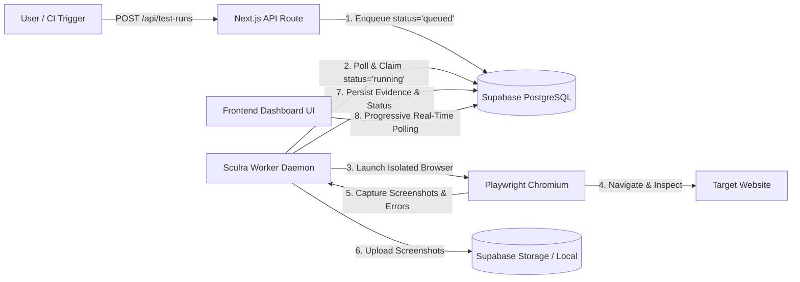

---

## 2. Test Execution Lifecycle & State Machine

A test run progresses through the following deterministic states:

```
[queued] ──> [running] ──> [passed]
    │             │
    └──> [cancelled] <──┘
                  │
                  └──> [failed]
```

1. **`queued`**: Created when a user clicks "Run Test" or triggers `POST /api/test-runs`.
2. **`running`**: Claimed atomically by the worker daemon (`UPDATE test_runs SET status = 'running' WHERE id = :id AND status = 'queued'`).
3. **`passed`**: Page navigation completed cleanly (HTTP status 200–399, DOM loaded, screenshot captured).
4. **`failed`**: Navigation timeout, DNS failure, server error (HTTP 5xx), or security validation rejection.
5. **`cancelled`**: User initiated cancellation before or during execution.

> **Release Readiness Scoring**: The engine deterministically computes `overall_score` (0–100), 5 category scores (functional, visual, responsive, reliability, coverage), blockers, risk levels, and confidence levels, persisting them to `public.release_scores` and updating `test_runs.overall_score`. See `docs/RELEASE_READINESS.md` for full details.

---

## 3. Worker Daemon CLI Commands

### Running the Worker Daemon
To start the continuous background worker polling daemon from the repository root:
```bash
pnpm worker
# or
pnpm --filter @sculra/worker start
```

### Running a Single Test Run
To execute a specific test run by ID and terminate immediately upon completion:
```bash
pnpm --filter @sculra/worker start <testRunId>
```

### Running Test Suites
```bash
# Run worker test suite including real Playwright browser tests
pnpm --filter @sculra/worker test

# Run all test suites across the monorepo
pnpm test
```

---

## 4. Environment Configuration

The worker reads standard environment variables from `.env` or system environment:

| Variable | Description | Default |
| :--- | :--- | :--- |
| `NEXT_PUBLIC_SUPABASE_URL` | Supabase project API URL | Required for DB sync |
| `SUPABASE_SERVICE_ROLE_KEY` | Supabase privileged service role key | Required for worker writes |
| `SCULRA_AI_PROVIDER` | AI QA provider implementation (`mock`, `openai`) | `mock` |
| `OPENAI_API_KEY` | OpenAI API Secret Key | Required if `SCULRA_AI_PROVIDER=openai` |
| `OPENAI_MODEL` | OpenAI Model ID for structured QA planning | `gpt-4o-mini` |
| `OPENAI_MAX_RETRIES` | Max retries for transient 429/5xx errors | `3` |
| `OPENAI_TIMEOUT_MS` | Per-request timeout limit in milliseconds | `30000` |
| `OPENAI_BASE_URL` | Optional custom base URL for OpenAI-compatible proxies | `undefined` |
| `WORKER_POLL_INTERVAL_MS` | Queue polling frequency in milliseconds | `2000` |
| `WORKER_CONCURRENCY` | Maximum concurrent browser executions | `1` |
| `TEST_BROWSER` | Playwright browser engine (`chromium`) | `chromium` |
| `TEST_NAVIGATION_TIMEOUT_MS` | Page load timeout limit in milliseconds | `15000` |
| `TEST_RUN_TIMEOUT_MS` | Maximum duration for an entire test job | `30000` |

---

## 5. Security & SSRF Protection

All target URLs undergo strict security validation in `shared/utils/security.ts` and `worker/src/security.ts` before browser launch:
- **Restricted Hosts**: Access to cloud metadata IPs (`169.254.169.254`, `metadata.google.internal`), private IPv4 subnets (`10.0.0.0/8`, `172.16.0.0/12`, `192.168.0.0/16`), and loopback addresses is blocked by default in production.
- **Protocol Enforcement**: Only `http:` and `https:` protocols are permitted. `file://`, `ftp://`, and `data://` schemes are rejected.
- **Port Allowlisting**: Traffic is restricted to standard web ports (80, 443, 8080, 8443, 3000, 5173).

---

## 6. Evidence Storage Abstraction

The storage layer (`worker/src/storage.ts`) implements `IEvidenceStorage`:
- **Supabase Storage Bucket**: When credentials and the `test-evidence` bucket are configured, screenshots are uploaded directly to Supabase Storage with public URLs.
- **Local Filesystem Fallback**: If Supabase Storage is unavailable, screenshots are safely saved to `.storage/evidence/<testRunId>/` for local development.
- **Structured Evidence Table (`public.test_evidence`)**: Records every captured artifact with type (`screenshot`, `console_error`, `network_error`, `navigation`, `application_map`, `journey_result`, `journey_step`, `action_trace`, `observation`), metadata, and timestamp.

---

## 7. Application Discovery Engine

The Application Discovery module (`worker/src/discovery.ts`) maps the structural surface of a target web application:
- **Same-Origin Crawling**: BFS queue respecting configurable bounds (`maxPages`, `maxDepth`, `maxLinksPerPage`, `maxElementsPerPage`).
- **Interactive Element Extraction**: Locates non-text actionable elements (buttons, links, form fields, select dropdowns, checkboxes).
- **Responsive Viewport Probing**: Captures screenshots across desktop (`1280x720`), tablet (`768x1024`), and mobile (`390x844`) layouts.
- **Resilient Selectors**: Computes robust CSS and semantic locators for every discovered interactable element.

---

## 8. Deterministic User Journey & Safe Interaction Engine

The User Journey Engine (`worker/src/journeys/`) systematically plans and executes safe user journeys across discovered applications:

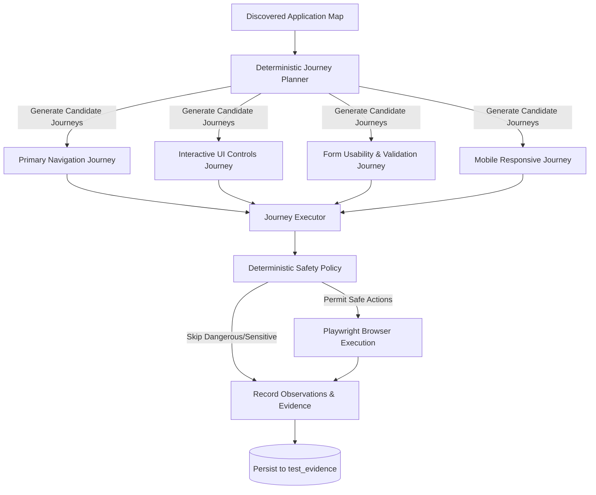

### Deterministic Safety Policy (`worker/src/journeys/safety.ts`)
- **Dangerous Action Filter**: Automatically skips destructive operations (deletion, permanent removal, account termination, log out / sign out, monetary payments / checkout, and external publishing / deployments).
- **Sensitive Field Filter**: Prevents synthetic data injection into sensitive fields (passwords, PINs, OTP tokens, API keys, secrets, credit card numbers, CVVs, SSNs, and bank accounts).
- **Deterministic Fixture Values**: Injects synthetic, non-sensitive fixtures (`sculra.test.fixture@example.com`, `Sculra Test User`, `Sculra QA`, etc.).

### Journey Types
1. **Primary Navigation**: Traverses internal routes, asserting HTTP status codes, page titles, and URL routing.
2. **Interactive UI Controls**: Clicks non-destructive buttons, accordions, and tabs to observe DOM mutations and detect no-ops (`CLICK_NO_OP`).
3. **Form Usability & Validation**: Evaluates form client constraints (`VALIDATE_FORM`), fills safe inputs, and records validation states.
4. **Responsive Viewport**: Executes workflows on mobile viewport (`390x844`) to observe usability on small screens.

---

## 9. Deterministic Functional Bug Detection & Issue Intelligence

> **Important Architecture Principle**: *This is deterministic bug detection, not AI reasoning.* All bug classifications, severity evaluations, and deduplication fingerprints are produced deterministically through rigorous rule sets without stochastic or non-deterministic LLM calls.

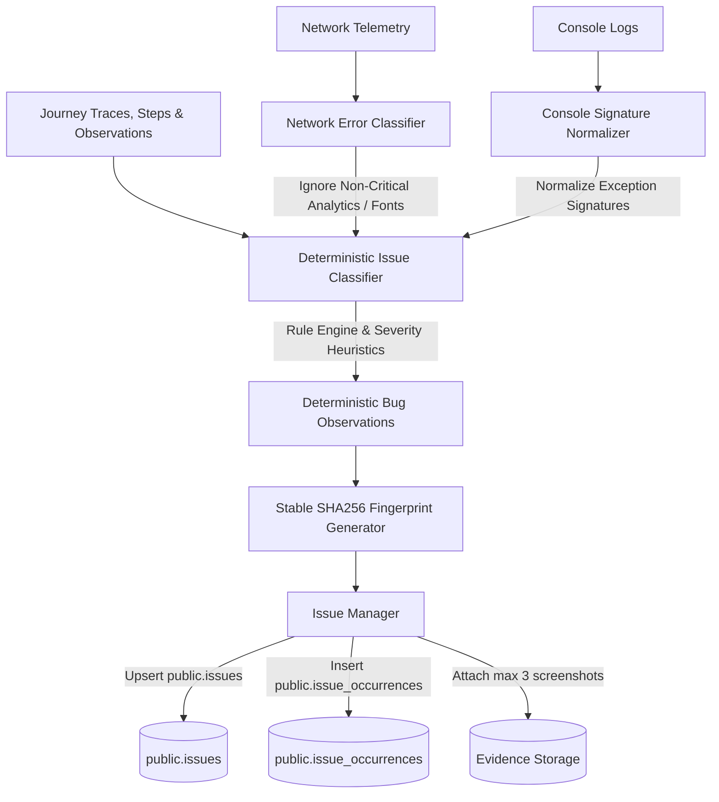

### Deterministic Bug Classification Categories
The issue classifier (`worker/src/issues/classifier.ts`) evaluates journey telemetry and categorizes findings into standardized bug types:
1. **`CRITICAL_API_FAILURE`**: Critical first-party backend HTTP 5xx errors and failed network operations directly triggered by user actions.
2. **`BROKEN_CONTROL`**: Interactive UI elements that produce no DOM changes, state mutations, or network effects (`CLICK_NO_OP`), or fail to respond to user gestures.
3. **`NAVIGATION_FAILURE`**: Broken internal links, 404/500 routing failures, navigation timeouts, or unexpected route redirects.
4. **`UNHANDLED_EXCEPTION`**: Uncaught JavaScript runtime errors or React framework crash boundary triggers during user workflows.
5. **`LAYOUT_DEFECT`**: Viewport clipping or severe element visual anomalies detected during responsive traversal.
6. **`FORM_VALIDATION_ERROR`**: Client-side constraint violations recorded for usability observations (distinguished as non-bug validation feedback vs submission failures).

### Severity Heuristics & Primary CTA Elevation
Severity is calculated deterministically based on error impact and element prominence:
- **`critical`**: Complete workflow blockers (runtime crashes, unhandled exceptions, internal server errors on primary navigation).
- **`high`**: Failures on primary calls-to-action (e.g. "Get Started Now", "Submit", "Sign Up", "Save") and critical API failures.
- **`medium`**: Broken secondary controls, non-critical navigation dead-ends, and 4xx client errors.
- **`low`**: Minor non-blocking UI anomalies and warnings.
- **`info`**: Expected form constraint validations and usability observations (does not count as a failing bug).

### Stable SHA256 Deduplication & Fingerprinting
To prevent issue duplication across multiple test runs or viewport sizes, issues are fingerprinted deterministically using:
```typescript
SHA256(`${projectId}:${normalizedUrl}:${bugType}:${action}:${normalizedSelector}:${normalizedErrorSignature}`)
```
- Query parameters are sanitized and volatile tokens (timestamps, random session IDs) are stripped.
- Selectors and error signatures are canonicalized.
- An issue recurrence increments `occurrence_count`, updates `last_seen_at`, and records a new entry in `public.issue_occurrences`.

### Issue Lifecycle & Status Preservation
- Existing `resolved` or `ignored` issues are **never** automatically reopened upon recurrence without explicit user configuration.
- The test run marks `status = 'failed'` if and only if one or more actionable functional bugs (`CRITICAL_API_FAILURE`, `BROKEN_CONTROL`, `NAVIGATION_FAILURE`, `UNHANDLED_EXCEPTION`) are detected.
- Each issue occurrence stores up to 3 bounded screenshot evidence references.

### Network and Console Telemetry Intelligence
- **Third-Party Noise Elimination**: Network errors from analytics providers (Google Analytics, PostHog, Segment, Sentry, Telemetry), missing favicons, and non-blocking font downloads are ignored by default.
- **Sensitive Data Redaction**: Query strings containing tokens, keys, passwords, or credentials are systematically redacted (`[REDACTED]`) before fingerprinting or persistence.

---

## 10. Deterministic Visual Regression & Responsive QA Engine

> **Important Architecture Principle**: *This is deterministic visual/responsive QA, not AI visual reasoning.* All geometry evaluations, overflow checks, overlap calculations, layout shift measurements, and pixel-level screenshot comparisons operate deterministically without stochastic LLM calls or simulated metrics.

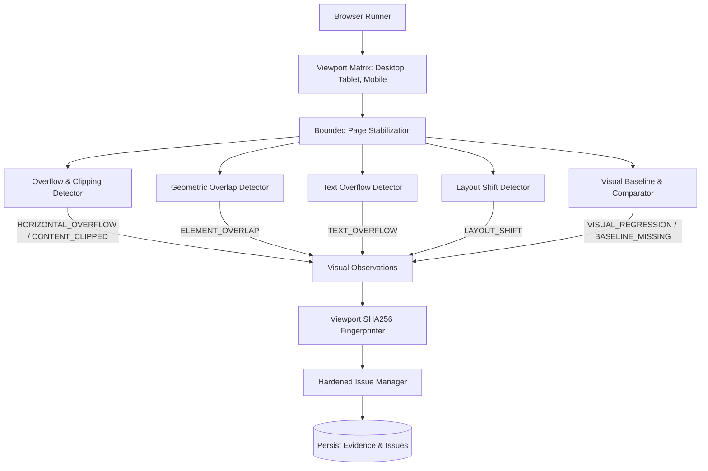

### Viewport Profile Matrix
The responsive engine evaluates applications across standard viewport profiles:
1. **Desktop**: `1440 × 900` (device scale 1x, widescreen desktop layout)
2. **Tablet**: `768 × 1024` (device scale 2x, touchscreen portrait layout)
3. **Mobile**: `390 × 844` (device scale 3x, touchscreen mobile layout with mobile user agent)

### Bounded Execution Limits
- `MAX_RESPONSIVE_PAGES = 10`
- `MAX_VIEWPORTS = 5`
- `MAX_SCREENSHOTS_PER_PAGE_PER_VIEWPORT = 2`
- `MAX_RESPONSIVE_EXECUTION_TIME = 120000` (120 seconds)

### Detection Capabilities & Heuristics
1. **Horizontal Layout Overflow (`HORIZONTAL_OVERFLOW`)**:
   - Compares `document.documentElement.scrollWidth` and `document.body.scrollWidth` against viewport width.
   - Identifies offending DOM elements via bounding boxes and computed styles.
   - **False-Positive Exclusion**: Excludes intentional scroll containers (`overflow-x: auto/scroll`, `.overflow-x-auto`, `[role="tablist"]`, `data-carousel`, `pre`, `code`), fixed overlays, and offscreen menus.
2. **Element Clipping (`CONTENT_CLIPPED`)**:
   - Detects interactive buttons, inputs, and links extending outside parent containers with `overflow: hidden`.
3. **Element Overlap (`ELEMENT_OVERLAP`)**:
   - Calculates rectangle intersections between visible interactive candidates.
   - Ignores parent/child containment, badges in cards, icons in buttons, and active modals.
   - Flags significant overlap ($\ge 20\%$ area or $\ge 150\text{px}^2$) between unrelated interactive elements.
4. **Text Truncation Overflow (`TEXT_OVERFLOW`)**:
   - Detects text elements where `scrollWidth > clientWidth` without `text-overflow: ellipsis`.
5. **Layout Shift After Interaction (`LAYOUT_SHIFT`)**:
   - Measures displacement $(\Delta x, \Delta y)$ of stable elements before vs after a journey interaction.
   - Flags unexpected layout movements $\ge 40\text{px}$.

### Visual Baseline & Pixel-by-Pixel Image Comparison
- **Deterministic Comparison**: Uses pure pixel color distance $\Delta E = \max(|r_1-r_2|, |g_1-g_2|, |b_1-b_2|, |a_1-a_2|)$.
- **Dimension Matching**: Asserts dimension equality ($W_1 = W_2, H_1 = H_2$). Returns `DIMENSION_MISMATCH` if dimensions differ.
- **Configurable Thresholds**:
  - $< 0.1\%$ difference $\rightarrow$ `PASS`
  - $0.1\% - 1\%$ difference $\rightarrow$ `INFO` (review)
  - $1\% - 5\%$ difference $\rightarrow$ `MEDIUM` visual regression
  - $> 5\%$ difference $\rightarrow$ `HIGH` visual regression
- **Baseline Missing Behavior**: If no baseline exists for a target page and viewport, records `BASELINE_MISSING` (severity `info`), stores the snapshot, and does **not** create a visual regression bug.

### IssueManager Concurrency Hardening
- Concurrent issue creation is hardened against race conditions using the PostgreSQL unique constraint on `(project_id, fingerprint)`.
- If two workers insert the same fingerprint simultaneously, the duplicate key violation is caught gracefully, the existing issue is retrieved, its `occurrence_count` is incremented, and an entry is recorded in `public.issue_occurrences`.
- Two simultaneous runs result in **1 issue** and **2 occurrences** with zero lost data.

---

## 11. Provider-Agnostic AI QA Orchestration Foundation

> **Critical Architectural Guarantee**: *The AI never directly controls Playwright.* The AI operates strictly as a structured planner and reasoner that produces a typed, validatable plan (`AIQAPlan`). The existing deterministic `JourneyExecutor` remains the sole browser actuator.

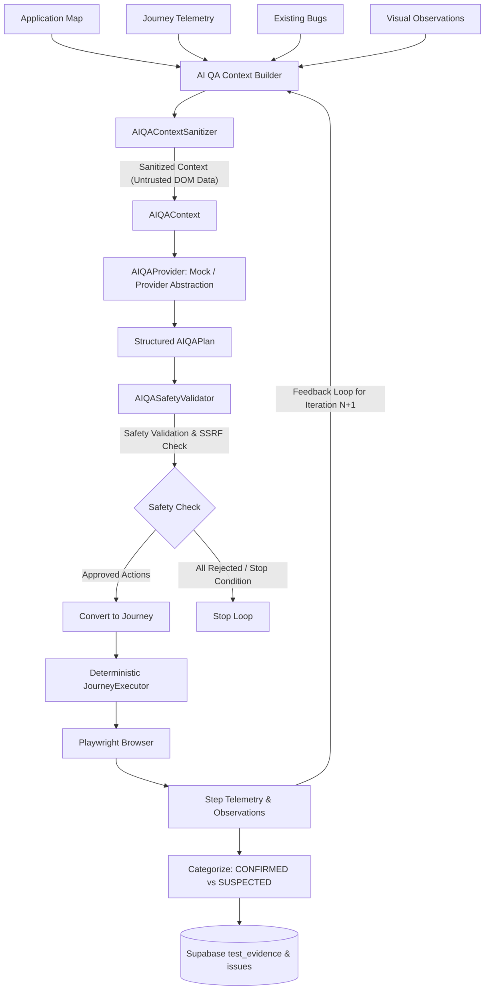

### Core Components
1. **Provider Abstraction & Production Providers (`worker/src/ai-qa/`)**:
   - Strongly-typed, provider-agnostic interface enabling modular model backends.
   - `MockAIQAProvider`: Deterministic offline provider for fast unit tests, regression suites, and CI/CD without API keys.
   - `OpenAIQAProvider`: Production provider using OpenAI's Structured Outputs API (`json_schema` response format) with strict JSON schema compliance.
   - Factory pattern (`createAIQAProvider`) enabling zero-code runtime switching via `SCULRA_AI_PROVIDER=openai|mock`.
2. **Adaptive State Management & Coverage Engine (`AIQAStateManager`)**:
   - Tracks evolving state across iterations: tested routes, interactions, forms, and navigation paths.
   - Discovers uncovered high-value targets (unvisited pages, unexercised forms, primary CTAs).
   - Manages bounded hypothesis lifecycles (`PENDING` $\rightarrow$ `TESTING` $\rightarrow$ `CONFIRMED` / `DISPROVEN` / `INCONCLUSIVE`).
   - Computes deterministic coverage integer counts (no fake percentages).
3. **Context Sanitization & Prompt Injection Defense (`AIQAContextSanitizer`)**:
   - Treats all browser DOM text, titles, button labels, form labels, and errors as **untrusted data**.
   - Redacts JWTs, bearer tokens, API keys, passwords, and private credentials.
   - Quarantines prompt injection patterns (e.g. `Ignore previous instructions...`) to prevent malicious page content from redefining safety rules or budgets.
   - Uses strict system prompt delimiters (`=== TRUSTED QA SYSTEM INSTRUCTIONS ===` and `=== UNTRUSTED APPLICATION EVIDENCE ===`).
4. **Strict Safety Validator (`AIQASafetyValidator`)**:
   - Validates allowlisted action vocabulary: `NAVIGATE`, `CLICK`, `FILL`, `SELECT`, `CHECK`, `UNCHECK`, `PRESS`, `WAIT_FOR_NAVIGATION`, `ASSERT_VISIBLE`, `ASSERT_URL`, `ASSERT_TITLE`, `VALIDATE_FORM`.
   - Enforces SSRF and scope boundaries: blocks cross-origin navigations, loopback addresses, and cloud metadata endpoints.
   - Blocks dangerous operations: `delete`, `checkout`, `cancel subscription`, `logout`, etc.
   - Blocks sensitive fields: passwords, payment cards, SSNs, OTPs.
5. **Bounded Budgets & Adaptive Feedback Loops (`AIQABudgetTracker`)**:
   - Enforces configurable bounds: `MAX_AI_ITERATIONS = 3`, `MAX_AI_CALLS = 5`, `MAX_TOTAL_ACTIONS = 30`, `MAX_AI_TIME_MS = 60000`.
   - Feeds state summaries, recent observations, and failures from Iteration $N$ into the context for Iteration $N+1$.
6. **Issue Intelligence & Evidence Integration**:
   - Distinguishes `CONFIRMED` defects (directly verified by deterministic failure/observation) from `SUSPECTED` anomalies.
   - Persists `ai_qa_plan`, `ai_qa_result`, `ai_qa_state_summary`, and `ai_qa_stop` evidence rows into `public.test_evidence`.
7. **Autonomous Strategy & Prioritization Engine (`worker/src/strategy/`)**:
   - Synthesizes candidate targets (`PAGE`, `BUTTON`, `FORM`, `PREVIOUS_FAILURE`, `RESPONSIVE_VIEW`) across discovery, telemetry, and hypotheses.
   - Deterministically evaluates optimal strategy modes: `FAILURE_DRIVEN`, `DEPTH_FIRST`, `RELEASE_GAP`, `REGRESSION_FOCUSED`, `BREADTH_FIRST`.
   - Computes bounded deterministic priority scores (`0–100`) with human-readable explanations.
   - Enriches selection with OpenAI/Mock strategy reasoning (`analyzeTestStrategy`) and guarantees AI cannot invent arbitrary target IDs.
---

## 12. AI Product Understanding & Business-Critical Workflow Discovery Engine

> **Important Architecture Principle**: *The system elevates raw URLs and selectors into a structured Product Model.* The engine understands what the application is (SaaS, marketplace, CRM, etc.), categorizes pages semantically, discovers product features and personas, infers business-critical workflows, scores criticality deterministically (0–100), and traces failure impact across the product graph.

```mermaid
flowchart TD
    Discovery[Application Discovery & Telemetry] --> Extractor[ProductEvidenceExtractor]
    Extractor --> Classifier[SemanticPageClassifier]
    Extractor --> Features[FeatureDiscoveryEngine]
    Extractor --> Roles[RoleDiscoveryEngine]
    Extractor --> Workflows[WorkflowDiscoveryEngine]
    
    Classifier & Features & Roles & Workflows --> Graph[ProductGraph & Impact Tracer]
    Graph --> Criticality[BusinessCriticalityEvaluator]
    
    Criticality --> AIAdvisor[ProductAnalyzer: OpenAI / Mock]
    AIAdvisor --> Validator[ProductModelValidator & Hallucination Filter]
    Validator --> Builder[ProductModelBuilder]
    
    Builder --> Model[(ProductModel)]
    Builder --> Coverage[(CoverageAgainstProductModel)]
    
    Model --> Strategy[Test Strategy Prioritization (+Criticality Boost)]
    Model --> Impact[Failure Impact Tracing (Issues)]
    Model --> Readiness[Release Readiness Blocker Evaluation]
    Model --> Evidence[(test_evidence: product_model, product_workflow)]
```

### Core Components (`worker/src/product/`)
1. **Product Evidence Extractor (`evidence.ts`)**:
   - Compiles grounded, sanitized route summaries, navigation topology, forms, actions, and headings from discovery and journey telemetry.
   - Redacts all query parameters and secrets.
2. **Semantic Page Classifier (`classifier.ts`)**:
   - Categorizes routes deterministically into standardized semantics: `LANDING`, `AUTH`, `DASHBOARD`, `SETTINGS`, `PROFILE`, `BILLING`, `ONBOARDING`, `DOCUMENTATION`, `CHECKOUT`, `CART`, `PRODUCT_LIST`, `PRODUCT_DETAIL`, `ADMIN`, `CRUD`, `MESSAGING`, `SEARCH`, `UNKNOWN`.
   - Distinguishes authenticated vs public routes.
3. **Feature & Role Discovery Engines (`features.ts`, `roles.ts`)**:
   - `FeatureDiscoveryEngine`: Groups related routes, interactive controls, and capabilities into cohesive product features (e.g. "Authentication & Identity", "Billing & Subscriptions").
   - `RoleDiscoveryEngine`: Discovers personas (`VISITOR`, `MEMBER`, `ADMIN`, `CUSTOMER`, `SUPERADMIN`) from observed navigation, admin controls, and team invite elements.
4. **Business-Critical Workflow Discovery Engine (`workflows.ts`)**:
   - Identifies multi-step user goals (e.g. "User Registration & Onboarding", "Subscription Upgrade", "Item Checkout") with explicit entry points, ordered step sequences, and terminal success criteria.
   - Tracks execution status (`NOT_TESTED`, `PARTIALLY_TESTED`, `FULLY_TESTED`, `FAILED`, `BLOCKED`) and lifecycle status (`HYPOTHESIZED`, `INFERRED`, `CONFIRMED`).
5. **Deterministic Criticality Scoring (`criticality.ts`)**:
   - Computes integer scores (0–100) and tiers (`CRITICAL`, `HIGH`, `MEDIUM`, `LOW`) based on revenue/payment paths (+35), auth/identity boundaries (+30), core data creation/mutation (+20), and downstream dependency fan-out (+15).
   - Generates transparent, human-readable explanations (`reasons: string[]`) for every score.
6. **Product Graph & Failure Impact Tracing (`graph.ts`)**:
   - Constructs directed relationships (`CONTAINS`, `DEPENDS_ON`, `WORKFLOW_STEP`, `ACCESSIBLE_BY`, `MUTATES`, `AUTHENTICATES`).
   - `traceFailureImpact(pageUrl, selector?)`: Traces which workflows, features, and user roles are directly or transitively degraded when a defect occurs on a specific route.
7. **Advisory AI Model Integration (`analyzer.ts`, `schema.ts`)**:
   - Structured Outputs schema (`AI_PRODUCT_UNDERSTANDING_JSON_SCHEMA`) enabling OpenAI to recommend application profile, features, workflows, and missing high-priority journeys.
   - Strict hallucination filters strip any suggested route or step not present in the discovered application.
8. **Integrations Across the Testing Engine**:
   - **Test Strategy Engine**: Enriches candidate targets with workflow criticality multipliers (+20 bonus for `CRITICAL` workflows).
   - **Release Readiness Engine**: Flags failures in business-critical workflows as hard blockers with risk escalation.
   - **Persistence & UI**: Stores `product_model` and `product_workflow` in `public.test_evidence` and renders the rich **Product Understanding** dashboard tab on `/test-runs/[testRunId]`.

---

## 13. Authenticated & Role-Based QA Foundation (MVP)

> **Important Architecture & Security Principle**: *Zero Credential Exposure.* Passwords, API tokens, session cookies, and authorization headers exist strictly in volatile memory during form login execution and are **never** passed to AI providers, stored in `test_evidence`, recorded in `issues`, or emitted in logs.
>
> > [!NOTE]
> > `EnvironmentSecretProvider` is an MVP/local configuration mechanism, not a production secret vault. Production enterprise deployments should integrate with hardened secret management systems (e.g., AWS Secrets Manager, HashiCorp Vault, Azure Key Vault).

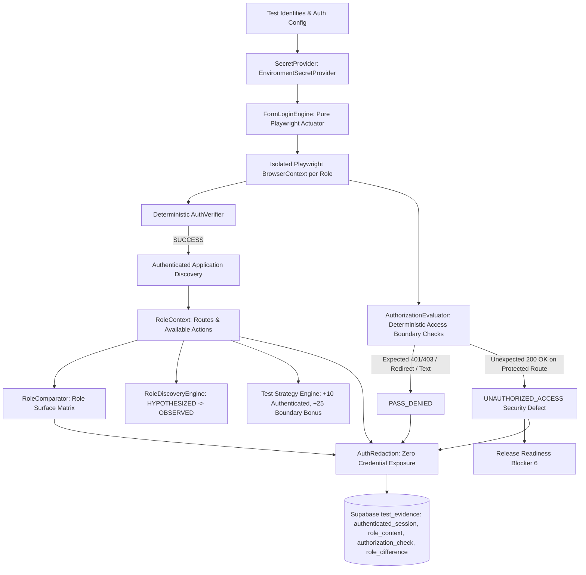

### Core Components (`worker/src/auth/`)
1. **Secret Management (`secrets.ts`)**:
   - `SecretProvider`: Interface resolving secret references (`env:VAR_NAME` or `raw:VALUE`) in memory.
   - `EnvironmentSecretProvider`: Retrieves credentials from system environment variables without writing to disk or logs.
2. **Zero Credential Exposure & Redaction Engine (`redaction.ts`)**:
   - Redacts passwords, API keys, tokens, session cookies, and authorization headers from strings, nested objects, and telemetry.
   - Strips sensitive query parameters from URLs and replaces values with `[REDACTED]`.
3. **Deterministic Form Login Engine (`form-login.ts`, `verifier.ts`)**:
   - `FormLoginEngine`: Identifies login forms using semantic selectors (`input[type="email"]`, `input[type="password"]`, `button[type="submit"]`), injects credentials in memory, and submits.
   - `AuthVerifier`: Confirms successful session establishment by verifying URL transition away from login, disappearance of password field, emergence of authenticated UI elements (avatar, user menu, dashboard links), and presence of session cookies.
4. **Session Isolation via Playwright `BrowserContext`**:
   - Each test identity (`ADMIN`, `MEMBER`, etc.) executes in a clean, isolated `BrowserContext`.
   - Storage state, cookies, and localStorage are completely partitioned between identities to prevent session cross-contamination.
5. **Role Discovery & Product Model Promotion (`worker/src/product/roles.ts`)**:
   - Discovered role contexts populate observed routes and accessible actions into the `ProductModel`.
   - Inferred roles are promoted from `HYPOTHESIZED` to `OBSERVED` with 100% confidence.
6. **Deterministic Authorization Evaluation (`authorization.ts`)**:
   - `AuthorizationEvaluator`: Tests role access boundaries on protected routes against explicit rules (`ALLOW`, `DENY_401_403`, `DENY_REDIRECT`, `DENY_ACCESS_TEXT`).
   - Flags `UNAUTHORIZED_ACCESS` if a non-privileged identity successfully accesses a protected endpoint without expected access denial.
7. **Role Surface Comparison Matrix (`comparator.ts`)**:
   - `RoleComparator`: Computes set differences between role surfaces, identifying role-exclusive routes (e.g., admin panels) and common shared surfaces.
8. **Strategy & Release Readiness Integrations**:
   - `Prioritizer`: Applies deterministic priority bonuses (+10 for authenticated targets, +25 for authorization boundaries).
   - `ReleaseReadiness`: Implements Blocker 6 (`UNAUTHORIZED_ACCESS: Critical security access boundary violation detected`).
   - `test_evidence`: Persists `authenticated_session`, `role_context`, `authorization_check`, `role_difference`, and `unauthorized_access` evidence rows with zero credentials.

## 14. API & Backend Autonomous QA Architecture (Prompt 24)

Sculra incorporates a deterministic, bounded API QA engine designed to discover backend API endpoints, execute safe HTTP tests, validate response contracts and JSON schemas, enforce role-based API authorization boundaries, and feed API coverage and reliability metrics directly into the Strategy Engine, Product Model, and Release Readiness scoring.

> [!NOTE]
> **MVP Scope & Limitation Disclaimer**:
> This milestone is an API QA foundation, not a complete API security scanner. Automated execution is restricted to safe idempotent methods (`GET`, `HEAD`, `OPTIONS`) by default. Data mutating methods (`POST`, `PUT`, `PATCH`, `DELETE`) require explicit safe test configuration.

### Architecture & Conceptual Flow

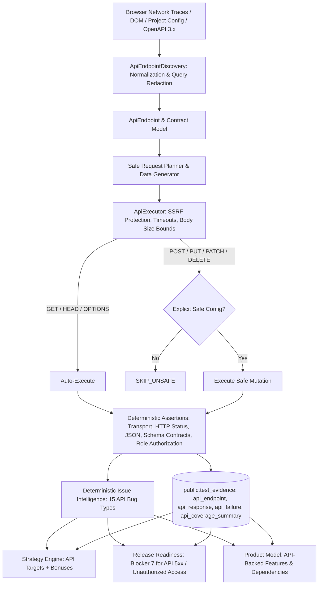

### Core Components (`worker/src/api-qa/`)

1. **Endpoint Normalization & Secret Redaction (`normalizer.ts`)**:
   - Strips sensitive query parameter values (`token`, `access_token`, `refresh_token`, `api_key`, `apikey`, `key`, `secret`, `password`, `otp`, `code`, `authorization`, `session`, `cookie`, `jwt`) with `[REDACTED]`.
   - Normalizes path placeholders (`/api/projects/123` -> `/api/projects/{id}`).
2. **Bounded OpenAPI 3.x Parser (`openapi.ts`)**:
   - Parses bounded OpenAPI 3.x documents (max document size 2MB, max endpoints 200, max schema depth 8).
   - Validates document URL against SSRF protections and re-validates redirect destinations.
   - Malformed OpenAPI documents produce deterministic `API_CONFIGURATION_ERROR` evidence without crashing the worker.
3. **Deterministic Safe Request Data Generator (`generator.ts`)**:
   - Generates deterministic sample data for required parameters/schemas (string -> `"sculra-test"`, numbers -> min valid, booleans -> `false`).
   - Never generates real credentials, payment info, PII, or destructive identifiers.
4. **Safe HTTP Executor (`executor.ts`)**:
   - Executes HTTP requests with bounded timeout (default 10s), bounded response size (default 1MB), bounded body size (default 256KB), and bounded redirects (default 3 hops).
   - Enforces strict SSRF protections and re-validates each redirect destination.
   - Blocks mutating HTTP methods (`POST`, `PUT`, `PATCH`, `DELETE`) unless explicitly configured with `safeToExecute: true`.
   - Blocks destructive keywords (`delete`, `logout`, `payment`, `purchase`, `transfer`, `withdraw`, `cancel`, `subscription`, `bulk`, etc.).
   - Injects credentials in-memory only; strictly scrubs sensitive response headers (`Set-Cookie`, `Authorization`, `x-api-key`) from evidence and logs.
5. **Deterministic Assertions & Contract Validation (`assertions.ts`)**:
   - Transport assertions: detects timeouts (`API_TIMEOUT`) and network/DNS failures (`API_NETWORK_FAILURE`).
   - HTTP status assertions: detects 5xx server crashes (`API_HTTP_5XX`), client errors (`API_HTTP_4XX`), and unexpected redirects (`API_UNEXPECTED_REDIRECT`).
   - Content integrity assertions: verifies JSON syntax (`API_INVALID_JSON`) and content type matches (`API_CONTENT_TYPE_MISMATCH`).
   - OpenAPI contract assertions: verifies required fields presence (`API_REQUIRED_FIELD_MISSING`) and data types (`API_SCHEMA_VIOLATION`).
6. **Role-Based API Authorization Evaluator (`authorization.ts`)**:
   - Tests role boundaries against protected API endpoints.
   - Validates privileged access (ADMIN -> 200) vs unprivileged access (MEMBER -> 401/403).
   - Detects `API_UNEXPECTED_AUTHORIZED_ACCESS` when an unauthorized role accesses a restricted endpoint.
7. **Strategy & Release Readiness Integrations**:
   - Strategy Prioritizer: Adds target types (`API_ENDPOINT`, `API_AUTHORIZATION`, `API_CONTRACT`, `API_FAILURE`, `API_REGRESSION`) with priority bonuses.
   - Release Readiness: Adds Blocker 7 (`Critical API 5xx Server Error` and `API_UNEXPECTED_AUTHORIZED_ACCESS`).
   - Product Model: Links API endpoints to features and workflow dependencies as `OBSERVED` or `HYPOTHESIZED`.

## 15. Security & Authorization Autonomous QA Architecture (Prompt 25)

Sculra provides a deterministic, bounded Security and Authorization QA foundation designed to safely identify common application security weaknesses, missing defensive controls, insecure transport policies, secret exposures, and authorization boundary failures across web applications and backend APIs.

> [!CAUTION]
> **Strict Non-Penetration Testing Scope Boundary**:
> Sculra is a defensive QA and release readiness platform, **NOT** an unrestricted penetration testing tool, exploit framework, or offensive vulnerability scanner.
>
> **What Sculra DOES:**
> - Evaluates defensive security headers (`CSP`, `X-Content-Type-Options`, `HSTS`, `X-Frame-Options`, `Referrer-Policy`).
> - Checks cookie security flags (`HttpOnly`, `Secure`, `SameSite`) with zero value leakage.
> - Evaluates CORS policies for wildcard credentials and reflected origins.
> - Tests for open redirect weaknesses using safe, bounded sentinel parameters.
> - Scans response bodies for exposed secrets, API keys, and private tokens with automatic in-place redaction.
> - Tests authorization boundaries and role separation deterministically (`ANONYMOUS`, `MEMBER`, `ADMIN`).
> - Produces reproducible, evidence-backed security findings and feeds release blockers into Release Readiness.
>
> **What Sculra DOES NOT DO:**
> - Does NOT exploit real systems, bypass authentication through exploitation, or attempt credential stuffing.
> - Does NOT execute brute-force attacks or dictionary attacks against login forms.
> - Does NOT run arbitrary malicious JavaScript payloads (e.g. offensive XSS payloads) against live applications.
> - Does NOT fuzz random internet endpoints or attack out-of-scope external domains.
> - Does NOT attempt Denial of Service (DoS), resource exhaustion, or distributed attacks.
> - Does NOT mutate production database records without explicit user confirmation.

### Zero Credential Exposure Principle

Passwords, tokens, API keys, session cookies, and authorization headers exist strictly in memory during execution.
- All response headers (`Set-Cookie`, `Authorization`, `x-api-key`) are scrubbed before storage.
- All response body tokens matching secret patterns are masked in-place (`AKIA[MASKED]`, `sk_live_[MASKED]`, `eyJ[MASKED]`).
- Telemetry, logs, database evidence rows (`public.test_evidence`), AI context prompts, and frontend UI components receive only masked, safe diagnostic excerpts.

### Architecture & Security Workflow

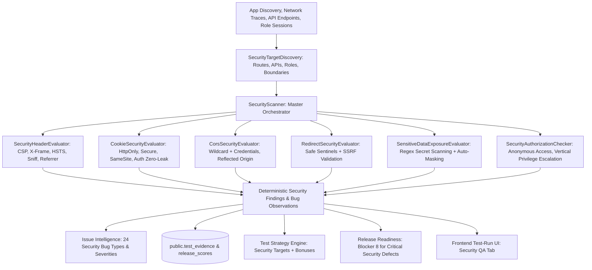

### Core Security Components (`worker/src/security/`)

1. **Deterministic Security Target Discovery (`discovery.ts`)**:
   - Extracts security targets (`PAGE`, `API`, `AUTH_ROUTE`, `HEADER_TARGET`, `COOKIE_TARGET`, `CORS_TARGET`, `REDIRECT_TARGET`, `SENSITIVE_DATA_TARGET`) from `ApplicationMap`, `ApiEndpoint[]`, `RoleContext[]`, and `AuthenticatedSession[]`.
2. **Security Header Evaluator (`headers.ts`)**:
   - Assesses response headers against standard defensive requirements (`Content-Security-Policy`, `X-Content-Type-Options: nosniff`, `Strict-Transport-Security`, `X-Frame-Options`, `Referrer-Policy`).
   - Flags missing or insecure header policies (`SECURITY_HEADER_MISSING`, `SECURITY_HEADER_WEAK`).
3. **Cookie Security Evaluator (`cookies.ts`)**:
   - Inspects `Set-Cookie` directives from HTTP responses.
   - Asserts `HttpOnly` on authentication and session cookies, `Secure` on HTTPS connections, and `SameSite` flags.
   - Zero-leak guarantee: Cookie values are never logged or stored.
4. **CORS Misconfiguration Evaluator (`cors.ts`)**:
   - Evaluates cross-origin resource sharing policies.
   - Flags `Access-Control-Allow-Origin: *` combined with `Access-Control-Allow-Credentials: true`.
   - Flags reflection of untrusted request `Origin` headers into `Access-Control-Allow-Origin`.
5. **Open Redirect Evaluator (`redirects.ts`)**:
   - Evaluates redirect parameters (`redirect_to`, `next`, `url`, `return_to`, `target`) using safe internal and external test sentinels.
   - Validates that redirect locations do not navigate to untrusted domains without validation.
6. **Sensitive Data & Secret Exposure Evaluator (`exposure.ts`)**:
   - Deterministically scans HTTP response bodies for exposed credentials (AWS access keys, Stripe secret keys, GitHub PATs, JWT tokens, RSA/EC private keys, database connection strings, plain-text passwords).
   - Enforces aggressive in-place masking before any evidence or finding is produced.
7. **Security Authorization & Privilege Escalation Checker (`authorization.ts`)**:
   - Tests unauthenticated access to protected administrative and member routes.
   - Evaluates vertical privilege escalation (MEMBER role accessing ADMIN endpoints).
8. **Master Security Scanner (`scanner.ts`)**:
   - Orchestrates bounded execution across all security targets.
   - Computes deterministic `SecurityCoverageSummary` and produces standardized `SecurityFinding[]` and `BugObservation[]`.
9. **Strategy, Release Readiness, and Evidence Integrations**:
   - Strategy Prioritizer: Adds security target types with deterministic priority rankings.
   - Release Readiness: Adds Blocker 8 for critical security defects (`AUTHENTICATION_BYPASS`, `PRIVILEGE_ESCALATION`, `SECRET_EXPOSURE`, `TOKEN_EXPOSURE`, `PUBLICLY_ACCESSIBLE_PROTECTED_API`, `PUBLICLY_ACCESSIBLE_PROTECTED_ROUTE`).
   - Test Evidence: Persists `security_summary` and `security_finding` rows.
   - UI: Renders a dedicated **Security QA** dashboard tab with metric cards, findings breakdown, and defensive remediation guidance.

## 16. Performance & Reliability Autonomous QA Engine (Prompt 26)

Sculra incorporates a production-oriented, deterministic Performance & Reliability Autonomous QA Engine. It measures real browser navigation timings, Core Web Vitals, asset payload weights, single-session safe action latencies, API response responsiveness, and multi-run page load reliability under authentic QA conditions.

> [!IMPORTANT]
> **Strict Non-Destructive QA Scope Boundaries**:
> 
> 1. **Zero Synthetic Load**:
>    Sculra is **NOT** a stress testing, load generation, or DoS tool. It measures realistic single-session user interactions, sequential navigation, and single-flight API requests without flooding target servers.
> 
> 2. **Zero Metric Fabrication**:
>    Missing, unsupported, or unobserved metrics are explicitly recorded with statuses (`measured`, `unavailable`, `unsupported`, `invalid`). Missing metrics are NEVER coerced to zero, guessed, or hallucinated by AI.
> 
> 3. **Zero Credential Exposure**:
>    All cookies, tokens, `Authorization` headers, and sensitive query parameters (`token`, `secret`, `key`, `password`, `jwt`) are redacted in-place before storage or telemetry capture.
> 
> 4. **Explicit Baselines**:
>    Metrics are compared only against compatible dimensions (same project, target path, HTTP method, viewport, and authenticated role). If no historical baseline exists, Sculra reports `BASELINE_MISSING` and establishes a baseline rather than generating false regressions.
> 
> 5. **Release Blocker 9**:
>    Severe performance regressions ($\ge 15\%$ on business-critical workflows or $\ge 25\%$ overall) or repeated unrecoverable timeouts trigger **Release Blocker 9**, capping release readiness at $\le 59$ and issuing `DO_NOT_RELEASE`.

### Architecture & Telemetry Pipeline

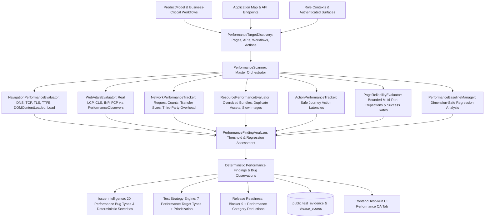

### Core Components (`worker/src/performance/`)

1. **Types & Policy (`types.ts`, `policy.ts`)**:
   - Comprehensive TypeScript models (`PerformanceTarget`, `PerformanceMetricValue`, `NavigationPerformance`, `WebVitalMeasurement`, `ResourceMeasurement`, `NetworkMeasurement`, `ActionPerformance`, `ReliabilityMeasurement`, `PerformanceBaseline`, `PerformanceRegression`, `PerformanceFinding`, `PerformanceCoverageSummary`, `PerformanceScanResult`).
   - Configurable `DEFAULT_PERFORMANCE_POLICY` defining thresholds for TTFB (800ms / 1800ms), FCP (1800ms / 3000ms), LCP (2500ms / 4000ms), CLS (0.1 / 0.25), INP (200ms / 500ms), PageLoad (3000ms / 6000ms), API duration (500ms / 2000ms), max resource sizes (JS 400KB, CSS 150KB, Image 800KB), and regression percentages (25% standard, 15% critical workflow).
2. **Deterministic Performance Target Discovery (`discovery.ts`)**:
   - Collects performance targets from `ProductModel` business-critical workflows, `RoleContext` authenticated surfaces, `ApplicationMap` pages, and `ApiEndpoint` models.
3. **Navigation Performance Evaluator (`navigation.ts`)**:
   - Reads real browser Navigation Timing API entries (`window.performance.getEntriesByType('navigation')`).
   - Calculates DNS duration, connect duration, TTFB, download duration, DOMContentLoaded, loadEvent, first paint, and transferred bytes.
4. **Core Web Vitals Evaluator (`web-vitals.ts`)**:
   - Measures real browser Core Web Vitals (LCP, CLS, INP) and supporting metrics (FCP, TTFB) via in-browser `PerformanceObserver`s with explicit rating badges.
5. **Network Performance Tracker (`network.ts`)**:
   - Instruments Playwright network events to track request counts, failed requests, slow requests, and payload transfers with zero-leak sensitive query and header redactions.
6. **Resource Performance Evaluator (`resources.ts`)**:
   - Audits loaded assets (scripts, stylesheets, images, fonts) to identify oversized bundles, slow downloads, duplicate asset requests, and broken resources.
7. **Action Performance Tracker (`actions.ts`)**:
   - Measures execution durations and triggered network activity for safe user journey interactions without recording sensitive form input values.
8. **Page Reliability Evaluator (`reliability.ts`)**:
   - Evaluates multi-run page consistency across bounded repetitions (max 3) to detect intermittent failures, unhandled runtime exceptions, and flake rates.
9. **Performance Baseline Manager (`baseline.ts`)**:
   - Constructs composite dimensional target keys (`type:method:path:viewport:role`) and compares current telemetry against historical baselines.
10. **Performance Finding & Issue Analyzer (`analyzer.ts`)**:
    - Translates raw metric measurements, threshold violations, and regressions into deterministic `PerformanceFinding`s and `BugObservation`s with unique SHA-256 fingerprints.
11. **Master Performance Scanner (`scanner.ts`)**:
    - Orchestrates target discovery, browser probes, API latency evaluations, reliability checks, and coverage summaries.
12. **Issue Intelligence & Strategy Integrations**:
    - Added 20 performance bug types to `BugType` and mapped to deterministic severities.
    - Added 7 performance target types to `TestTargetType` with prioritization bonuses.
13. **Release Readiness & Blocker 9 (`release/scorer.ts`)**:
    - Computes dedicated `scores.performance` and `breakdown.performance`.
    - Enforces **Blocker 9** for critical regressions ($\ge 15\%$) or unrecoverable latency failures on business-critical flows, capping overall release score at $\le 59$ with `DO_NOT_RELEASE`.
14. **Evidence Persistence & Frontend UI**:
    - Persists `performance_summary` and `performance_finding` rows to `public.test_evidence`.
    - Renders a dedicated **Performance QA** tab in the test run dashboard displaying scorecards, Core Web Vitals, latency breakdowns, and actionable remediation guidance.

---

## 16. Accessibility & Inclusive UX Autonomous QA Engine

Sculra includes an autonomous Accessibility & Inclusive UX QA engine designed to evaluate web applications for digital accessibility, barrier-free usability, and inclusive design standards. The engine operates on the 4 WCAG Principles (Perceivable, Operable, Understandable, Robust) under deterministic, evidence-grounded rules.

### Core Non-Destructive Principles

> 1. **Deterministic WCAG-Oriented Checks**:
>    Evaluations inspect real DOM properties, computed styles, ARIA trees, and active keyboard navigation paths rather than statistical guesses.
> 
> 2. **Zero Fake Scores**:
>    Missing or unmeasured accessibility assessments are explicitly represented as `undefined` (rendered as `--`). Genuine score 0 remains 0. Perfect 100/100 scores are never fabricated.
> 
> 3. **Grounded Deterministic Findings**:
>    Every reported issue contains exact DOM selectors, HTML snippets, observed computed properties, expected guidelines, and WCAG success criteria. AI is strictly bounded to summarizing deterministic findings.
> 
> 4. **Multi-Viewport Responsive Evaluation**:
>    Touch target dimensions ($\ge 24\text{px} \times 24\text{px}$ standard, $\ge 44\text{px} \times 44\text{px}$ enhanced) and 200% text reflow clipping are validated across Desktop (`1280x720`), Tablet (`768x1024`), and Mobile (`390x844`) viewports.
> 
> 5. **Standard WCAG Terminology**:
>    Findings reference specific WCAG 2.1/2.2 Success Criteria without asserting unverified legal compliance guarantees.
> 
> 6. **Release Blocker 10**:
>    Critical accessibility defects (unrecoverable keyboard traps, missing form control labels on business-critical workflows, broken modal focus traps, severe contrast failures) trigger **Release Blocker 10**, capping the overall release readiness score at $\le 59$ and issuing `DO_NOT_RELEASE`.

### Architecture & Evaluation Pipeline

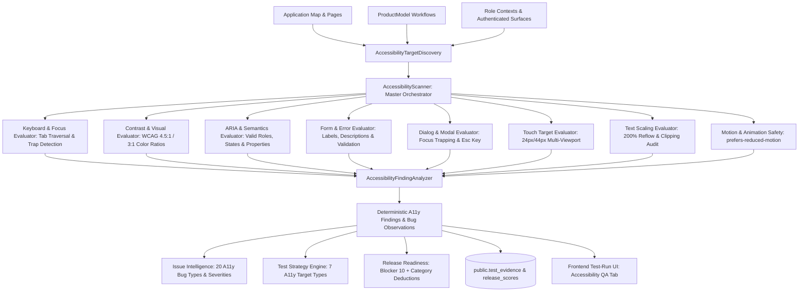

### Core Components (`worker/src/accessibility/`)

1. **Types & Policy (`types.ts`, `policy.ts`)**:
   - TypeScript definitions for `AccessibilityTarget`, `AccessibilityFinding`, `AccessibilityScanResult`, `AccessibilityCoverageSummary`, and `AccessibilityPolicy`.
   - Default policy enforces WCAG 2.1 AA thresholds (contrast 4.5:1 normal text, 3:1 large text, 24px minimum touch target, 200% text reflow zoom).
2. **Deterministic Target Discovery (`discovery.ts`)**:
   - Collects interactive pages, modals, forms, and business-critical workflows for accessibility evaluation.
3. **Keyboard Navigation & Trap Evaluator (`keyboard.ts`, `focus.ts`)**:
   - Dispatches Tab/Shift+Tab navigation in real Chromium pages, detects circular keyboard traps (`2.1.2`), verifies tab order logical flow (`2.4.3`), and checks visible focus outlines (`2.4.7`).
4. **Semantics, Headings & Landmarks (`semantics.ts`, `headings.ts`, `landmarks.ts`)**:
   - Audits HTML heading hierarchies (no skipped levels, unique `<h1>`), landmark regions (`<main>`, `<nav>`, `<header>`, `<footer>`), and valid semantic tags.
5. **Form Usability & Error Announcements (`forms.ts`, `errors.ts`)**:
   - Checks `<input>`, `<select>`, `<textarea>` for associated `<label>` or `aria-label`/`aria-labelledby` (`1.3.1`, `3.3.2`) and verifies error message associations (`aria-describedby`, `aria-errormessage`).
6. **ARIA Roles & States (`aria.ts`)**:
   - Validates ARIA role definitions against W3C standards, ensuring required attributes and child/parent role relationships are satisfied (`4.1.2`).
7. **Dialog & Modal Focus Containment (`dialogs.ts`)**:
   - Verifies modal dialogs trap focus while open, restore focus on close, and dismiss cleanly upon `Escape` keypress.
8. **Contrast & Image Alt Text (`contrast.ts`, `images.ts`)**:
   - Calculates relative luminance contrast ratios between foreground text and computed background colors (`1.4.3`).
   - Audits `` and SVGs for meaningful `alt` text or `role="presentation"` (`1.1.1`).
9. **Text Scaling & 200% Reflow (`text-scaling.ts`)**:
   - Simulates 200% font zoom and 320px responsive viewport to verify content reflows without truncation, horizontal scrolling, or overlapping text (`1.4.4`, `1.4.10`).
10. **Motion & Reduced Animation (`motion.ts`)**:
    - Evaluates CSS transitions and auto-playing animations under `prefers-reduced-motion: reduce` (`2.3.3`).
11. **Touch Targets Across Viewports (`touch-targets.ts`, `responsive.ts`)**:
    - Measures interactive element bounding boxes across Desktop, Tablet, and Mobile viewports to enforce $\ge 24\text{px}$ minimum and $\ge 44\text{px}$ recommended dimensions (`2.5.5`, `2.5.8`).
12. **Severity & Blocker Assessment (`severity.ts`)**:
    - Classifies findings into `critical`, `high`, `medium`, and `low` severities, identifying blocker criteria for the Release Scorer.
13. **Evidence Persistence (`evidence.ts`)**:
    - Formats summary and finding artifacts into `accessibility_summary` and `accessibility_finding` rows for `public.test_evidence`.
14. **Finding & Issue Analyzer (`analyzer.ts`)**:
    - Translates findings into `BugObservation` records with deterministic SHA-256 fingerprints for Issue Intelligence deduplication.
15. **Master Accessibility Scanner (`scanner.ts`)**:
    - Orchestrates multi-target scans, aggregates metrics into `AccessibilityCoverageSummary`, and computes deterministic scores.
16. **Issue Intelligence & Strategy Integrations**:
    - 20 accessibility bug types mapped in `BugType` with deterministic severities.
    - 7 accessibility target types mapped in `TestTargetType` with adaptive prioritization.
17. **Release Readiness & Blocker 10 (`release/scorer.ts`)**:
    - Calculates dedicated `scores.accessibility` (weighted 10% in overall release score when active).
    - Enforces **Blocker 10** for critical accessibility defects on business-critical workflows, capping overall score at $\le 59$ with `DO_NOT_RELEASE`.
18. **Frontend Test-Run UI**:
    - Dedicated **Accessibility QA** tab rendering metric cards, WCAG principle breakdowns (Perceivable, Operable, Understandable, Robust), detailed findings table, and inclusive UX guarantees.

## 17. Cross-Run QA Intelligence, Regression Detection & Historical QA Memory (Prompt 28)

Sculra incorporates a production-grade Cross-Run QA Intelligence, Regression Detection, and Historical QA Memory Engine. It deterministically tracks application evolution across consecutive test runs, detects regressions against dimensional baselines, verifies defect recoveries with strict proof-of-retesting, classifies target flakiness and stability, monitors multi-domain score trends, boosts test strategy priorities for fragile targets, and generates grounded explanatory AI summaries protected against prompt injection.

> [!IMPORTANT]
> **Core Invariants & Non-Fabrication Guarantees**:
> 
> 1. **Zero Metric Fabrication**:
>    Missing baselines, unavailable metrics, or unobserved deltas are explicitly reported as `BASELINE_MISSING` or `undefined` (`--`). Scores and metrics are NEVER defaulted with fallback constants (never `?? 100` / `|| 100`). Genuine score zero is truthfully preserved as `0`.
> 
> 2. **`NOT_RETESTED` != `FIXED`**:
>    A defect is ONLY marked `RECOVERED` if its specific target (URL, selector, API endpoint, or check suite) was actively exercised cleanly during the current test execution. Targets skipped or unvisited remain `NOT_RETESTED`, preventing false resolution reporting.
> 
> 3. **`BASELINE_MISSING` != `REGRESSION`**:
>    When executing on a new branch, environment, or viewport without an existing compatible baseline, Sculra initializes a new baseline and reports score trends as `INSUFFICIENT_DATA`. A missing baseline is never penalized as a regression.
> 
> 4. **Deterministic Authority vs AI Explanations**:
>    All regression decisions, recovery verifications, flakiness calculations, and stability state classifications are computed deterministically. The AI layer is strictly explanatory, operating under strict prompt-injection defenses and secret redaction.

### Architecture & Memory Flow

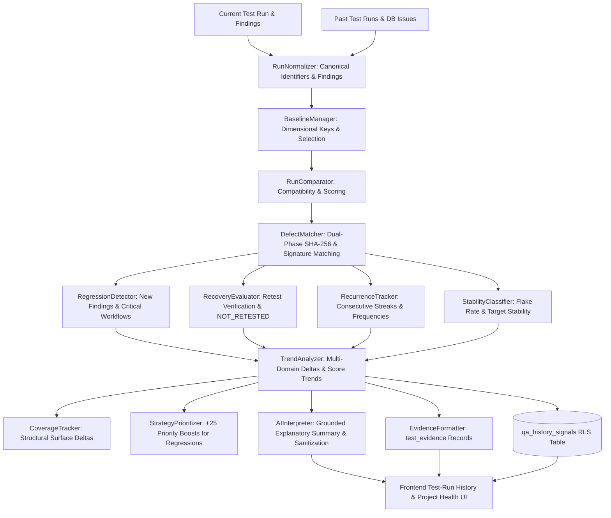

### Core Modules (`worker/src/history/`)

1. **Types & Policy (`types.ts`, `policy.ts`)**:
   - Domain models for `RunComparison`, `RegressionEvent`, `RecoveryEvent`, `RecurrenceEvent`, `TargetStabilityRecord`, `MetricTrendRecord`, `HistoricalScoreDeltas`, and `HistoricalPolicyConfig`.
   - Bounded defaults: Max history window 30 runs, max target records 500, min runs for trend 2, min runs for flakiness 3, flakiness threshold 0.20 (20%), regression priority boost +25 points.
2. **Run Normalizer (`run-normalizer.ts`)**:
   - Normalizes runs, findings, DB issues, URLs, selectors, finding types, and metric names to canonical representations.
   - Handles mapping from live `TestExecutionResult` via `fromExecutionResult`.
3. **Dimensional Baseline Manager (`baseline.ts`)**:
   - Constructs dimensional baseline keys: `projectId:environment:branch:viewport`.
   - Selects the most recent compatible successful/completed run within the same dimension.
4. **Run Comparator (`comparator.ts`)**:
   - Assesses multi-dimensional compatibility (project, branch, environment, viewport, commit).
   - Calculates compatibility score (0-100) and ranks prior candidate runs.
5. **Dual-Phase Defect Matcher (`matcher.ts`)**:
   - Phase 1 (Primary): Exact SHA-256 fingerprint matching.
   - Phase 2 (Secondary): Fuzzy structured signature matching (target identifier + bug type + selector similarity $\ge 0.85$).
6. **Regression Detector (`regression.ts`)**:
   - Identifies findings present in current run that were absent in baseline.
   - Cross-references with `ProductModel` to associate regressions with business-critical workflows and severity rankings.
7. **Recovery Evaluator (`recovery.ts`)**:
   - Inspects visited URLs, tested selectors, API endpoints, and check suites to verify active retesting.
   - Strictly classifies un-retested baseline findings as `NOT_RETESTED`, preventing false recovery assertions.
8. **Recurrence Tracker (`recurrence.ts`)**:
   - Tracks consecutive run streaks, total occurrence counts, first seen run, and recurrence rate across history.
9. **Target Stability & Flakiness Classifier (`stability.ts`)**:
   - Computes target flake rates ($\text{fail count} / \text{total runs}$) and classifies targets into:
     - `STABLE_PASS`: Clean pass rate $\ge 90\%$.
     - `STABLE_FAILURE`: Persistent failure rate $\ge 80\%$.
     - `INTERMITTENT`: Flaky pass/fail oscillation (flake rate $> 20\%$).
     - `RECOVERED`: Target previously failing, now cleanly passing.
     - `RECURRING`: Target persistently failing across multiple runs.
     - `INSUFFICIENT_HISTORY`: Single run observed.
10. **Multi-Domain Metric & Trend Analyzer (`trends.ts`)**:
    - Analyzes metric deltas across Release Readiness, Accessibility, Performance, Security, and Functional defect counts.
    - Classifies overall score trajectory: `IMPROVING`, `DEGRADING`, `STABLE`, `VOLATILE`, `INSUFFICIENT_DATA`.
11. **Structural Coverage Tracker (`coverage.ts`)**:
    - Tracks structural surface deltas: pages, forms, buttons, links, and responsive viewports.
12. **Strategy Prioritization Booster (`strategy.ts`)**:
    - Computes deterministic strategy boosts (+25 pts for regressed targets, +15 pts for flaky/intermittent targets, +10 pts for recurring targets).
13. **Evidence Persistence (`evidence.ts`)**:
    - Formats historical artifacts into `test_evidence` records (`historical_summary`, `regression_event`, `recovery_event`, `recurrence_event`, `stability_signal`, `trend_snapshot`, `coverage_trend`).
14. **Prompt-Injection-Guarded AI Interpreter (`ai-interpreter.ts`)**:
    - Generates grounded, executive summaries explaining evolution, regressions, and stability.
    - Features prompt-injection sanitization (stripping control directives, Markdown escape attempts, and delimiters) and regex secret masking with automatic deterministic fallback.
15. **Master Historical Analyzer (`analyzer.ts`)**:
    - Coordinates the full analysis pipeline, generates signals, calculates score deltas, and produces `qa_history_signals` payloads.

### Database Architecture (`public.qa_history_signals`)

```sql
CREATE TABLE IF NOT EXISTS public.qa_history_signals (
  id UUID PRIMARY KEY DEFAULT gen_random_uuid(),
  project_id UUID NOT NULL REFERENCES public.projects(id) ON DELETE CASCADE,
  organization_id UUID REFERENCES public.organizations(id) ON DELETE CASCADE,
  test_run_id UUID NOT NULL REFERENCES public.test_runs(id) ON DELETE CASCADE,
  signal_type TEXT NOT NULL,
  target_type TEXT NOT NULL,
  target_identifier TEXT NOT NULL,
  fingerprint TEXT,
  severity TEXT,
  confidence NUMERIC(3,2) DEFAULT 1.0,
  occurrence_count INT DEFAULT 1,
  consecutive_count INT DEFAULT 1,
  environment TEXT,
  viewport TEXT,
  role TEXT,
  metadata JSONB DEFAULT '{}'::jsonb,
  first_seen_at TIMESTAMPTZ DEFAULT now(),
  last_seen_at TIMESTAMPTZ DEFAULT now(),
  created_at TIMESTAMPTZ DEFAULT now()
);
```

### Frontend User Experience

1. **Test-Run Detail — History & Regressions Tab**:
   - Baseline comparison banner with direct link to baseline run ID.
   - Executive AI & deterministic evolution summary.
   - Score delta scorecards (Release Readiness, Accessibility, Performance, Security, Regressions, Recoveries).
   - New Regressions list with business criticality and workflow mappings.
   - Verified Recoveries list with active retest verification proof.
   - Recurring Defects watchlist with streak counters.
   - Target Stability & Flakiness matrix table.
   - Structural coverage deltas.
   - Database audit log drawer of `qa_history_signals`.

2. **Project QA History & Health Page (`/projects/[projectId]/history`)**:
   - Overall stability trajectory badge.
   - Chronological run evolution timeline and metrics table.
   - Project-level flaky target watchlist.
   - Real-time QA history signals log.

## 18. Autonomous QA Control Plane & End-to-End Test Campaigns (Prompt 29)

Sculra incorporates an Autonomous QA Control Plane and End-to-End Campaign Engine that binds all 12 specialized QA domain engines into a single cohesive autonomous orchestration loop. Instead of running isolated single-module audits, Sculra executes unified, multi-stage, risk-prioritized, budget-bounded QA campaigns.

> [!IMPORTANT]
> **Key Architecture & Scope Invariants**:
>
> 1. **Zero Metric Fabrication**:
>    Missing, unobserved, or unconfigured data is strictly reported as `undefined` / `--` in the UI and state models. Scores are never coerced to default 100 or fabricated values.
>
> 2. **Authoritative Deterministic Release Gate**:
>    The deterministic `ReleaseScorer` remains the authoritative judge of quality and release safety. AI analysis is strictly advisory and grounded in deterministic observations.
>
> 3. **Strict DAG Dependency Scheduling**:
>    Tasks execute according to a 5-stage Directed Acyclic Graph. Downstream audits (e.g., role checks, visual comparisons, release evaluation) only execute once prerequisite discovery and baseline dependencies are satisfied.
>
> 4. **Adaptive Dynamic Task Insertion**:
>    When severe runtime crashes, HTTP 500 errors, or authentication anomalies are observed during surface verification, the control plane dynamically synthesizes and schedules high-priority re-test tasks within budget limits.
>
> 5. **Bounded Execution & Budget Guardrails**:
>    Campaigns enforce hard upper limits on duration, total task count, parallel stages, retry attempts, and evidence links, preventing unbounded loops or resource exhaustion.

### Control Plane Architecture & 5-Stage Pipeline

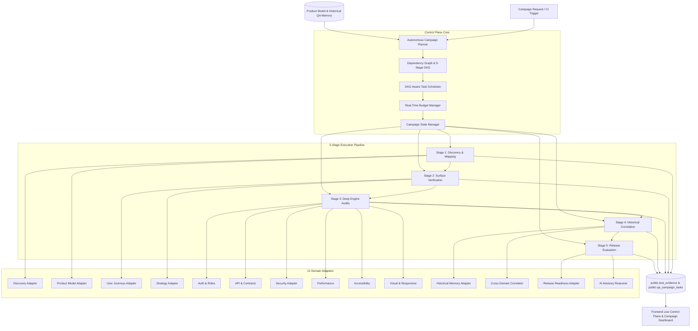

### 5-Stage Directed Acyclic Graph (DAG) Pipeline

1. **Stage 1: Discovery & Mapping (`DISCOVERY_MAPPING`)**:
   - Crawls target application routes and builds `ApplicationMap`.
   - Synthesizes `ProductModel` identifying features, workflows, and user roles.
2. **Stage 2: Surface Verification (`SURFACE_VERIFICATION`)**:
   - Executes deterministic core user journeys and primary navigation flows.
   - Activates Strategy Prioritizer to identify high-risk exploratory targets.
3. **Stage 3: Deep Engine Audits (`DEEP_ENGINE_AUDITS`)**:
   - Executes domain audits in parallel or dependency-governed sequences:
     - **Auth & Roles**: Role context switching and permission boundaries.
     - **API & Backend**: Discovered endpoint contracts, schemas, and payload tests.
     - **Security**: Headers, cookies, CORS, open redirects, sensitive exposures.
     - **Performance**: Navigation timings, Core Web Vitals, and action latencies.
     - **Accessibility**: WCAG 2.1 AA checks, keyboard navigation, contrast ratios.
     - **Visual & Responsive**: Multi-viewport layout and visual delta checks.
4. **Stage 4: Historical Correlation (`HISTORICAL_CORRELATION`)**:
   - Compares results against historical dimensional baseline runs.
   - Evaluates cross-domain evidence links (e.g., linking API 500 errors to functional button failures).
   - Generates `qa_history_signals` for new regressions, recoveries, and recurring defects.
5. **Stage 5: Release Evaluation (`RELEASE_EVALUATION`)**:
   - Computes authoritative deterministic release readiness score and verdict (`RELEASE`, `RELEASE_WITH_CAUTION`, `DO_NOT_RELEASE`).
   - Evaluates blockers (Blockers 1 through 9).
   - Produces advisory AI Executive Narrative with highlights, critical concerns, and recommended next steps.

### Core Modules (`worker/src/campaign/`)

1. **Domain Types & Policy (`types.ts`, `policy.ts`)**:
   - Type definitions for `CampaignState`, `CampaignTask`, `CampaignProgress`, `CampaignSummary`, `CampaignBudget`, `CampaignObjective`, and `CampaignDomain`.
   - Default campaign policies and clamp bounds.
2. **Autonomous Campaign Planner (`planner.ts`)**:
   - Deconstructs campaign objectives into discrete, dependency-ordered tasks.
   - Selects targets across pages, APIs, workflows, and roles.
3. **Dependency Graph & Scheduler (`dependency-graph.ts`, `scheduler.ts`)**:
   - Builds execution DAGs and validates prerequisite satisfaction before task dispatch.
   - Allocates ready tasks to available concurrency slots.
4. **Target Selector & Prioritizer (`target-selector.ts`)**:
   - Scores candidate targets by combining product business criticality, historical regression signals (+25 pts), and intrinsic domain risk.
5. **Budget Guardrail Manager (`budget.ts`)**:
   - Tracks duration, executed tasks, retries, and dynamic adaptive insertions in real-time.
   - Triggers graceful campaign termination when budget thresholds are reached.
6. **Campaign State Manager (`state.ts`)**:
   - Maintains immutable-safe shared campaign state, observation histories, and evidence links.
7. **Cross-Domain Evidence Correlator (`correlation.ts`)**:
   - Detects multi-engine correlations (e.g. backend server error matching frontend UI crash).
   - Synthesizes root-cause hypotheses with confidence ratings.
8. **Termination Evaluator (`termination.ts`)**:
   - Evaluates deterministic campaign stopping conditions (`GOAL_SATISFIED`, `ALL_TASKS_COMPLETED`, `BUDGET_EXHAUSTED`, `TIME_LIMIT_REACHED`, `CANCELLED_BY_USER`, `CRITICAL_BLOCKER_THRESHOLD`).
9. **AI Executive Reasoner (`ai-reasoner.ts`)**:
   - Generates grounded, advisory executive narrative summaries with prompt-injection defenses.
10. **Campaign Analyzer (`analyzer.ts`)**:
    - Synthesizes completed campaign summary, coverage matrix, and release scorecard.
11. **Evidence & Persistence Managers (`evidence.ts`, `persistence.ts`)**:
    - Formats campaign evidence and manages database sync with `public.qa_campaigns`, `public.qa_campaign_tasks`, and `public.test_evidence`.
12. **Master Campaign Executor (`executor.ts`)**:
    - Executes the end-to-end adaptive campaign loop, coordinating adapters and daemon tasks.

### Database Architecture (`public.qa_campaigns` & `public.qa_campaign_tasks`)

```sql
-- Campaigns Table
CREATE TABLE IF NOT EXISTS public.qa_campaigns (
  id UUID PRIMARY KEY DEFAULT gen_random_uuid(),
  project_id UUID NOT NULL REFERENCES public.projects(id) ON DELETE CASCADE,
  organization_id UUID REFERENCES public.organizations(id) ON DELETE CASCADE,
  name TEXT NOT NULL,
  objective TEXT NOT NULL,
  status TEXT NOT NULL DEFAULT 'PENDING',
  current_stage TEXT NOT NULL DEFAULT 'DISCOVERY_MAPPING',
  config JSONB NOT NULL DEFAULT '{}'::jsonb,
  budget_status JSONB NOT NULL DEFAULT '{}'::jsonb,
  progress_snapshot JSONB NOT NULL DEFAULT '{}'::jsonb,
  summary JSONB,
  overall_score NUMERIC(5,2),
  release_verdict TEXT,
  error_message TEXT,
  started_at TIMESTAMPTZ,
  completed_at TIMESTAMPTZ,
  created_at TIMESTAMPTZ DEFAULT now(),
  updated_at TIMESTAMPTZ DEFAULT now()
);

-- Campaign Tasks Table
CREATE TABLE IF NOT EXISTS public.qa_campaign_tasks (
  id UUID PRIMARY KEY DEFAULT gen_random_uuid(),
  campaign_id UUID NOT NULL REFERENCES public.qa_campaigns(id) ON DELETE CASCADE,
  task_key TEXT NOT NULL,
  stage TEXT NOT NULL,
  domain TEXT NOT NULL,
  status TEXT NOT NULL DEFAULT 'QUEUED',
  priority INT DEFAULT 50,
  target JSONB NOT NULL DEFAULT '{}'::jsonb,
  dependencies TEXT[] DEFAULT '{}'::text[],
  retry_count INT DEFAULT 0,
  max_retries INT DEFAULT 1,
  started_at TIMESTAMPTZ,
  completed_at TIMESTAMPTZ,
  duration_ms INT,
  error TEXT,
  observations_count INT DEFAULT 0,
  issues_detected INT DEFAULT 0,
  metadata JSONB DEFAULT '{}'::jsonb,
  created_at TIMESTAMPTZ DEFAULT now()
);
```

### Frontend User Experience

1. **Project QA Campaigns Page (`/projects/[projectId]/campaigns`)**:
   - Campaign history table with status, objective, stage, release verdict, and overall score.
   - Status filtering (`ALL`, `RUNNING`, `COMPLETED`, `FAILED`, `CANCELLED`).
   - "New QA Campaign" Launch Modal with objective selection, domain checkboxes, duration/task budget controls, and adaptive task insertion options.

2. **Campaign Live Control Plane Dashboard (`/campaigns/[campaignId]`)**:
   - Live status banner with real-time execution polling.
   - Start / Rerun / Cancel interactive controls.
   - 5-Stage Directed Acyclic Graph (DAG) Pipeline timeline.
   - 12-Engine Domain Coverage Matrix.
   - Live Task Queue with status badges and durations.
   - Cross-Domain Correlations panel with root cause analysis.
   - Authoritative Release Readiness Scorecard and Blocker list.
   - Advisory AI Executive Narrative summary.
   - Structured Live Evidence Feed.

## 19. Production QA Execution Reliability, Distributed Job Queue & Worker Hardening

Sculra's background execution engine is hardened for production multi-worker environments to eliminate duplicate job execution, zombie worker state overwrites, stuck jobs, uncaught process crashes, and silent infrastructure failures.

```mermaid
flowchart TD
    subgraph DistributedQueue[Supabase Distributed Queue]
        Q1[(qa_campaigns / test_runs)]
        RPC[acquire_execution_job RPC]
        HB[heartbeat_execution_job RPC]
        REC[fail_exhausted_stale_jobs RPC]
    end

    subgraph WorkerAlpha[Worker Instance Alpha]
        IdA[Worker Identity Alpha] --> AcqA[JobAcquirer]
        AcqA -->|1. Atomic Claim + Lease| RPC
        AcqA --> RunA[JobRunner]
        RunA --> HBLoopA[Active Heartbeat Loop (15s)]
        HBLoopA -->|2. Extend Lease| HB
        RunA --> ExecA[Campaign / Job Executor]
        ExecA --> FinA[Guarded JobFinalizer]
        FinA -->|3. Terminal State Update (worker_id guard)| Q1
    end

    subgraph WorkerBeta[Worker Instance Beta]
        IdB[Worker Identity Beta] --> ScanB[JobRecoveryScanner]
        ScanB -->|4. Detect Expired Lease| REC
        ScanB --> AcqB[JobAcquirer]
        AcqB -->|5. Reclaim Stale Job (Attempt + 1)| RPC
    end
```

### 19.1 Core Execution Invariants

1. **Zero Duplicate Ownership**: At any point in time, an active job is leased by at most ONE worker instance (`worker_id`). A worker lease is valid for `JOB_LEASE_SECONDS = 60` and renewed every `JOB_HEARTBEAT_SECONDS = 15`.
2. **Deterministic Stale Recovery**: If a worker node crashes or experiences a network partition, its heartbeat ceases. Once `lease_expires_at < NOW()`, peer workers reclaim the job (`status = 'QUEUED'`, `recovery_count++`, `previous_worker_id` recorded).
3. **Bounded Retries**: A job can be retried up to `MAX_JOB_ATTEMPTS = 3`. Once attempts are exhausted, the job transitions to `status = 'FAILED'` with typed error code `MAX_ATTEMPTS_EXCEEDED`.
4. **Guarded State Finalization**: Terminal status updates (`COMPLETED`, `FAILED`, `CANCELLED`) verify that the calling worker still owns the job (`WHERE id = :id AND worker_id = :worker_id`). Stale zombie workers that wake up after losing their lease are rejected and cannot overwrite recovered execution results.
5. **Infrastructure Failure $\neq$ Task QA Verdict**: Worker timeouts, browser launch crashes, and database connection blips are recorded as typed `ExecutionError`s (`BROWSER_LAUNCH_FAILED`, `DATABASE_PERSISTENCE_FAILED`, `JOB_TIMEOUT`, `LEASE_LOST`) rather than task assertions.
6. **Zero Metric Fabrication**: If a run or campaign is interrupted, uncollected metrics remain `null` or undefined. The system never injects fake 100% or 0% scores.

### 19.2 Execution Modules (`worker/src/execution/`)

| Module | Purpose | Key Classes & Functions |
| :--- | :--- | :--- |
| `types.ts` | Unified execution job and result contracts | `ExecutionJob`, `ExecutionResult`, `ExecutionErrorCode` |
| `identity.ts` | Distributed worker identity and tagging | `WorkerIdentity`, `generateWorkerId()` |
| `execution-errors.ts` | Typed error classification hierarchy | `classifyExecutionError()`, `isRetryableError()` |
| `execution-policy.ts` | Lease timeouts, retry policies, backoff | `DEFAULT_JOB_LEASE_SECONDS`, `DEFAULT_MAX_JOB_ATTEMPTS` |
| `job-acquirer.ts` | Atomic distributed job acquisition | `JobAcquirer.acquireNextJob()`, `acquireJobs()` |
| `job-heartbeat.ts` | Active background lease renewal loop | `JobHeartbeatManager.startHeartbeat()` |
| `job-finalizer.ts` | Guarded terminal state updater | `JobFinalizer.finalizeJob()` |
| `job-recovery.ts` | Stale expired lease recovery scanner | `JobRecoveryScanner.scanAndRecoverStaleJobs()` |
| `job-runner.ts` | Full job execution lifecycle coordinator | `JobRunner.runJob()` |
| `metrics.ts` | Structured worker metrics tracking | `ExecutionMetricsTracker` |

### 19.3 Security Hardening & Secret Redaction

- **Privileged Key Enforcement**: Production worker nodes strictly require `SUPABASE_SERVICE_ROLE_KEY` to execute background jobs and reject unauthenticated / anon key starts.
- **Deep Log Sanitization**: `WorkerLogger` scans and masks Bearer tokens, JWTs, Supabase secret keys (`sb_secret_*`, `service_role*`), passwords, cookies, and API keys across all log messages and nested JSON payloads.
- **Graceful Process Shutdown**: Trapping `SIGINT` and `SIGTERM` initiates a graceful teardown: stopping new job polling, triggering cancellation tokens on in-flight tasks, allowing running executors a grace period to persist state, and stopping active heartbeat loops.

---

## 20. CI/CD QA Gates, Automatic Triggers & Developer Feedback Loop

Sculra directly participates in software development workflows by accepting GitHub webhooks on code pushes and pull requests, enqueuing autonomous QA campaigns, computing deterministic gate verdicts, and delivering structured developer feedback.

```mermaid
flowchart TD
    subgraph GitHub[GitHub Repository / Developer Workspace]
        Push[Git Push / PR Opened] -->|1. Webhook HTTP POST| Webhook[POST /api/webhooks/github]
        Checks[GitHub Checks / PR Feedback] <--|6. Markdown & JSON Feedback| FeedbackEngine[CIFeedbackGenerator]
    end

    subgraph API[Sculra API Gateway]
        Webhook -->|2. Constant-Time HMAC SHA-256| SecCheck{Valid Signature?}
        SecCheck -- No --> Reject[401 / 413 Rejection]
        SecCheck -- Yes --> IdempCheck{Delivery Exists?}
        IdempCheck -- Yes --> SkipDuplicate[200 already_processed]
        IdempCheck -- No --> Enqueue[3. Insert qa_campaigns status='QUEUED']
    end

    subgraph ExecutionQueue[Prompt 30 Distributed Queue]
        Enqueue --> Q[(qa_campaigns Table)]
        WorkerDaemon[Worker Daemon] -->|4. Atomic Acquire & Lease| Q
        WorkerDaemon --> Exec[CampaignExecutor]
    end

    subgraph ControlPlane[CI Gate & Evaluation Layer]
        Exec -->|5. Campaign Summary| GateEngine[CIGateEngine]
        GateEngine -->|Evaluate Policy| Decision[CIGateDecision]
        Decision --> FeedbackEngine
        Decision --> GateResults[(cicd_gate_results Table)]
    end
```

### 20.1 Core Invariants & Security Guarantees

1. **Zero Parallel Queue / Daemon**: Webhooks enqueue campaigns directly into `public.qa_campaigns` (`status = 'QUEUED'`). The existing `WorkerDaemon` and `JobAcquirer` claim and execute them with full lease, heartbeat, and retry guarantees.
2. **Constant-Time HMAC SHA-256**: All incoming GitHub webhook payloads are validated against the project's configured `ci_webhook_secret` using `crypto.timingSafeEqual` on the `x-hub-signature-256` header, preventing timing side-channel attacks.
3. **Payload Ceilings**: Webhook payloads are strictly capped at 1MB (1,048,576 bytes). Oversized requests are rejected immediately with HTTP 413.
4. **Delivery Idempotency**: Each delivery is tracked by GitHub's `x-github-delivery` UUID in `public.cicd_webhook_events`. Duplicate deliveries return HTTP 200 without duplicate queueing.
5. **Prompt Injection & Secret Defense**: User-controlled inputs (commit messages, PR titles, branch names) are sanitized with `sanitizeCIInput()` to neutralize prompt injection directives and defang scripts. All logs and feedback redact credentials with `maskSecrets()`.
6. **Zero Metric Fabrication**: If a campaign is interrupted or evidence is insufficient, scores remain `null` and the gate evaluates to `INSUFFICIENT_EVIDENCE`. The platform never fabricates 100% or 0% scores.

### 20.2 Gate Policies & Deterministic Verdicts

| Gate Policy | Behavior | Failing Criteria |
| :--- | :--- | :--- |
| `BLOCK_ON_CRITICAL_ISSUE` (Default) | Standard production gate | Critical blockers > 0 OR release recommendation `DO_NOT_RELEASE` |
| `STRICT` | Zero-defect high-assurance gate | Critical findings > 0 OR high findings > 0 OR regressions > 0 OR score < threshold (default 80) OR recommendation != `RELEASE` |
| `PERMISSIVE` | Tolerant review gate | Critical findings >= 3 OR critical blockers with `DO_NOT_RELEASE` |
| `BLOCK_ON_REGRESSION` | Regressions-only gate | Regressions count > 0 OR critical blockers > 0 |

#### Deterministic Gate Verdicts:
- **`PASS`**: All gate policy criteria satisfied.
- **`FAIL`**: One or more gate policy thresholds violated.
- **`INSUFFICIENT_EVIDENCE`**: Test coverage or release assessment confidence is insufficient.
- **`CANCELLED`**: Campaign execution was cancelled.
- **`ERROR`**: Premature infrastructure failure or missing summary evidence.

### 20.3 CI/CD Domain Modules (`worker/src/cicd/`)

| Module | Responsibility |
| :--- | :--- |
| `types.ts` | Unified interfaces: `NormalizedCIEvent`, `CIGateDecision`, `CIFeedback`, `ProjectCIConfig` |
| `errors.ts` | Typed error hierarchy: `SignatureVerificationError`, `PayloadTooLargeError`, `DuplicateDeliveryError` |
| `redaction.ts` | Prompt injection neutralization and deep secret masking |
| `webhooks.ts` | Constant-time HMAC SHA-256 verification and 1MB ceiling enforcement |
| `github.ts` | Normalization of `push`, `pull_request` (`opened`, `synchronize`, `reopened`), and `ping` |
| `mapping.ts` | Deterministic resolution of GitHub repository coordinates to Sculra projects |
| `gate.ts` | Deterministic evaluation engine implementing policy rule tables |
| `feedback.ts` | GitHub-compatible Markdown summary and structured JSON generator |
| `trigger.ts` | Automatic queue scheduler inserting into `public.qa_campaigns` |

### 20.4 Developer Feedback Schema (`CIFeedback`)

The synthesized developer feedback contains:
- **Headline**: Emoji-tagged verdict status (e.g., `✅ Sculra CI Gate Passed (Score: 94/100)`).
- **Summary Table**: Measured release score, recommendation, critical blockers count, regressions, recoveries.
- **Blockers & Regressions**: Detailed itemized finding descriptions with severity tags and evidence summaries.
- **Commit Context**: Repository full name, short commit SHA, author, and PR number.
- **Deep Links**: Direct link to the autonomous QA campaign in the Sculra dashboard.
- **GitHub Check Run Integration**: Typed conclusion (`success`, `failure`, `action_required`, `neutral`, `cancelled`).

---

## 21. Code Change Intelligence, Impact Analysis & Change-Aware QA

Sculra understands what changed, where it changed, what application capabilities and user journeys are impacted, which QA targets and business workflows are affected, and which QA engines should execute with priority while maintaining safety coverage baselines.

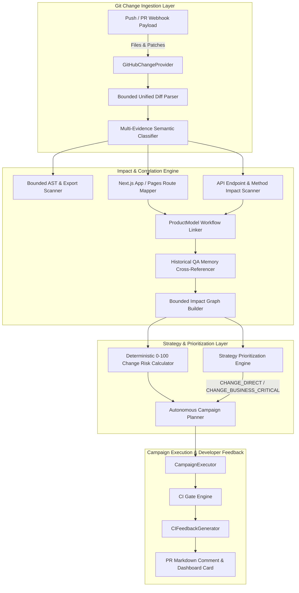

### 21.1 Core Invariants & Safety Guarantees

1. **No External Code Execution**: Sculra never clones arbitrary untrusted repositories, never runs `npm install` or build commands, and never executes repository shell scripts. Analysis is performed strictly on unified diff patches and metadata.
2. **Deterministic Bounded Limits**:
   - `MAX_CHANGED_FILES = 500`
   - `MAX_PATCH_BYTES = 2MB` (2,097,152 bytes)
   - `MAX_HUNKS_PER_FILE = 100`
   - `MAX_LINES_PER_HUNK = 300`
   - `MAX_TOTAL_CHANGED_LINES = 10,000`
   - `MAX_GRAPH_NODES = 1,000`
   - `MAX_GRAPH_EDGES = 3,000`
   When any threshold is exceeded, the analysis status is marked as `PARTIAL` with a clear explanation, ensuring bounded execution without crashing or hanging workers.
3. **Strict No-Fake-Data Guarantee**: Risk scores, impact graphs, and priority boosts are 100% deterministically calculated from empirical evidence. `?? 100` and `?? 0` fallbacks or simulated percentages are strictly prohibited.
4. **Balanced Change-Aware QA**: Change intelligence prioritizes tests directly and transitively affected by code changes without creating tunnel vision. Safety baselines for visual, accessibility, and security assurance continue executing according to campaign objectives.

### 21.2 Deterministic Change Risk Scoring (0–100)

Change risk is calculated via additive weighted factors representing real operational risk:

| Factor | Condition | Score Adjustment |
| :--- | :--- | :--- |
| `AUTHENTICATION_IMPACT` | `AUTHENTICATION` or `AUTHORIZATION` classification | +25 |
| `PAYMENT_IMPACT` | `PAYMENT` classification or Stripe/billing keywords | +25 |
| `DATABASE_IMPACT` | `DATABASE` migrations, schema, or ORM changes | +20 |
| `ROUTING_IMPACT` | User-facing route or layout modified | +15 |
| `API_IMPACT` | API route handler or contract changed | +15 |
| `CRITICAL_WORKFLOW_TOUCHED` | Touches CRITICAL business workflow in `ProductModel` | +25 |
| `HIGH_WORKFLOW_TOUCHED` | Touches HIGH business workflow in `ProductModel` | +15 |
| `HISTORICAL_REGRESSION_RISK`| Historically associated with recent regressions | +20 |
| `VERY_LARGE_DIFF` | Size category is `VERY_LARGE` (>50 files or >2,000 lines) | +15 |
| `DOCUMENTATION_ONLY` | Only documentation modified (e.g. `.md`, `.rst`) | Score fixed to 5 (`LOW`) |
| `TEST_ONLY` | Only test files modified (e.g. `.test.ts`, `.spec.ts`) | Score fixed to 15 (`LOW`) |

#### Risk Levels:
- **`CRITICAL`**: Score $\ge$ 80
- **`HIGH`**: Score $\ge$ 60
- **`MEDIUM`**: Score $\ge$ 30
- **`LOW`**: Score $<$ 30

### 21.3 Strategy Engine Prioritization Boosts

The deterministic prioritizer (`DeterministicPrioritizer`) applies typed priority boosts to targets affected by code changes:

- **`CHANGE_DIRECT`** (+25 pts): Target URL, route, or API is directly modified in the commit diff.
- **`CHANGE_TRANSITIVE`** (+15 pts): Target is downstream of a modified component or layout.
- **`CHANGE_BUSINESS_CRITICAL`** (+20 pts): Target executes steps within an affected CRITICAL `ProductModel` workflow.
- **`CHANGE_SECURITY`** (+25 pts): Target resides in an authentication or authorization boundary modified by the commit.
- **`CHANGE_HISTORICAL`** (+20 pts): Target is associated with past regressions and intersects current code changes.

All priority scores remain strictly bounded between 0 and 100.

### 21.4 Change Intelligence Domain Modules (`worker/src/change-intelligence/`)

| Module | Responsibility |
| :--- | :--- |
| `types.ts` | Unified domain models: `ChangeSet`, `ChangedFile`, `ChangeHunk`, `ImpactGraph`, `ChangeRisk`, `ChangeAnalysisResult` |
| `policy.ts` | Execution limits, file size categories, and risk tier definitions |
| `normalizer.ts` | Path normalization, directory traversal defense, binary file, lockfile, and doc filters |
| `parser.ts` | Safe bounded unified diff parser enforcing hunk and line thresholds |
| `classifier.ts` | Multi-evidence semantic classifier (`AUTH`, `API`, `ROUTING`, `DATABASE`, `UI`, `STYLE`, `CONFIG`) |
| `symbol-impact.ts` | Bounded scanner extracting exported symbols, components, and HTTP route handlers (`GET`, `POST`, etc.) |
| `route-impact.ts` | Next.js App Router and Pages Router route extractor |
| `api-impact.ts` | API endpoint matcher identifying impacted backend routes |
| `product-impact.ts` | Cross-referencer linking changed routes to `ProductModel` critical workflows and features |
| `historical-impact.ts` | Cross-referencer tagging historically associated flakiness and prior regressions |
| `risk.ts` | Deterministic 0–100 Change Risk score and factor calculator |
| `graph.ts` | Bounded graph builder constructing nodes and edges with cycle protection |
| `matcher.ts` | QA domain recommender and strategy boost generator |
| `git-provider.ts` | Provider abstraction and context models |
| `github.ts` | GitHub change fetcher with graceful offline fallback to webhook payload |
| `evidence.ts` | Formatter generating structured `TestEvidencePayload` records for campaign persistence |
| `redaction.ts` | Token and password sanitization |
| `analyzer.ts` | Master `ChangeIntelligenceAnalyzer.analyze()` orchestrator |

### 21.5 Database Schema (`public.change_analyses`)

Analysis records are persisted to `public.change_analyses` with Row-Level Security:
```sql
CREATE TABLE IF NOT EXISTS public.change_analyses (
  id UUID PRIMARY KEY DEFAULT gen_random_uuid(),
  organization_id UUID REFERENCES public.organizations(id) ON DELETE CASCADE,
  project_id UUID NOT NULL REFERENCES public.projects(id) ON DELETE CASCADE,
  campaign_id UUID REFERENCES public.qa_campaigns(id) ON DELETE SET NULL,
  commit_sha TEXT NOT NULL,
  base_sha TEXT,
  branch TEXT,
  pull_request_number INTEGER,
  change_count INTEGER NOT NULL DEFAULT 0,
  additions_count INTEGER NOT NULL DEFAULT 0,
  deletions_count INTEGER NOT NULL DEFAULT 0,
  risk_score NUMERIC(5, 2) NOT NULL DEFAULT 0,
  risk_level TEXT NOT NULL DEFAULT 'LOW',
  analysis_status TEXT NOT NULL DEFAULT 'COMPLETED',
  classifications JSONB NOT NULL DEFAULT '[]'::jsonb,
  summary JSONB NOT NULL DEFAULT '{}'::jsonb,
  impact_graph JSONB NOT NULL DEFAULT '{}'::jsonb,
  metadata JSONB NOT NULL DEFAULT '{}'::jsonb,
  created_at TIMESTAMPTZ NOT NULL DEFAULT timezone('utc'::text, now())
);
```

---

## 22. AI Root Cause Analysis, Code-Aware Bug Diagnosis & Fix Planning

Sculra bridges the gap between test execution failure and developer remediation. When an issue or test failure occurs, the engine performs structured root cause analysis, diagnoses whether the failure is an application bug, test defect, environmental glitch, or regression, pinpoints the relevant source code files and functions, correlates with recent git changes, and produces an actionable, step-by-step fix plan and verification strategy.

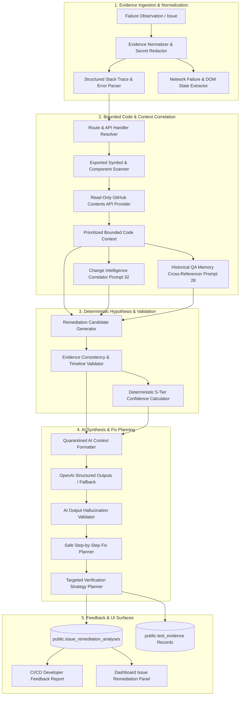

### 22.1 Core Invariants, Source of Truth Hierarchy & Security Guarantees

1. **Strict Separation of Evidentiary Categories**:
   - **`OBSERVED FACT`**: Empirical runtime logs, HTTP status codes, console error strings, stack traces, and DOM element snapshots.
   - **`INFERENCE`**: Code-to-route mappings, AST symbol definitions, or change correlations.
   - **`HYPOTHESIS`**: Proposed root cause explanations that are tested for consistency against observed facts.
   - **`RECOMMENDATION`**: Actionable remediation steps and targeted verification tests.
   *The system never treats an inference or hypothesis as an established fact.*

2. **Source of Truth Hierarchy**:
   1. Direct QA runtime evidence (screenshots, console logs, network logs, DOM state)
   2. Runtime error & stack trace (exact line numbers, stack frames)
   3. Network evidence (status codes, payloads, timings)
   4. DOM / Application behavior (visual state, rendered elements)
   5. Changed code (git commit diffs, modified hunks)
   6. Static code relationships (imports, exports, component trees)
   7. Historical QA evidence (past pass/fail runs, flaky history)
   8. ProductModel (workflows, user journeys)
   9. AI inference (*weakest source of truth — never overrides empirical facts*)

3. **Strict Scope Constraint (Diagnosis & Fix Planning ONLY)**:
   - Sculra is strictly a diagnostic and planning engine.
   - **DO NOT modify the user's code repository.**
   - **DO NOT create commits or pull requests on target repositories.**
   - **DO NOT auto-apply patches.**
   - All repository interaction is strictly read-only via GitHub Contents API / raw file lookups.

4. **Deterministic Bounded Limits**:
   - `MAX_EVIDENCE_ITEMS = 50`
   - `MAX_TOTAL_EVIDENCE_BYTES = 512KB`
   - `MAX_RELEVANT_FILES = 20`
   - `MAX_BYTES_PER_FILE = 50KB`
   - `MAX_TOTAL_CODE_CONTEXT = 300KB`
   - `MAX_SYMBOLS = 100`
   - `MAX_IMPORT_DEPTH = 3`
   - `MAX_ANALYSES_PER_CAMPAIGN = 20`
   - `MAX_AI_REQUESTS_PER_ANALYSIS = 2`
   - `MAX_ANALYSIS_SECONDS = 45`

5. **Prompt Injection & Secret Quarantine**:
   - All inputs (console errors, stack traces, untrusted code snippets) are filtered with `maskSecrets()` to scrub API keys, JWTs, Bearer tokens, and database passwords.
   - Untrusted repository content and error messages are quarantined as raw data blocks to prevent prompt injection hijacking.

6. **Zero Hallucination Enforcement (`AIOutputValidator`)**:
   - Every file path, symbol name, and route referenced in AI responses is strictly validated against the ingested code context.
   - Hallucinated references are automatically stripped before persisting or surfacing to developers.
   - If AI analysis fails, times out, or returns malformed data, the system falls back seamlessly to deterministic rule-based analysis.

### 22.2 Bug Diagnosis Taxonomy

Every diagnosed failure is classified into an authoritative category:

| Diagnosis Category | Description | Typical Evidentiary Signal |
| :--- | :--- | :--- |
| `APPLICATION_BUG` | Defect in application source code or business logic | Unhandled 500 exceptions, `TypeError: Cannot read properties of undefined`, logical assertion failures |
| `TEST_DEFECT` | Flawed test definition, incorrect selector, or outdated expectation | Element selector mismatch when DOM is healthy, stale assertion expectation |
| `ENVIRONMENT_GLITCH` | Infrastructure outage, network timeout, or third-party service downtime | `ECONNREFUSED`, `503 Service Unavailable`, gateway timeout 504 |
| `REGRESSION` | Previously working functionality broken by recent code changes | Failure on a route modified in the latest commit diff with historical passing runs |
| `CONFIGURATION_ERROR` | Missing environment variables, invalid CORS, or misconfigured auth | `401 Unauthorized`, `CORS header missing`, undefined configuration keys |
| `DATA_ISSUE` | Corrupted test fixtures, missing seed records, or unexpected database state | Foreign key constraint violation, empty result set on required entity |
| `FLAKY_BEHAVIOR` | Non-deterministic timing, race condition, or animation delay | Intermittent failures across consecutive runs on unchanged code |
| `UNKNOWN` | Insufficient evidence to establish a definitive diagnosis category | Partial logs, missing stack trace, generic unstructured failure |

### 22.3 Deterministic Confidence Scoring (5-Tier)

Confidence is calculated deterministically from empirical evidence points minus ambiguity penalties:

- **Empirical Additive Factors**:
  - `DIRECT_STACK_TRACE_MATCH`: +30 pts
  - `RECENT_CHANGE_CORRELATION`: +25 pts
  - `EXACT_ERROR_SIGNATURE`: +20 pts
  - `REPRODUCIBLE_ACROSS_RUNS`: +15 pts
  - `DOM_EVIDENCE_CORROBORATION`: +10 pts
  - `NETWORK_EVIDENCE_CORROBORATION`: +10 pts
  - `HISTORICAL_REGRESSION_MATCH`: +10 pts

- **Penalties**:
  - `MISSING_STACK_TRACE`: -25 pts
  - `MULTIPLE_PLAUSIBLE_HYPOTHESES`: -20 pts
  - `UNRESOLVED_SOURCE_MAP`: -15 pts
  - `NO_MATCHING_SOURCE_FILE`: -20 pts
  - `FLAKY_FAILURE_HISTORY`: -15 pts

- **Calculated Confidence Tiers**:
  - **`VERY_HIGH`** ($\ge 85$ pts): Complete stack trace, verified source file, exact error signature.
  - **`HIGH`** ($\ge 70$ pts): Clear runtime evidence and correlated source file or change.
  - **`MEDIUM`** ($\ge 50$ pts): Plausible hypothesis with partial evidence or indirect correlation.
  - **`LOW`** ($\ge 30$ pts): Ambiguous symptoms, missing stack frames, or multiple competing hypotheses.
  - **`VERY_LOW`** ($< 30$ pts): Severely degraded or purely inferential context.

### 22.4 Remediation Domain Modules (`worker/src/remediation/`)

| Module | Responsibility |
| :--- | :--- |
| `types.ts` | Unified domain models: `FailureObservation`, `BugDiagnosis`, `RootCauseHypothesis`, `CodeContext`, `FixPlan`, `VerificationPlan`, `RemediationAnalysis` |
| `policy.ts` | Ceilings, byte limits, timeout configurations, and version constants |
| `errors.ts` | Typed error hierarchy: `RemediationError`, `CodeContextUnavailableError`, `AIInvalidOutputError`, `InsufficientEvidenceError` |
| `redaction.ts` | Deep secret masking (OpenAI, GitHub, AWS, JWT, URI) and prompt injection neutralizing |
| `stack-trace.ts` | V8/Node and browser stack trace parser with Turbopack/Webpack chunk normalization |
| `error-parser.ts` | Runtime error parser extracting signatures, referenced files, and symbols |
| `source-map.ts` | Source map locator with SSRF protection against cloud metadata endpoints |
| `route-mapper.ts` | Next.js App Router and Pages Router route and API matcher |
| `symbol-mapper.ts` | AST / export scanner extracting symbols and constructing import graphs |
| `github-context.ts` | Read-only GitHub Contents API retriever (no git clone, no shell execution) |
| `code-context.ts` | Prioritized context builder assembling bounded code context |
| `change-context.ts` | Prompt 32 Change Intelligence cross-referencer (`DIRECT_CHANGE`, `TRANSITIVE_CHANGE`) |
| `history-context.ts` | Prompt 28 Historical Memory cross-referencer tagging past flakiness and regressions |
| `evidence-context.ts` | Failure observation normalizer and evidence bundler |
| `candidate-generator.ts` | `RemediationCandidateGenerator` generating deterministic root cause candidates |
| `hypothesis-validator.ts` | Consistency validator discarding contradictory hypotheses |
| `confidence.ts` | Deterministic 5-tier confidence calculator |
| `fix-plan.ts` | Step-by-step fix planner with `SECURITY_RISK` detection for auth bypass |
| `verification-plan.ts` | Targeted verification planner recommending QA domains and regression assertions |
| `ai-schema.ts` | JSON Schema for OpenAI Structured Outputs |
| `ai-validator.ts` | `AIOutputValidator` stripping unverified file/symbol/route hallucinations |
| `ai-analyzer.ts` | `AIRootCauseAnalyzer` orchestrating LLM diagnosis with prompt injection quarantine |
| `evidence.ts` | Structured `TestEvidencePayload` formatter for campaign persistence |
| `analyzer.ts` | Master `RemediationAnalyzer.analyze()` orchestrator |

### 22.5 Database Schema (`public.issue_remediation_analyses`)

Remediation analyses are persisted to `public.issue_remediation_analyses`:
```sql
CREATE TABLE IF NOT EXISTS public.issue_remediation_analyses (
  id UUID PRIMARY KEY DEFAULT gen_random_uuid(),
  organization_id UUID REFERENCES public.organizations(id) ON DELETE CASCADE,
  project_id UUID NOT NULL REFERENCES public.projects(id) ON DELETE CASCADE,
  issue_id UUID REFERENCES public.issues(id) ON DELETE CASCADE,
  campaign_id UUID REFERENCES public.qa_campaigns(id) ON DELETE SET NULL,
  test_run_id UUID REFERENCES public.test_runs(id) ON DELETE SET NULL,
  analysis_status TEXT NOT NULL DEFAULT 'COMPLETED',
  analysis_version INTEGER NOT NULL DEFAULT 1,
  bug_diagnosis JSONB NOT NULL DEFAULT '{}'::jsonb,
  root_cause_hypotheses JSONB NOT NULL DEFAULT '[]'::jsonb,
  code_context JSONB NOT NULL DEFAULT '{}'::jsonb,
  change_context JSONB NOT NULL DEFAULT '{}'::jsonb,
  historical_context JSONB NOT NULL DEFAULT '{}'::jsonb,
  confidence JSONB NOT NULL DEFAULT '{}'::jsonb,
  fix_plan JSONB NOT NULL DEFAULT '{}'::jsonb,
  verification_plan JSONB NOT NULL DEFAULT '{}'::jsonb,
  metadata JSONB NOT NULL DEFAULT '{}'::jsonb,
  created_at TIMESTAMPTZ NOT NULL DEFAULT timezone('utc'::text, now()),
  updated_at TIMESTAMPTZ NOT NULL DEFAULT timezone('utc'::text, now())
);
```

### 22.6 Developer Experience & Frontend Surfaces

- **CI/CD Developer Feedback**:
  Every CI run failing a gate due to critical blockers or regressions includes an itemized remediation section (`### 🔬 AI Root Cause Diagnosis & Fix Plan`) with the diagnosed category, primary root cause explanation, confidence score, suspected files and lines, and recommended fix steps.
- **Interactive Issue Remediation Panel (`IssueRemediationPanel.tsx`)**:
  Integrated directly inside the expanded view of issues in `IssueList.tsx`:
  - **Honest Status Badges**: Displays `Not analyzed`, `Diagnosed`, `Partial analysis`, `Insufficient evidence`, or `Analysis unavailable`.
  - **Categorized Tabs**:
    1. **Root Cause**: Primary hypothesis, reasoning, contradiction checks, alternative hypotheses.
    2. **Fix Plan**: Step-by-step remediation guide with file references and safety warnings.
    3. **Verification Plan**: Targeted QA domains, specific regression checks, and edge cases.
    4. **Code & Change Context**: Referenced source files, line numbers, and commit diff relationships (`DIRECT_CHANGE`, `TRANSITIVE_CHANGE`).
    5. **Empirical Evidence**: Cleaned console errors, stack traces, and network logs with secret masking.

---

## 23. Autonomous Safe Fix Agent & Code Remediation

### 23.1 Closed-Loop Remediation Flow
Prompt 34 completes Sculra's end-to-end autonomous quality engineering loop, transitioning the system from analytical planning into safe, automated code remediation:

```
QA FAILURE
    ↓
EMPIRICAL EVIDENCE (DOM, console, network, visual diff)
    ↓
ROOT CAUSE DIAGNOSIS & RELEVANT CODE
    ↓
GROUNDED FIX PLAN (affected files & symbols)
    ↓
AUTHORIZATION & POLICY CHECK (mode ceilings, allowlists)
    ↓
ISOLATED SCRATCH WORKSPACE (outside repository tree)
    ↓
BASELINE REPRODUCTION (reproduces failure deterministically)
    ↓
STRUCTURED PATCH GENERATION & VALIDATION (AST/context-anchored)
    ↓
ATOMIC PATCH APPLICATION
    ↓
TARGETED TEST VERIFICATION (determines pass & zero regressions)
    ↓
INDEPENDENT DIFF REVIEW (syntax, secret leaks, unauthorized files)
    ↓
DEDICATED REMEDIATION BRANCH (`sculra/fix/...`)
    ↓
PULL REQUEST CREATION (with structured markdown evidence)
    ↓
HUMAN APPROVAL GATE (mandatory review; no auto-merge)
```

### 23.2 Core Invariants & Safety Ceilings

1. **Default Branch Immutability**:
   - The user's default branch (`main`, `master`, `production`, `release`, etc.) is strictly read-only.
   - Sculra NEVER commits, modifies, or merges directly to the default branch.
2. **Dedicated Remediation Branches**:
   - All proposed fixes are committed to dedicated branches following the pattern:
     `sculra/fix/<issue-short-id>/<safe-slug>`
   - Protected branch names are rejected by git safety guards.
3. **No Automatic Merging**:
   - PRs are opened for human review. Sculra NEVER auto-merges pull requests. Human inspection and approval are mandatory.
4. **Execution Modes**:
   - `PLAN_ONLY` (default): Analyzes root cause and validates fix plan; no sandbox, no code edit, no git operation.
   - `DRY_RUN`: Generates structured patch and performs diff review without executing test commands or touching git.
   - `APPLY_AND_VERIFY`: Applies patch in isolated sandbox, runs baseline and post-fix verification tests, and verifies zero regressions.
   - `CREATE_PR`: Commits verified patch to isolated branch and opens a GitHub Pull Request with full evidence. Requires explicit project enablement (`fix_agent_enabled = true`).
5. **Hard Safety Ceilings**:
   - Max 10 remediations per campaign.
   - Max 10 files changed per patch.
   - Max 500 diff lines (additions + deletions) per patch.
   - Max 2 patch generation attempts per remediation.
   - Max 5 deterministic test commands (allowlisted only).
   - 120s timeout per command, 300s timeout per remediation run.
   - 200KB max test output capture.
6. **Automatic Rollback & Sandbox Teardown**:
   - Any failure in baseline reproduction, patch application, verification tests, diff review, or git operations immediately initiates atomic rollback. Scratch directories are purged with zero lingering files.

### 23.3 Worker Architecture & Modules (`worker/src/fix-agent/`)

| Module | Responsibility |
| :--- | :--- |
| `types.ts` | Domain models (`FixAgentMode`, `FixAgentState`, `FixRemediationRecord`, `FixEvidenceRecord`, `StructuredPatch`, `DiffReviewResult`, `FixVerificationResult`) |
| `policy.ts` | Ceilings, timeouts, constants, and `DEFAULT_PROJECT_FIX_POLICY` |
| `errors.ts` | Typed error hierarchy (`FixAgentError`, `PolicyBlockedError`, `GitSafetyError`, `BaselineNotReproducedError`, `RollbackError`, etc.) |
| `redaction.ts` | Secret masking and prompt injection neutralizing |
| `security.ts` | `FixSecurityScanner` detecting security-sensitive paths/code and destructive shell commands |
| `state.ts` | 18-state `FixAgentStateMachine` with transition guards and history tracking |
| `authorization.ts` | `FixAuthorizationManager` validating project enablement, mode ceilings, and path permissions |
| `plan-validator.ts` | `FixPlanValidator` validating grounded diagnosis, path traversal checks, and confidence thresholds |
| `code-context.ts` | `FixCodeContextRetriever` assembling bounded, secret-masked context from target files |
| `patch-generator.ts` | `FixPatchGenerator` with OpenAI Structured Outputs and deterministic fallback |
| `patch-validator.ts` | `FixPatchValidator` validating file limits, diff lines, blocked paths, and security regressions |
| `workspace.ts` | `IsolatedWorkspaceManager` creating scratch sandbox directories outside the main tree |
| `git.ts` | `SafeGitOperations` generating `sculra/fix/...` branch names and commit messages with safety assertions |
| `patch-applier.ts` | `PatchApplier` using exact context anchoring to replace code atomically |
| `diff-reviewer.ts` | Independent `DiffReviewer` computing additions/deletions and scanning for secrets and obfuscation |
| `test-planner.ts` | `TestPlanner` mapping verification plans to allowlisted commands |
| `test-runner.ts` | `TestRunner` running commands with 120s timeout and 200KB output cap |
| `verification.ts` | `VerificationManager` coordinating baseline reproduction and post-fix verification |
| `rollback.ts` | `RollbackManager` safely tearing down workspaces and cleaning up branches |
| `pr.ts` | `GitHubPRCreator` opening pull requests with structured markdown evidence |
| `telemetry.ts` | `FixTelemetryTracker` capturing execution metrics, token usage, and durations |
| `analyzer.ts` | Master `FixAgentOrchestrator` orchestrating the 18 steps with concurrency locks and DB persistence |

### 23.4 Database Schema

Remediations and evidence are persisted in PostgreSQL with Row Level Security:

```sql
-- Project fix policy columns on public.projects
ALTER TABLE public.projects
  ADD COLUMN fix_agent_enabled BOOLEAN NOT NULL DEFAULT false,
  ADD COLUMN fix_agent_mode TEXT NOT NULL DEFAULT 'PLAN_ONLY',
  ADD COLUMN fix_allowed_paths TEXT[] NOT NULL DEFAULT ARRAY[]::TEXT[],
  ADD COLUMN fix_blocked_paths TEXT[] NOT NULL DEFAULT ARRAY['.github/**', 'supabase/migrations/**', 'package.json']::TEXT[],
  ADD COLUMN fix_max_files_changed INTEGER NOT NULL DEFAULT 10,
  ADD COLUMN fix_max_diff_lines INTEGER NOT NULL DEFAULT 500,
  ADD COLUMN fix_allowed_test_commands TEXT[] NOT NULL DEFAULT ARRAY[]::TEXT[],
  ADD COLUMN fix_require_human_approval BOOLEAN NOT NULL DEFAULT true,
  ADD COLUMN fix_auto_pr_enabled BOOLEAN NOT NULL DEFAULT false,
  ADD COLUMN fix_branch_prefix TEXT NOT NULL DEFAULT 'sculra/fix/';

-- Public fix remediations tracking 18 execution states
CREATE TABLE public.fix_remediations (
  id UUID PRIMARY KEY DEFAULT gen_random_uuid(),
  organization_id UUID REFERENCES public.organizations(id) ON DELETE CASCADE,
  project_id UUID NOT NULL REFERENCES public.projects(id) ON DELETE CASCADE,
  issue_id UUID REFERENCES public.issues(id) ON DELETE CASCADE,
  remediation_analysis_id UUID REFERENCES public.issue_remediation_analyses(id) ON DELETE SET NULL,
  mode TEXT NOT NULL DEFAULT 'PLAN_ONLY',
  status TEXT NOT NULL DEFAULT 'INITIAL',
  branch_name TEXT,
  base_branch TEXT DEFAULT 'main',
  commit_sha TEXT,
  patch_unified TEXT,
  patch_structured JSONB,
  files_changed TEXT[] DEFAULT ARRAY[]::TEXT[],
  lines_added INTEGER NOT NULL DEFAULT 0,
  lines_removed INTEGER NOT NULL DEFAULT 0,
  baseline_status TEXT NOT NULL DEFAULT 'NOT_RUN',
  verification_status TEXT NOT NULL DEFAULT 'NOT_RUN',
  verification_results JSONB,
  diff_review_results JSONB,
  pull_request_number INTEGER,
  pull_request_url TEXT,
  pull_request_status TEXT NOT NULL DEFAULT 'NONE',
  human_approved BOOLEAN NOT NULL DEFAULT false,
  approved_by TEXT,
  approved_at TIMESTAMPTZ,
  error_message TEXT,
  error_code TEXT,
  retry_count INTEGER NOT NULL DEFAULT 0,
  max_retries INTEGER NOT NULL DEFAULT 2,
  execution_time_ms INTEGER NOT NULL DEFAULT 0,
  ai_model TEXT,
  token_usage JSONB,
  created_at TIMESTAMPTZ NOT NULL DEFAULT timezone('utc'::text, now()),
  updated_at TIMESTAMPTZ NOT NULL DEFAULT timezone('utc'::text, now()),
  completed_at TIMESTAMPTZ
);

-- Public fix evidence table for audit logs
CREATE TABLE public.fix_evidence (
  id UUID PRIMARY KEY DEFAULT gen_random_uuid(),
  remediation_id UUID NOT NULL REFERENCES public.fix_remediations(id) ON DELETE CASCADE,
  evidence_type TEXT NOT NULL,
  content TEXT NOT NULL,
  structured_data JSONB,
  file_path TEXT,
  file_line INTEGER,
  created_at TIMESTAMPTZ NOT NULL DEFAULT timezone('utc'::text, now())
);
```

### 23.5 Frontend Surfaces & Developer Controls

1. **Fix Agent Dashboard (`/projects/[projectId]/fixes`)**:
   - **Metrics Overview**: Stored counts for Total Remediations, Targeted Verification Pass Rate (%), PRs Opened, and Awaiting Human Review.
   - **Safety Policy Drawer**: Allows project admins to toggle agent enablement, set maximum execution mode, configure max files / diff lines, set allowed/blocked path globs, and enforce the mandatory human review gate.
   - **Remediation History List**: Real-time listing of past and active remediations with status badges, diff counters, and branch links.
2. **Interactive Remediation Panel (`FixAgentPanel.tsx`)**:
   - Embedded in both the Fixes Dashboard and Issue details.
   - **Unified Diff Tab**: Syntax-colored code diffs rendered via `DiffViewer.tsx` with secret masking and additions/deletions badges.
   - **Verification Results Tab**: Baseline reproduction vs post-fix verification status, exit codes, test counts, and command stdout/stderr logs.
   - **Diff Review & Security Tab**: Independent reviewer verdict, secret leak checks, and policy compliance.
   - **Git & PR Tab**: Branch name, commit SHA, PR link, and "Approve & Open PR" button.
3. **Issue Integration (`IssueRemediationPanel.tsx`)**:
   - Added direct tab switch and "Launch Fix Agent" callout within the diagnosed root cause and fix plan tabs, allowing instant progression from analysis to automated remediation.


