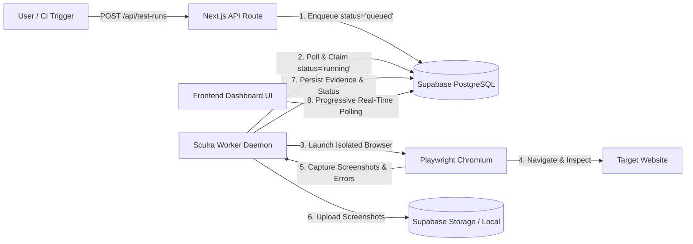

# Sculra Autonomous Test Engine Architecture

This document describes the architecture, lifecycle, and operational instructions for the Sculra Playwright Test Worker (`@sculra/worker`).

---

## 1. System Overview

Sculra's testing engine is decoupled into two primary components:
1. **Frontend / API Service (`frontend`)**: Next.js 16 web application that allows users to trigger test runs (`POST /api/test-runs`), view progressive execution status, and inspect collected evidence (`/test-runs/[testRunId]`).
2. **Autonomous Test Worker Daemon (`@sculra/worker`)**: A background Node.js service running Playwright Chromium in headless mode, continuously polling Supabase for queued test runs and capturing real browser artifacts without blocking user requests.



---

## 2. Test Execution Lifecycle & State Machine

A test run progresses through the following deterministic states:

```
[queued] ──> [running] ──> [passed]
    │             │
    └──> [cancelled] <──┘
                  │
                  └──> [failed]
```

1. **`queued`**: Created when a user clicks "Run Test" or triggers `POST /api/test-runs`.
2. **`running`**: Claimed atomically by the worker daemon (`UPDATE test_runs SET status = 'running' WHERE id = :id AND status = 'queued'`).
3. **`passed`**: Page navigation completed cleanly (HTTP status 200–399, DOM loaded, screenshot captured).
4. **`failed`**: Navigation timeout, DNS failure, server error (HTTP 5xx), or security validation rejection.
5. **`cancelled`**: User initiated cancellation before or during execution.

> **Note on Scoring**: In alignment with Sculra's design principles, `overall_score` remains `null` until the AI Release Readiness Scoring Engine is implemented. No placeholder scores (e.g. 100% or 0%) are faked.

---

## 3. Worker Daemon CLI Commands

### Running the Worker Daemon
To start the continuous background worker polling daemon from the repository root:
```bash
pnpm worker
# or
pnpm --filter @sculra/worker start
```

### Running a Single Test Run
To execute a specific test run by ID and terminate immediately upon completion:
```bash
pnpm --filter @sculra/worker start <testRunId>
```

### Running Test Suites
```bash
# Run worker test suite including real Playwright browser tests
pnpm --filter @sculra/worker test

# Run all test suites across the monorepo
pnpm test
```

---

## 4. Environment Configuration

The worker reads standard environment variables from `.env` or system environment:

| Variable | Description | Default |
| :--- | :--- | :--- |
| `NEXT_PUBLIC_SUPABASE_URL` | Supabase project API URL | Required for DB sync |
| `SUPABASE_SERVICE_ROLE_KEY` | Supabase privileged service role key | Required for worker writes |
| `WORKER_POLL_INTERVAL_MS` | Queue polling frequency in milliseconds | `2000` |
| `WORKER_CONCURRENCY` | Maximum concurrent browser executions | `1` |
| `TEST_BROWSER` | Playwright browser engine (`chromium`) | `chromium` |
| `TEST_NAVIGATION_TIMEOUT_MS` | Page load timeout limit in milliseconds | `15000` |
| `TEST_RUN_TIMEOUT_MS` | Maximum duration for an entire test job | `30000` |

---

## 5. Security & SSRF Protection

All target URLs undergo strict security validation in `shared/utils/security.ts` and `worker/src/security.ts` before browser launch:
- **Restricted Hosts**: Access to cloud metadata IPs (`169.254.169.254`, `metadata.google.internal`), private IPv4 subnets (`10.0.0.0/8`, `172.16.0.0/12`, `192.168.0.0/16`), and loopback addresses is blocked by default in production.
- **Protocol Enforcement**: Only `http:` and `https:` protocols are permitted. `file://`, `ftp://`, and `data://` schemes are rejected.
- **Port Allowlisting**: Traffic is restricted to standard web ports (80, 443, 8080, 8443, 3000, 5173).

---

## 6. Evidence Storage Abstraction

The storage layer (`worker/src/storage.ts`) implements `IEvidenceStorage`:
- **Supabase Storage Bucket**: When credentials and the `test-evidence` bucket are configured, screenshots are uploaded directly to Supabase Storage with public URLs.
- **Local Filesystem Fallback**: If Supabase Storage is unavailable, screenshots are safely saved to `.storage/evidence/<testRunId>/` for local development.
- **Structured Evidence Table (`public.test_evidence`)**: Records every captured artifact with type (`screenshot`, `console_error`, `network_error`, `navigation`), metadata, and timestamp.
