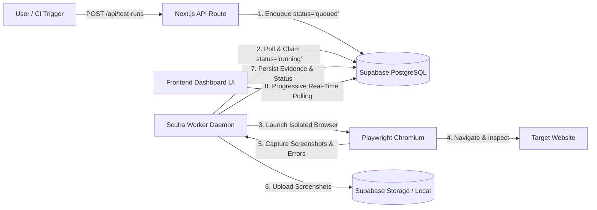
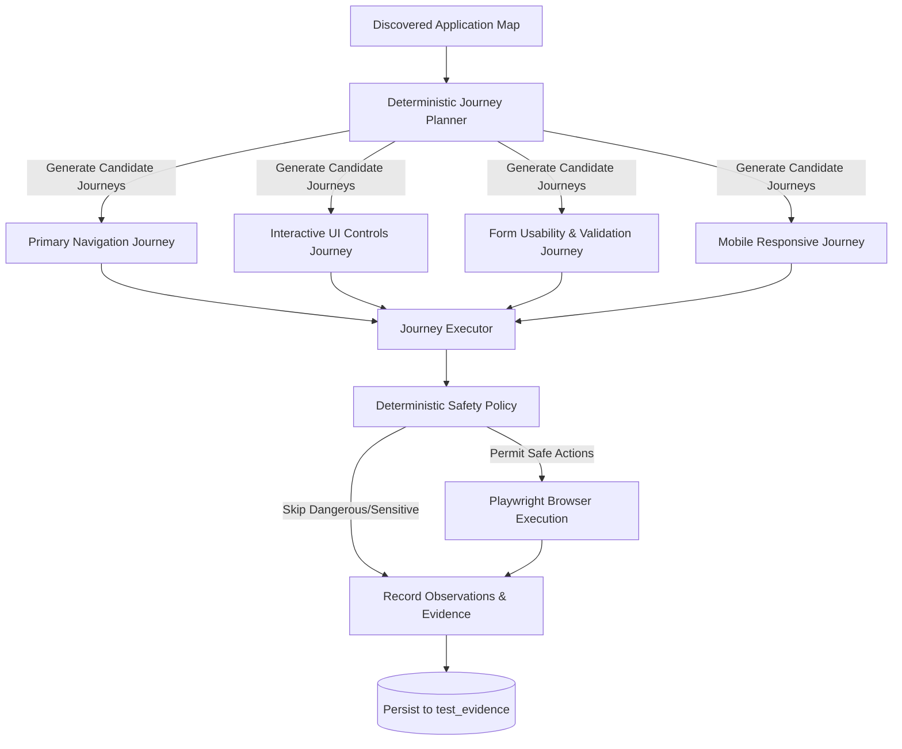
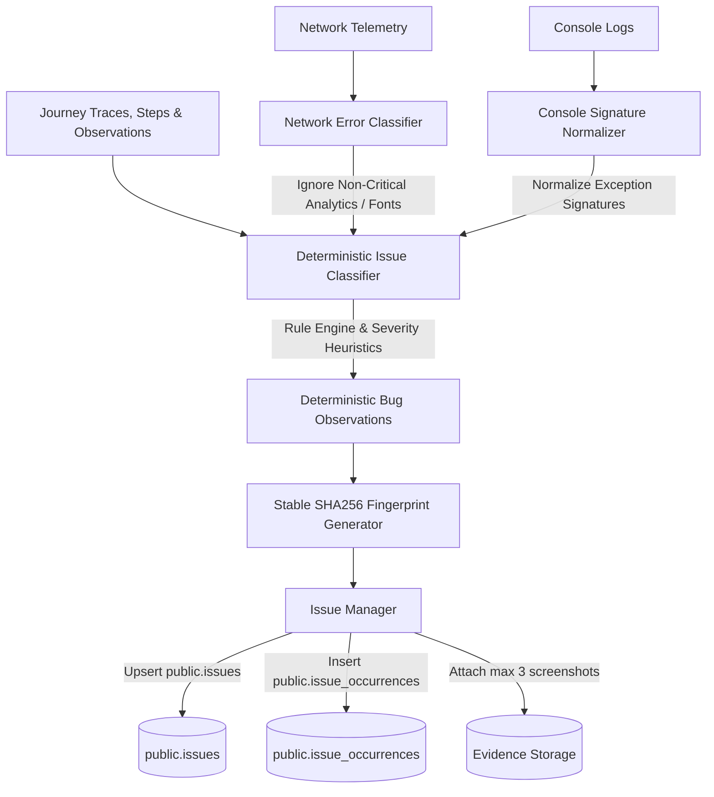
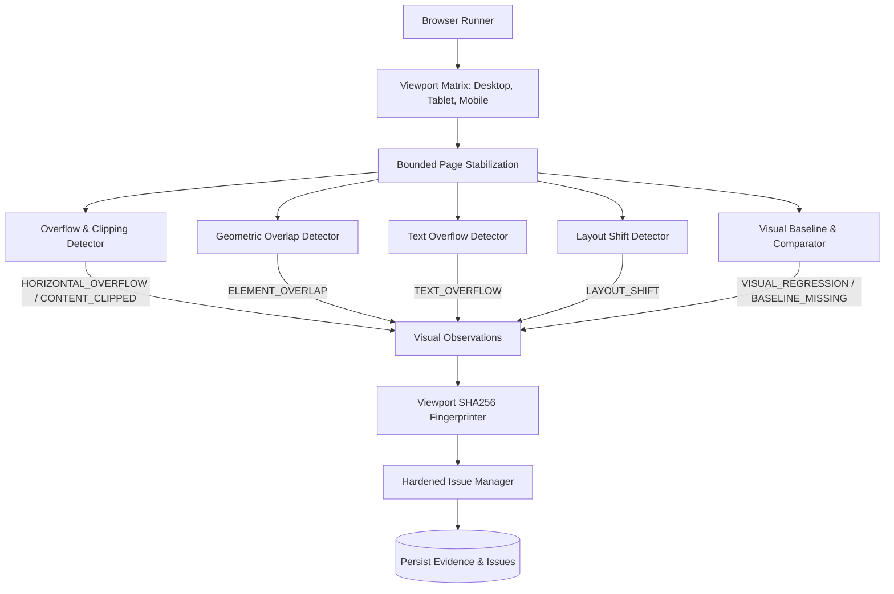
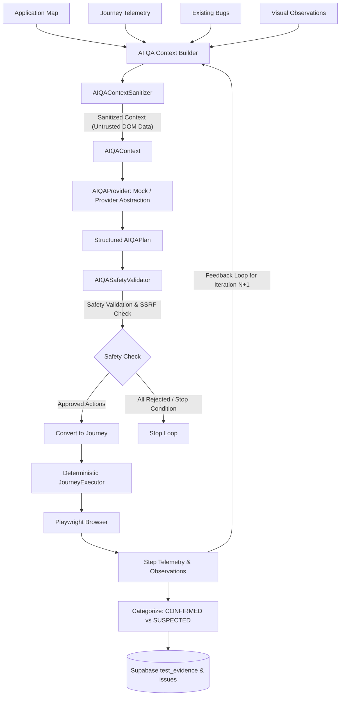

# Sculra Autonomous Test Engine Architecture

This document describes the architecture, lifecycle, and operational instructions for the Sculra Playwright Test Worker (`@sculra/worker`).

---

## 1. System Overview

Sculra's testing engine is decoupled into two primary components:
1. **Frontend / API Service (`frontend`)**: Next.js 16 web application that allows users to trigger test runs (`POST /api/test-runs`), view progressive execution status, and inspect collected evidence (`/test-runs/[testRunId]`).
2. **Autonomous Test Worker Daemon (`@sculra/worker`)**: A background Node.js service running Playwright Chromium in headless mode, continuously polling Supabase for queued test runs and capturing real browser artifacts without blocking user requests.



---

## 2. Test Execution Lifecycle & State Machine

A test run progresses through the following deterministic states:

```
[queued] ──> [running] ──> [passed]
    │             │
    └──> [cancelled] <──┘
                  │
                  └──> [failed]
```

1. **`queued`**: Created when a user clicks "Run Test" or triggers `POST /api/test-runs`.
2. **`running`**: Claimed atomically by the worker daemon (`UPDATE test_runs SET status = 'running' WHERE id = :id AND status = 'queued'`).
3. **`passed`**: Page navigation completed cleanly (HTTP status 200–399, DOM loaded, screenshot captured).
4. **`failed`**: Navigation timeout, DNS failure, server error (HTTP 5xx), or security validation rejection.
5. **`cancelled`**: User initiated cancellation before or during execution.

> **Note on Scoring**: In alignment with Sculra's design principles, `overall_score` remains `null` until the AI Release Readiness Scoring Engine is implemented. No placeholder scores (e.g. 100% or 0%) are faked.

---

## 3. Worker Daemon CLI Commands

### Running the Worker Daemon
To start the continuous background worker polling daemon from the repository root:
```bash
pnpm worker
# or
pnpm --filter @sculra/worker start
```

### Running a Single Test Run
To execute a specific test run by ID and terminate immediately upon completion:
```bash
pnpm --filter @sculra/worker start <testRunId>
```

### Running Test Suites
```bash
# Run worker test suite including real Playwright browser tests
pnpm --filter @sculra/worker test

# Run all test suites across the monorepo
pnpm test
```

---

## 4. Environment Configuration

The worker reads standard environment variables from `.env` or system environment:

| Variable | Description | Default |
| :--- | :--- | :--- |
| `NEXT_PUBLIC_SUPABASE_URL` | Supabase project API URL | Required for DB sync |
| `SUPABASE_SERVICE_ROLE_KEY` | Supabase privileged service role key | Required for worker writes |
| `WORKER_POLL_INTERVAL_MS` | Queue polling frequency in milliseconds | `2000` |
| `WORKER_CONCURRENCY` | Maximum concurrent browser executions | `1` |
| `TEST_BROWSER` | Playwright browser engine (`chromium`) | `chromium` |
| `TEST_NAVIGATION_TIMEOUT_MS` | Page load timeout limit in milliseconds | `15000` |
| `TEST_RUN_TIMEOUT_MS` | Maximum duration for an entire test job | `30000` |

---

## 5. Security & SSRF Protection

All target URLs undergo strict security validation in `shared/utils/security.ts` and `worker/src/security.ts` before browser launch:
- **Restricted Hosts**: Access to cloud metadata IPs (`169.254.169.254`, `metadata.google.internal`), private IPv4 subnets (`10.0.0.0/8`, `172.16.0.0/12`, `192.168.0.0/16`), and loopback addresses is blocked by default in production.
- **Protocol Enforcement**: Only `http:` and `https:` protocols are permitted. `file://`, `ftp://`, and `data://` schemes are rejected.
- **Port Allowlisting**: Traffic is restricted to standard web ports (80, 443, 8080, 8443, 3000, 5173).

---

## 6. Evidence Storage Abstraction

The storage layer (`worker/src/storage.ts`) implements `IEvidenceStorage`:
- **Supabase Storage Bucket**: When credentials and the `test-evidence` bucket are configured, screenshots are uploaded directly to Supabase Storage with public URLs.
- **Local Filesystem Fallback**: If Supabase Storage is unavailable, screenshots are safely saved to `.storage/evidence/<testRunId>/` for local development.
- **Structured Evidence Table (`public.test_evidence`)**: Records every captured artifact with type (`screenshot`, `console_error`, `network_error`, `navigation`, `application_map`, `journey_result`, `journey_step`, `action_trace`, `observation`), metadata, and timestamp.

---

## 7. Application Discovery Engine

The Application Discovery module (`worker/src/discovery.ts`) maps the structural surface of a target web application:
- **Same-Origin Crawling**: BFS queue respecting configurable bounds (`maxPages`, `maxDepth`, `maxLinksPerPage`, `maxElementsPerPage`).
- **Interactive Element Extraction**: Locates non-text actionable elements (buttons, links, form fields, select dropdowns, checkboxes).
- **Responsive Viewport Probing**: Captures screenshots across desktop (`1280x720`), tablet (`768x1024`), and mobile (`390x844`) layouts.
- **Resilient Selectors**: Computes robust CSS and semantic locators for every discovered interactable element.

---

## 8. Deterministic User Journey & Safe Interaction Engine

The User Journey Engine (`worker/src/journeys/`) systematically plans and executes safe user journeys across discovered applications:



### Deterministic Safety Policy (`worker/src/journeys/safety.ts`)
- **Dangerous Action Filter**: Automatically skips destructive operations (deletion, permanent removal, account termination, log out / sign out, monetary payments / checkout, and external publishing / deployments).
- **Sensitive Field Filter**: Prevents synthetic data injection into sensitive fields (passwords, PINs, OTP tokens, API keys, secrets, credit card numbers, CVVs, SSNs, and bank accounts).
- **Deterministic Fixture Values**: Injects synthetic, non-sensitive fixtures (`sculra.test.fixture@example.com`, `Sculra Test User`, `Sculra QA`, etc.).

### Journey Types
1. **Primary Navigation**: Traverses internal routes, asserting HTTP status codes, page titles, and URL routing.
2. **Interactive UI Controls**: Clicks non-destructive buttons, accordions, and tabs to observe DOM mutations and detect no-ops (`CLICK_NO_OP`).
3. **Form Usability & Validation**: Evaluates form client constraints (`VALIDATE_FORM`), fills safe inputs, and records validation states.
4. **Responsive Viewport**: Executes workflows on mobile viewport (`390x844`) to observe usability on small screens.

---

## 9. Deterministic Functional Bug Detection & Issue Intelligence

> **Important Architecture Principle**: *This is deterministic bug detection, not AI reasoning.* All bug classifications, severity evaluations, and deduplication fingerprints are produced deterministically through rigorous rule sets without stochastic or non-deterministic LLM calls.



### Deterministic Bug Classification Categories
The issue classifier (`worker/src/issues/classifier.ts`) evaluates journey telemetry and categorizes findings into standardized bug types:
1. **`CRITICAL_API_FAILURE`**: Critical first-party backend HTTP 5xx errors and failed network operations directly triggered by user actions.
2. **`BROKEN_CONTROL`**: Interactive UI elements that produce no DOM changes, state mutations, or network effects (`CLICK_NO_OP`), or fail to respond to user gestures.
3. **`NAVIGATION_FAILURE`**: Broken internal links, 404/500 routing failures, navigation timeouts, or unexpected route redirects.
4. **`UNHANDLED_EXCEPTION`**: Uncaught JavaScript runtime errors or React framework crash boundary triggers during user workflows.
5. **`LAYOUT_DEFECT`**: Viewport clipping or severe element visual anomalies detected during responsive traversal.
6. **`FORM_VALIDATION_ERROR`**: Client-side constraint violations recorded for usability observations (distinguished as non-bug validation feedback vs submission failures).

### Severity Heuristics & Primary CTA Elevation
Severity is calculated deterministically based on error impact and element prominence:
- **`critical`**: Complete workflow blockers (runtime crashes, unhandled exceptions, internal server errors on primary navigation).
- **`high`**: Failures on primary calls-to-action (e.g. "Get Started Now", "Submit", "Sign Up", "Save") and critical API failures.
- **`medium`**: Broken secondary controls, non-critical navigation dead-ends, and 4xx client errors.
- **`low`**: Minor non-blocking UI anomalies and warnings.
- **`info`**: Expected form constraint validations and usability observations (does not count as a failing bug).

### Stable SHA256 Deduplication & Fingerprinting
To prevent issue duplication across multiple test runs or viewport sizes, issues are fingerprinted deterministically using:
```typescript
SHA256(`${projectId}:${normalizedUrl}:${bugType}:${action}:${normalizedSelector}:${normalizedErrorSignature}`)
```
- Query parameters are sanitized and volatile tokens (timestamps, random session IDs) are stripped.
- Selectors and error signatures are canonicalized.
- An issue recurrence increments `occurrence_count`, updates `last_seen_at`, and records a new entry in `public.issue_occurrences`.

### Issue Lifecycle & Status Preservation
- Existing `resolved` or `ignored` issues are **never** automatically reopened upon recurrence without explicit user configuration.
- The test run marks `status = 'failed'` if and only if one or more actionable functional bugs (`CRITICAL_API_FAILURE`, `BROKEN_CONTROL`, `NAVIGATION_FAILURE`, `UNHANDLED_EXCEPTION`) are detected.
- Each issue occurrence stores up to 3 bounded screenshot evidence references.

### Network and Console Telemetry Intelligence
- **Third-Party Noise Elimination**: Network errors from analytics providers (Google Analytics, PostHog, Segment, Sentry, Telemetry), missing favicons, and non-blocking font downloads are ignored by default.
- **Sensitive Data Redaction**: Query strings containing tokens, keys, passwords, or credentials are systematically redacted (`[REDACTED]`) before fingerprinting or persistence.

---

## 10. Deterministic Visual Regression & Responsive QA Engine

> **Important Architecture Principle**: *This is deterministic visual/responsive QA, not AI visual reasoning.* All geometry evaluations, overflow checks, overlap calculations, layout shift measurements, and pixel-level screenshot comparisons operate deterministically without stochastic LLM calls or simulated metrics.



### Viewport Profile Matrix
The responsive engine evaluates applications across standard viewport profiles:
1. **Desktop**: `1440 × 900` (device scale 1x, widescreen desktop layout)
2. **Tablet**: `768 × 1024` (device scale 2x, touchscreen portrait layout)
3. **Mobile**: `390 × 844` (device scale 3x, touchscreen mobile layout with mobile user agent)

### Bounded Execution Limits
- `MAX_RESPONSIVE_PAGES = 10`
- `MAX_VIEWPORTS = 5`
- `MAX_SCREENSHOTS_PER_PAGE_PER_VIEWPORT = 2`
- `MAX_RESPONSIVE_EXECUTION_TIME = 120000` (120 seconds)

### Detection Capabilities & Heuristics
1. **Horizontal Layout Overflow (`HORIZONTAL_OVERFLOW`)**:
   - Compares `document.documentElement.scrollWidth` and `document.body.scrollWidth` against viewport width.
   - Identifies offending DOM elements via bounding boxes and computed styles.
   - **False-Positive Exclusion**: Excludes intentional scroll containers (`overflow-x: auto/scroll`, `.overflow-x-auto`, `[role="tablist"]`, `data-carousel`, `pre`, `code`), fixed overlays, and offscreen menus.
2. **Element Clipping (`CONTENT_CLIPPED`)**:
   - Detects interactive buttons, inputs, and links extending outside parent containers with `overflow: hidden`.
3. **Element Overlap (`ELEMENT_OVERLAP`)**:
   - Calculates rectangle intersections between visible interactive candidates.
   - Ignores parent/child containment, badges in cards, icons in buttons, and active modals.
   - Flags significant overlap ($\ge 20\%$ area or $\ge 150\text{px}^2$) between unrelated interactive elements.
4. **Text Truncation Overflow (`TEXT_OVERFLOW`)**:
   - Detects text elements where `scrollWidth > clientWidth` without `text-overflow: ellipsis`.
5. **Layout Shift After Interaction (`LAYOUT_SHIFT`)**:
   - Measures displacement $(\Delta x, \Delta y)$ of stable elements before vs after a journey interaction.
   - Flags unexpected layout movements $\ge 40\text{px}$.

### Visual Baseline & Pixel-by-Pixel Image Comparison
- **Deterministic Comparison**: Uses pure pixel color distance $\Delta E = \max(|r_1-r_2|, |g_1-g_2|, |b_1-b_2|, |a_1-a_2|)$.
- **Dimension Matching**: Asserts dimension equality ($W_1 = W_2, H_1 = H_2$). Returns `DIMENSION_MISMATCH` if dimensions differ.
- **Configurable Thresholds**:
  - $< 0.1\%$ difference $\rightarrow$ `PASS`
  - $0.1\% - 1\%$ difference $\rightarrow$ `INFO` (review)
  - $1\% - 5\%$ difference $\rightarrow$ `MEDIUM` visual regression
  - $> 5\%$ difference $\rightarrow$ `HIGH` visual regression
- **Baseline Missing Behavior**: If no baseline exists for a target page and viewport, records `BASELINE_MISSING` (severity `info`), stores the snapshot, and does **not** create a visual regression bug.

### IssueManager Concurrency Hardening
- Concurrent issue creation is hardened against race conditions using the PostgreSQL unique constraint on `(project_id, fingerprint)`.
- If two workers insert the same fingerprint simultaneously, the duplicate key violation is caught gracefully, the existing issue is retrieved, its `occurrence_count` is incremented, and an entry is recorded in `public.issue_occurrences`.
- Two simultaneous runs result in **1 issue** and **2 occurrences** with zero lost data.

---

## 11. Provider-Agnostic AI QA Orchestration Foundation

> **Critical Architectural Guarantee**: *The AI never directly controls Playwright.* The AI operates strictly as a structured planner and reasoner that produces a typed, validatable plan (`AIQAPlan`). The existing deterministic `JourneyExecutor` remains the sole browser actuator.



### Core Components
1. **Provider Abstraction (`AIQAProvider`)**:
   - Strongly-typed, provider-agnostic interface enabling future model integrations (OpenAI, Anthropic, local model) without altering test engine actuation.
   - Deterministic `MockAIQAProvider` enables offline verification, unit tests, and CI/CD without external API keys.
2. **Context Sanitization & Prompt Injection Defense (`AIQAContextSanitizer`)**:
   - Treats all browser DOM text, titles, button labels, form labels, and errors as **untrusted data**.
   - Redacts JWTs, bearer tokens, API keys, passwords, and private credentials.
   - Quarantines prompt injection patterns (e.g. `Ignore previous instructions...`) to prevent malicious page content from redefining safety rules or budgets.
3. **Strict Safety Validator (`AIQASafetyValidator`)**:
   - Validates allowlisted action vocabulary: `NAVIGATE`, `CLICK`, `FILL`, `SELECT`, `CHECK`, `UNCHECK`, `PRESS`, `WAIT_FOR_NAVIGATION`, `ASSERT_VISIBLE`, `ASSERT_URL`, `ASSERT_TITLE`, `VALIDATE_FORM`.
   - Enforces SSRF and scope boundaries: blocks cross-origin navigations, loopback addresses, and cloud metadata endpoints.
   - Blocks dangerous operations: `delete`, `checkout`, `cancel subscription`, `logout`, etc.
   - Blocks sensitive fields: passwords, payment cards, SSNs, OTPs.
4. **Bounded Budgets & Feedback Loops (`AIQABudgetTracker`)**:
   - Enforces configurable bounds: `MAX_AI_ITERATIONS = 3`, `MAX_AI_CALLS = 5`, `MAX_TOTAL_ACTIONS = 30`, `MAX_AI_TIME_MS = 60000`.
   - Feeds observations and results from Iteration $N$ into the context for Iteration $N+1$.
5. **Issue Intelligence & Evidence Integration**:
   - Distinguishes `CONFIRMED` defects (directly verified by deterministic failure/observation) from `SUSPECTED` anomalies.
   - Persists `ai_qa_plan` and `ai_qa_result` evidence rows into `public.test_evidence`.
   - Authoritative issue deduplication via SHA-256 fingerprinting.


